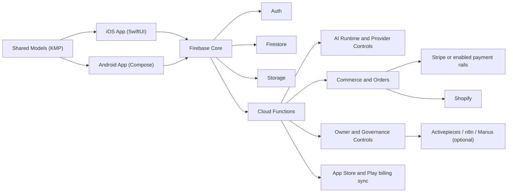

<p align="center">
  
</p>

<p align="center">
  
</p>

<h1 align="center">SkyOS</h1>

<p align="center">
  <strong>AI • Creator • Commerce Platform</strong>
</p>

<p align="center">
  Native iOS and Android product system for assistant-grade AI, creator media, merch commerce,
  membership, and owner governance in one controlled platform.
</p>

<p align="center">
  <a href="docs/README.md">Documentation</a> •
  <a href="docs/architecture.md">Architecture</a> •
  <a href="docs/deployment.md">Deployment</a> •
  <a href="docs/legal/terms.md">Terms</a> •
  <a href="docs/legal/privacy.md">Privacy</a> •
  <a href="https://github.com/Yang-D-Nash/SkyOs-App">Repository</a>
</p>

<p align="center">
  
  
  
  
</p>

<p align="center">
  
  
</p>

> Security-first. Firebase-backed. Native iOS + Android. Controlled AI runtime. Privacy-conscious by design. Owner governance controls.

SkyOS is the premium product layer of the Skydown ecosystem. It brings together a daily home
surface, assistant and agent-grade AI, creator media, merch commerce, membership logic, and
operator controls in one native system instead of a stack of disconnected tools.

The intent is not feature volume. The intent is a product that feels clear, commercially credible,
operationally governed, and releaseable on real devices.

## What Is SkyOS

SkyOS combines:

- a native AI layer for assistant, FAQ, visual generation, and agent-style execution
- creator media surfaces for music, video, beats, and artist presentation
- commerce infrastructure for merch, checkout initiation, orders, and support visibility
- membership-aware access, restore paths, and upgrade logic
- owner/admin controls for runtime settings, legal content, revenue operations, and release hygiene
- a Firebase-backed trust layer with rules, App Check, Cloud Functions, and operational safeguards

## Why SkyOS

SkyOS exists to solve a product problem, not just a technical one:

- one mobile product instead of separate AI, creator, shop, and admin islands
- recurring user value through assistant utility, media, membership, and commerce in one system
- founder-grade control over runtime behavior, permissions, legal content, and release readiness
- native quality on iPhone and Android instead of a lowest-common-denominator wrapper
- a repository that works as both product surface and operating system for the team behind it

## Core Modules

| Module | Role | Business value |
| --- | --- | --- |
| Home | Launch surface, entry points, signals, and product hierarchy | Makes the platform understandable from the first session |
| AI | Bot, FAQ, visual generation, and agent workflows | Creates recurring use beyond passive content consumption |
| Music and Video | Tracks, media, artist identity, and creator presentation | Anchors the platform in content and audience relevance |
| Merch and Orders | Storefront, cart, checkout handoff, and order visibility | Turns attention into revenue without leaving the ecosystem |
| Membership | Access control, restore, upgrade logic, and plan-aware limits | Supports monetization with clear value instead of clutter |
| Owner Control | Runtime settings, legal content, revenue ops, and role management | Gives the team leverage without a separate back office |
| Trust Layer | Security rules, App Check, support paths, and kill switches | Makes the product governable, not just demoable |

## Platforms

- Native iOS app in [`Skydown App/`](<Skydown App/>)
- Native Android app in [`androidApp/`](androidApp/)
- Shared Kotlin Multiplatform model layer in [`shared/`](shared/)
- Firebase backend with Auth, Firestore, Storage, Cloud Functions, rules, and App Check
- Optional external automation paths for user-owned Activepieces or `n8n`, plus optional Manus BYOS for agent workloads

## Architecture Snapshot

SkyOS is structured as two native mobile clients on top of a controlled Firebase backend with a
shared model layer, server-authoritative privileged mutations, and owner-governed runtime controls.



Core technical references:

- [docs/architecture.md](docs/architecture.md)
- [docs/backend.md](docs/backend.md)
- [docs/ios.md](docs/ios.md)
- [docs/android.md](docs/android.md)

## AI / Agent System

SkyOS AI is designed as a controlled product surface rather than an isolated chatbot.

- assistant, FAQ, visual generation, and agent-style flows live inside the main product shell
- provider routing, runtime settings, and usage policy remain owner-controlled
- AI availability is governed by account state, entitlement logic, and backend authority
- operational safety includes rate boundaries, pause states, history retention rules, and review paths

See [docs/ai-system.md](docs/ai-system.md).

## Commerce / Membership

Commerce is part of the product, not a bolted-on widget.

- merch discovery, cart behavior, checkout preparation, and order visibility sit inside the same user journey
- membership logic controls entitlement-aware access, restore, upgrade prompts, and recurring value surfaces
- hosted checkout, payment configuration, and live billing readiness are backend-governed and release-gated

See [docs/commerce.md](docs/commerce.md).

## Owner Control

SkyOS includes owner governance surfaces for the operating team behind the product.

- runtime controls for AI, commerce, and account policies
- legal content, role-sensitive settings, and release hygiene surfaces
- revenue operations, support-sensitive flows, and kill switches for incident response
- controlled integration points for external workflows and automation

See [docs/owner-admin.md](docs/owner-admin.md).

## Security Principles

- UI visibility is never the final permission boundary
- privileged mutations belong in Cloud Functions and rules, not only in client code
- Firestore and Storage default to explicit, role-aware access checks
- production secrets belong in secure runtime stores, not in git
- App Check, release smoke tests, and runtime locks are part of hardening, not optional polish
- privacy-sensitive flows should collect only what is needed for the product path in scope
- owner governance controls exist to contain incidents without shipping blind hotfixes first

## Documentation Index

### Core docs

- [docs/README.md](docs/README.md)
- [docs/architecture.md](docs/architecture.md)
- [docs/backend.md](docs/backend.md)
- [docs/ios.md](docs/ios.md)
- [docs/android.md](docs/android.md)
- [docs/ai-system.md](docs/ai-system.md)
- [docs/commerce.md](docs/commerce.md)
- [docs/owner-admin.md](docs/owner-admin.md)
- [docs/deployment.md](docs/deployment.md)
- [docs/release-checklist.md](docs/release-checklist.md)
- [docs/branding.md](docs/branding.md)
- [docs/faq.md](docs/faq.md)
- [docs/store/README.md](docs/store/README.md)
- [docs/store/app-store.md](docs/store/app-store.md)
- [docs/store/google-play.md](docs/store/google-play.md)
- [docs/store/screenshots.md](docs/store/screenshots.md)
- [docs/store/review-prep.md](docs/store/review-prep.md)

### Legal docs

- [docs/legal/terms.md](docs/legal/terms.md)
- [docs/legal/privacy.md](docs/legal/privacy.md)
- [docs/legal/imprint.md](docs/legal/imprint.md)

## Quick Start

### 1. Clone

```bash
git clone https://github.com/Yang-D-Nash/SkyOs-App.git
cd SkyOs-App
```

### 2. Install

```bash
npm ci --prefix functions
```

### 3. Run iOS

Open `Skydown App.xcodeproj` in Xcode for simulator or device work, or build from the command line:

```bash
xcodebuild -project "Skydown App.xcodeproj" -scheme "Skydown App" -configuration Debug -destination "generic/platform=iOS Simulator" build
```

### 4. Run Android

```bash
./gradlew :androidApp:assembleDebug
./gradlew :androidApp:assembleDebugAndroidTest
```

### 5. Run Functions

```bash
npm test --prefix functions
```

Live service paths require the expected Firebase configuration files and secure runtime secrets.
See [docs/backend.md](docs/backend.md) and [docs/deployment.md](docs/deployment.md).

## Deployment

Deployment is treated as a controlled release action, not a blind sync.

- use [docs/deployment.md](docs/deployment.md) for deploy and rollback procedure
- use [docs/release-checklist.md](docs/release-checklist.md) for final launch gating
- validate billing, legal content, rules, and real-device smoke before public release

Key commands:

```bash
firebase deploy --only functions
firebase deploy --only firestore:rules,storage
firebase deploy --only functions:syncShopifyMerch,functions:startAiSubscriptionCheckout
```

## Legal

SkyOS keeps its working legal basis in-repo for product, ops, and release coordination.

- [Terms](docs/legal/terms.md)
- [Privacy](docs/legal/privacy.md)
- [Imprint](docs/legal/imprint.md)
- [Subscription Terms](docs/legal/SUBSCRIPTION_TERMS.md)
- [AI Usage Notice](docs/legal/AI_USAGE_NOTICE.md)

These documents support the product foundation, but public launch should still pass final operator
and market-specific legal review.

## Status

Current repository baseline:

- native iOS and Android product foundations are in place
- Firebase backend, owner controls, merch, membership, and AI foundations exist
- release, legal, branding, and deployment documentation live in-repo
- the repository is structured to support product review, developer onboarding, and operating discipline

Still required before public release:

- final legal approval for the target operator and markets
- live billing and store validation on release candidates
- final localization and copy consistency pass
- final real-device release regression across critical flows
- monitoring, analytics sanity, and support readiness confirmation
