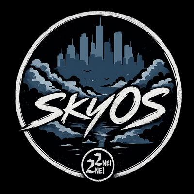
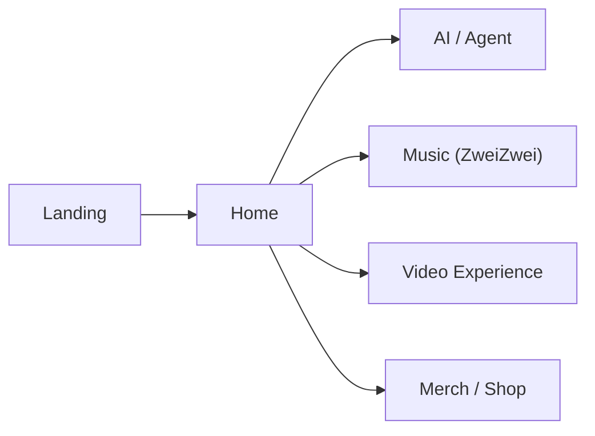
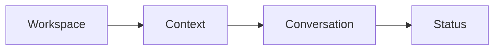
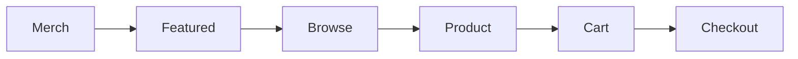
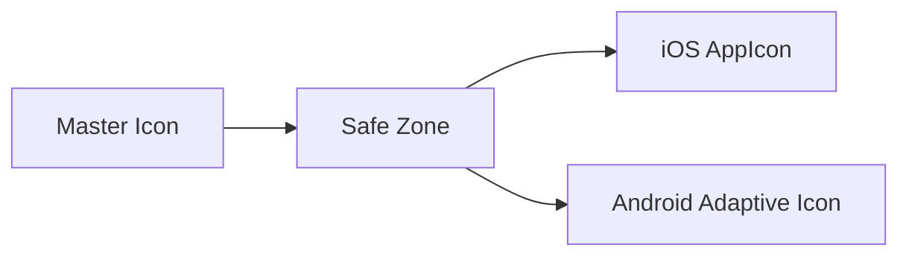
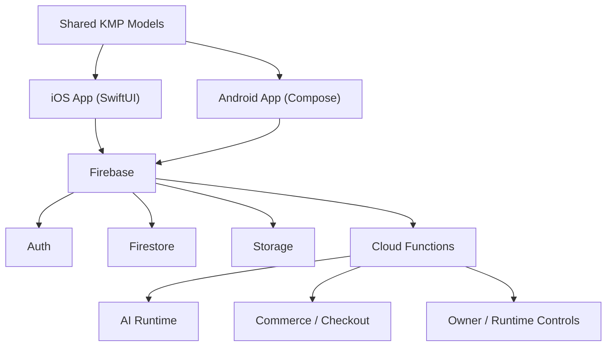
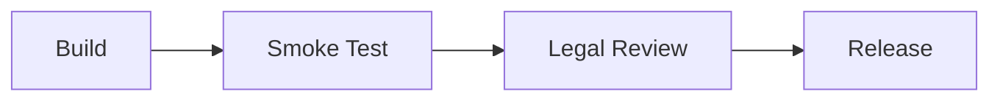

<p align="center">
  
  &nbsp;&nbsp;&nbsp;
  
  &nbsp;&nbsp;&nbsp;
  
</p>

<p align="center">
  
  &nbsp;&nbsp;
  
</p>

# Skydown

Skydown ist das native Cross-Platform-Produkt fuer iOS und Android. Die App verbindet AI,
Agent-Workflows, Music, Video, Merch, Auth, Legal-Flaechen und Runtime-Governance in einem ruhigen,
zusammenhaengenden Produktfluss. SkyOS beschreibt dabei die System- und Design-Sprache hinter dem
Produkt, waehrend ZweiZwei / 22 innerhalb der App ausschliesslich die Music-Identitaet markiert.

| Bereich | Stand |
| --- | --- |
| Produktstatus | `GO mit Legal-Review-Vorbehalt` |
| Branch | `main` |
| Letzter relevanter Commit | `d563afed3bb456137751781b5a04332ff8d269ba` |
| Plattformen | Native iOS (SwiftUI), Android (Jetpack Compose), Shared KMP |
| Letzter dokumentierter Device Smoke | Android `PASS`, iOS `PASS` |

## Inhaltsverzeichnis

- [Ueberblick](#ueberblick)
- [Produktuebersicht](#produktuebersicht)
- [Produktbereiche](#produktbereiche)
- [Landing / Home](#landing--home)
- [AI / Agent Workspace](#ai--agent-workspace)
- [Music](#music)
- [Video](#video)
- [Merch / Shop](#merch--shop)
- [Auth](#auth)
- [Legal / Policies](#legal--policies)
- [ZweiZwei / 22](#zweizwei--22)
- [Design-System / SkyOS](#design-system--skyos)
- [Motion-System](#motion-system)
- [Branding / Logos](#branding--logos)
- [App Icon Pipeline](#app-icon-pipeline)
- [Architekturuebersicht](#architekturuebersicht)
- [Plattformen](#plattformen)
- [iOS](#ios)
- [Android](#android)
- [Build / Development Setup](#build--development-setup)
- [Smoke-Test Ergebnis](#smoke-test-ergebnis)
- [Release-Status](#release-status)
- [Legal Review Hinweis](#legal-review-hinweis)
- [Qualitaetseinschaetzung](#qualitaetseinschaetzung)
- [Naechste Schritte](#naechste-schritte)

## Ueberblick

Skydown bringt mehrere bisher oft getrennte Produktflaechen in eine einzige App:

- AI und Agent fuer Assistenz, Planung, Visuals und strukturierte Ausfuehrung
- Music und Video fuer Artist-, Release- und Media-Praesenz
- Merch / Shop fuer Produktdarstellung, Cart und Checkout-Vorbereitung
- Auth, Membership und Settings fuer Kontoklarheit und Zugriffskontrolle
- Legal- und Policy-Flaechen direkt in der App statt nur ausserhalb des Produkts

Die Leitidee ist Klarheit statt Modulchaos: Home erklaert den Einstieg, AI und Agent geben
Handlungsfaehigkeit, Media verankert die Marke, Music traegt mit ZweiZwei / 22 eine eigene
kuratierte Identitaet, Commerce macht den Produktfluss wirtschaftlich relevant, und Legal / Settings
halten Vertrauen, Support und Governance sichtbar.

## Produktuebersicht

Skydown ist als ruhiges natives Produkt gedacht. Die App priorisiert:

- eine einheitliche Produktidentitaet statt funf unterschiedlich wirkender Sub-Apps
- klare Entitlement-, Membership- und Rollenlogik
- reale Mobile-Qualitaet auf iPhone und Android
- dokumentierte Build- und Smoke-Pfade vor Release
- transparente, aber noch nicht final juristisch freigegebene Legal-Flaechen



## Produktbereiche

<a id="landing--home"></a>

### Landing / Home

- Zweck: Die Landing- und Home-Flaeche erklaert Skydown als Produkt und gibt den Einstieg in AI, Media und Merch.
- UX-Prinzip: Orientierung vor Tiefe. Die Startflaeche soll ruhig, hierarchisch und sofort lesbar wirken.
- Wichtige UI-/Produktentscheidungen: Hero-first Einstieg, starke Brand-Surface, klar getrennte Content-Cluster, Music darf von hier aus klar in die ZweiZwei-/22-Welt fuehren, ohne dass Home selbst zur Music-Marke wird.
- Bewusst nicht gemacht: kein lauter Admin-Startscreen, kein Feature-Teppich, keine zerstreute Promo-Logik ohne Kontext.

<a id="ai--agent-workspace"></a>

### AI / Agent Workspace

- Zweck: AI und Agent liefern den aktiven Produktnutzen fuer Text, Visuals, FAQ-nahe Assistenz und gefuehrte Ausfuehrung.
- UX-Prinzip: Ein Workspace statt Tool-Zoo. Kontext, Eingabe, Antwort und Status sollen zusammengehalten werden.
- Wichtige UI-/Produktentscheidungen: Bot und Agent sind als unterschiedliche Arbeitsmodi sichtbar, Zugriff und Tiefe bleiben plan- und runtime-aware, Statusmeldungen bleiben ruhig statt alarmistisch, auf iPhone wurde Fullscreen so verfeinert, dass der Workspace sauber im Viewport liegt.
- Bewusst nicht gemacht: kein offenes Modell-Labor, keine provider-zentrierte UI, kein Token-Shop-Framing, keine developer-internen TODO-Flaechen im Nutzerfluss.



### Music

- Zweck: Music bindet Releases, Tracks, Artist-Praesenz und Mediennaehe in den Hauptfluss der App ein.
- UX-Prinzip: Artist-Fokus statt Streaming-Kopie. Music soll wie ein Teil von Skydown wirken und zugleich klar als ZweiZwei-/22-Musikraum lesbar sein.
- Wichtige UI-/Produktentscheidungen: klare Track-Auswahl, ruhige Listen- und Detailrhythmen, native Navigation, enge Verbindung zu Home, Brand Surface und einer explizit ueber ZweiZwei / 22 markierten Music Identity.
- Bewusst nicht gemacht: kein generischer Streaming-Klon, keine visuelle Uebernahme durch Retail-/Plattformfarben, keine unendliche Informationsdichte ohne Priorisierung.

### Video

- Zweck: Video zeigt Clips, Visuals und Motion-getragene Artist-Momente in einem eigenen Fokusraum.
- UX-Prinzip: Ein aktiver Clip oder ein klarer visueller Einstieg soll sofort im Mittelpunkt stehen.
- Wichtige UI-/Produktentscheidungen: vertikale bzw. grossflaechige Fokusfuehrung, ruhige Open-/Close-Uebergaenge und eine klare Einbindung in die Skydown-/SkyOS-Erfahrung statt in eine separate Music-Marke.
- Bewusst nicht gemacht: kein hektischer Feed als Standard, keine harten Schnitte zwischen Kontexten, keine visuelle Uebersteuerung durch aggressive Motion.

<a id="merch--shop"></a>

### Merch / Shop

- Zweck: Der Shop macht aus Markennaehe und Aufmerksamkeit einen nachvollziehbaren Commerce-Pfad.
- UX-Prinzip: Vertrauen und Lesbarkeit vor Druck. Produkte, Cart und Checkout-Vorbereitung muessen sauber und glaubwuerdig wirken.
- Wichtige UI-/Produktentscheidungen: Featured- und Browse-Pfade, Produktdetail, Cart, Checkout-Handoff, Order- und Support-Naehe bleiben im selben Produkt.
- Bewusst nicht gemacht: kein ueberladenes Storefront-Chaos, keine kuenstliche Scarcity-Mechanik, keine abrupten Spruenge in unerklaerte Checkout-Kontexte.



### Auth

- Zweck: Auth verbindet Sign-in, Session-Restore, Rollen- und Membership-Kontext mit dem restlichen Produkt.
- UX-Prinzip: Konto- und Zugriffslogik sollen klar bleiben und sich nicht wie ein verstecktes Backend-Thema anfuehlen.
- Wichtige UI-/Produktentscheidungen: Firebase Auth als Identitaetsbasis, Session-Restore beim App-Start, role-aware und membership-aware Sichtbarkeit, Restore- und Account-Pfade direkt in Settings.
- Bewusst nicht gemacht: kein versteckter Restore-Pfad, keine UI-Scheinberechtigungen als alleinige Sicherheitsgrenze, keine unklare Trennung zwischen Gast, User, Admin und Owner.

<a id="legal--policies"></a>

### Legal / Policies

- Zweck: Legal und Policy-Flaechen geben rechtliche, vertrauensbezogene und supportrelevante Informationen direkt in der App sichtbar aus.
- UX-Prinzip: Transparenz statt Entwickler-Placeholder. Die Screens sollen ruhig, lesbar und ehrlich sein.
- Wichtige UI-/Produktentscheidungen: AGB, Datenschutz, Nutzungsbedingungen, KI-Nutzung, Impressum und Supportpfade liegen gebuendelt in Settings; die sichtbaren Hinweise wurden auf neutrale Transparenzsprache vereinheitlicht.
- Bewusst nicht gemacht: keine rohen TODOs, keine `Legal sign-off`-Texte im UI, keine Behauptung, dass die Rechtstexte bereits final freigegeben sind.

<a id="zweizwei--22"></a>

## ZweiZwei / 22

ZweiZwei / 22 ist innerhalb von Skydown ausschliesslich die Music-Marke.

- Skydown ist die App- und Produktoberflaeche.
- SkyOS ist die zugrunde liegende System-, Motion- und Design-Sprache sowie die App-Icon-Identitaet.
- ZweiZwei / 22 kuratiert und markiert die Music Experience innerhalb der App.

Das ist in der Produktfuehrung wichtig, weil Music sichtbar eine eigene Identitaet tragen darf,
waehrend Video, Merch, AI, Home und die App-Struktur insgesamt im Skydown-/SkyOS-Rahmen bleiben.

Relevante Assets fuer diese Ebene:

| Asset | Pfad |
| --- | --- |
| ZweiZwei Wordmark | [`Skydown App/Assets.xcassets/ZweiZweiBrandLogo.imageset/zweizwei-logo.png`](<Skydown App/Assets.xcassets/ZweiZweiBrandLogo.imageset/zweizwei-logo.png>) |
| 22 Mark | [`Skydown App/Assets.xcassets/Sky22BrandLogo.imageset/22-logo.png`](<Skydown App/Assets.xcassets/Sky22BrandLogo.imageset/22-logo.png>) |

<a id="design-system--skyos"></a>

## Design-System / SkyOS

SkyOS verfolgt eine Design-Sprache, die eher an ein ruhiges Betriebssystem als an eine laute
Landingpage erinnert. Die Implementierung zeigt dieselben Grundbausteine auf iOS und Android.

### Background Wash

- iOS nutzt in `AppColors.screenGradient` und den Home-/Brand-Surfaces geschichtete Washes aus `topSky`, `midSky`, `horizonGlow` und `luminanceLift`.
- Android nutzt im Home-Screen einen zarten vertikalen Wash hinter dem Content statt flacher Einfarbigkeit.
- Das Ziel ist Atmosphaere ohne Nebelwand: genug Tiefe fuer Premium-Wirkung, aber nie so viel, dass Lesbarkeit oder Hierarchie kippen.

### Panels

- Karten und Module basieren auf weichen, leuchtenden Panel-Surfaces statt auf rohen Flat Cards.
- Relevante Token im Repo: `cardCornerRadius = 20`, `heroCornerRadius = 30`, `cardPadding = 12`, `panelPadding = 18`, `heroPadding = 17`.
- Panel-Flaechen arbeiten mit subtilen Border-, Bloom- und Sheen-Effekten, aber nicht mit harten Glas- oder Neon-Effekten.

### Spacing

- Vertikale Standardsektionen laufen ueber `sectionSpacing = 14`.
- Groessere Layouts erweitern den Rhythmus kontrolliert, statt jeden Screen frei zu improvisieren.
- Die Spacing-Logik stuetzt Ruhe, Scanbarkeit und einen wiedererkennbaren App-Rhythmus.

### Typography

- Auf iOS und Android wird die Typografie aus `Syne` fuer Interface/Hierarchy und `Awergy` fuer grosse Display- und Hero-Titel aufgebaut.
- Hero-Flaechen setzen auf klare Display-Typo, waehrend laufender UI-Text kontrolliert und technisch lesbar bleibt.
- Das Resultat ist eine deutlich markierte Headline-Hierarchie ohne magazinartige Ueberinszenierung.

### Ruhe, Hierarchie und Flow

- SkyOS arbeitet mit einer einzigen Produktidentitaet ueber Tabs und Module hinweg.
- Home, AI, Music, Video und Merch sollen wie ein System wirken, nicht wie unterschiedliche White-Label-Teile.
- Prioritaet hat ein ruhiger Lesefluss: erst Zweck, dann Tiefe, dann Aktion.

## Motion-System

Das Motion-System ist bewusst zurueckhaltend. Die Implementierung in `SkydownMotion` auf iOS und
`SkydownMotionTokens` auf Android zeigt ein konsistentes Prinzip:

- keine Springs als Standard fuer UI-Chrome
- kurze ease-out Bewegungen statt dramatischer Kinetik
- typische Dauer zwischen `180 ms` und `250 ms`
- Beispiele: iOS `screenTransition = 0.22s`, `contentReveal = 0.24s`, `pressInteraction = 0.18s`; Android `primaryEnter = 250ms`, `overlayEnter = 240ms`, `pressDuration = 180ms`
- dezente Press States mit leichtem Scale-, Alpha- und Y-Shift
- ruhige Tab- und Content-Wechsel statt harten Kontextbruechen

Fuer SkyOS ist Motion kein Showeffekt, sondern ein Mittel, um Statuswechsel, Fokus und Uebergaenge
angenehm zu halten.

<a id="branding--logos"></a>

## Branding / Logos

Die Release-Dokumentation trennt bewusst zwischen Produktmarke, Systemsprache und Music-Marke.

### Markenrollen

| Name | Rolle | Typischer Einsatz |
| --- | --- | --- |
| `Skydown` | Produkt und App | README, App-Kontext, Release-Dokumentation, Product-Narrative |
| `SkyOS` | System- und Design-Sprache | Motion, Surface-System, Design-Dokumentation, Brand-System, App-Icon-Identitaet |
| `ZweiZwei` / `22` | Music-Marke innerhalb der App | Music Experience, Releases, Music-Identitaet, visuelle Musik-Layer |

Verwendete Logo-Assets in dieser README:

| Marke | Pfad |
| --- | --- |
| Skydown Logo | [`Skydown App/Assets.xcassets/SkydownBrandLogo.imageset/skydown-logo.png`](<Skydown App/Assets.xcassets/SkydownBrandLogo.imageset/skydown-logo.png>) |
| SkyOS Logo | [`docs/assets/skyos-logo.png`](docs/assets/skyos-logo.png) |
| SkyOS App Icon Master | [`docs/assets/skyos-app-icon.png`](docs/assets/skyos-app-icon.png) |
| ZweiZwei Logo | [`Skydown App/Assets.xcassets/ZweiZweiBrandLogo.imageset/zweizwei-logo.png`](<Skydown App/Assets.xcassets/ZweiZweiBrandLogo.imageset/zweizwei-logo.png>) |
| 22 Mark | [`Skydown App/Assets.xcassets/Sky22BrandLogo.imageset/22-logo.png`](<Skydown App/Assets.xcassets/Sky22BrandLogo.imageset/22-logo.png>) |

Die Branding-Regel fuer diese README ist klar: Skydown benennt das Produkt, SkyOS beschreibt die
Systemsprache, und ZweiZwei / 22 markiert ausschliesslich den Music-Bereich. Historische
Mischformen oder zu breite 22-Zuschreibungen sollen nicht die primaere Produktkommunikation
dominieren.

## App Icon Pipeline

Die App-Icon-Pipeline wird im Repo ueber versionierte Quell- und Ziel-Assets nachvollziehbar
gemacht. Ziel ist, dass iOS und Android wie dasselbe finale SkyOS-App-Icon wirken und nicht wie
eine kuenstlich verkleinerte Ableitung.



Relevante versionierte Asset-Stufen:

| Stufe | Pfad |
| --- | --- |
| Master Icon | [`docs/assets/skyos-app-icon.png`](docs/assets/skyos-app-icon.png) |
| iOS Marketing Icon | [`Skydown App/Assets.xcassets/AppIcon.appiconset/1024.png`](<Skydown App/Assets.xcassets/AppIcon.appiconset/1024.png>) |
| Android Foreground Source | [`androidApp/src/main/res/drawable-nodpi/ic_launcher_foreground_src.png`](androidApp/src/main/res/drawable-nodpi/ic_launcher_foreground_src.png) |
| Android Launcher Outputs | [`androidApp/src/main/res/mipmap-xxhdpi/ic_launcher.png`](androidApp/src/main/res/mipmap-xxhdpi/ic_launcher.png) |

Der aktuelle Stand nutzt das bestehende Master-Asset direkt als Quelle fuer iOS und Android.
Eine fruehere lokale Safe-Zone-Hilfe, die das Motiv zusaetzlich verkleinert hat, ist bewusst nicht
Teil des verbindlichen Repo-Standes und wird fuer die Release-Baseline nicht vorausgesetzt.
ZweiZwei / 22 hat in dieser Pipeline keine App-Icon-Rolle.

## Architekturuebersicht

Skydown ist als natives Mobile-Produkt mit Firebase als operativer Backbone aufgebaut.



| Ebene | Pfad | Verantwortung |
| --- | --- | --- |
| iOS Client | [`Skydown App/`](<Skydown App/>) | SwiftUI-Surfaces, Services, lokale UI- und Produktlogik |
| Android Client | [`androidApp/`](androidApp/) | Compose-Screens, ViewModels, Data- und UI-Komponenten |
| Shared Layer | [`shared/`](shared/) | gemeinsame Models und Domain-Helfer |
| Backend | [`functions/`](functions/) | privilegierte Writes, AI-Ausfuehrung, Commerce, Owner-Ops |
| Dokumentation | [`docs/`](docs/) | Architektur, Branding, Deployment, Store- und Legal-Dokumente |

Weiterfuehrende Referenzen:

- [Architektur](docs/architecture.md)
- [iOS](docs/ios.md)
- [Android](docs/android.md)
- [Backend](docs/backend.md)
- [Deployment](docs/deployment.md)
- [Branding](docs/branding.md)

## Plattformen

### iOS

- Native App auf Basis von SwiftUI
- Projektpfade: [`Skydown App/`](<Skydown App/>) und [`Skydown App.xcodeproj/`](<Skydown App.xcodeproj/>)
- Design- und Motion-Sprache sind direkt in der App-Typografie, den Surface-Modifikatoren und `SkydownMotion` verankert
- UI-Tests liegen in [`Skydown AppUITests/`](<Skydown AppUITests/>)

### Android

- Native App auf Basis von Jetpack Compose
- Projektpfad: [`androidApp/`](androidApp/)
- Compose-Komponenten wie `SkydownCard`, `skydownPanelSurface` und `SkydownMotionTokens` spiegeln dieselbe Produktlogik wie auf iOS
- Connected Tests und Device Smoke liegen in `androidTest`

<a id="build--development-setup"></a>

## Build / Development Setup

### Voraussetzungen

- Xcode fuer iOS-Builds und Device-Validierung
- Android SDK / Android Studio fuer Android-Builds und Connected Tests
- Node.js fuer `functions/`
- Firebase CLI nur fuer Deploy- oder Rules-Arbeit

### Relevante Kommandos

```bash
npm ci --prefix functions
npm test --prefix functions
./gradlew :androidApp:compileDebugKotlin
xcodebuild -project "Skydown App.xcodeproj" -scheme "Skydown App" -configuration Debug -destination "generic/platform=iOS Simulator" build
```

### Repo-Orientierung

- Produktdokumentation: [`docs/README.md`](docs/README.md)
- Release-Checkliste: [`docs/release-checklist.md`](docs/release-checklist.md)
- Store-Story und Screenshot-Logik: [`docs/store/screenshots.md`](docs/store/screenshots.md)
- Manuelle Testcheckliste: [`manual-test-checklist.md`](manual-test-checklist.md)

## Smoke-Test Ergebnis

Der aktuell dokumentierte Release-Stand basiert auf erfolgreichen Build- und Device-Smoke-Rechecks.

| Bereich | Geraet / Scope | Status |
| --- | --- | --- |
| Android Build | `./gradlew :androidApp:compileDebugKotlin` | `PASS` |
| iOS Build | physisches iPhone-Build fuer `Skydown App` | `PASS` |
| Android Legal Smoke | Samsung `SM-F946B`, physisches Geraet, visuell bestaetigt | `PASS` |
| iOS AI Usage Notice Smoke | iPhone `16 Pro` laut aktuellem Release-Protokoll, physisches Geraet, visuell bestaetigt | `PASS` |

Gepruefte Release-Kernaussagen:

- App startet auf beiden Plattformen
- rechtliche Produktflaechen zeigen keine rohen TODO- oder Sign-off-Platzhalter mehr
- iPhone-AI-Fullscreen und Exit-Verhalten wurden nachjustiert und bleiben im dokumentierten Stand erhalten
- Release-Status ist technisch `GO`, aber weiterhin an juristische Freigabe gekoppelt

## Release-Status

Aktueller Stand: `GO mit Legal-Review-Vorbehalt`



Release-Fakten fuer den aktuellen Stand:

- Branch: `main`
- letzter relevanter Commit: `d563afed3bb456137751781b5a04332ff8d269ba`
- Commit-Titel: `fix(release): remove legal placeholders and verify device smoke`
- Android Smoke: `PASS`
- iOS Smoke: `PASS`
- verbleibender Vorbehalt: juristische Finalfreigabe der Rechtstexte

## Legal Review Hinweis

Die App enthaelt strukturierte Legal- und Policy-Flaechen. Die finalen Rechtstexte benoetigen vor
oeffentlicher Veroeffentlichung eine juristische Freigabe.

Im aktuellen Produktstand sind in der App sichtbar und strukturiert angelegt:

- [AGB](docs/legal/terms.md)
- [Datenschutz](docs/legal/privacy.md)
- [Nutzungsbedingungen](docs/legal/TERMS_OF_SERVICE.md)
- [KI-Nutzung](docs/legal/AI_USAGE_NOTICE.md)
- [Impressum](docs/legal/imprint.md)
- [Subscription Terms](docs/legal/SUBSCRIPTION_TERMS.md)

Wichtig fuer die Release-Kommunikation:

- Die App ist technisch smoke-verifiziert.
- Die sichtbaren Legal-Screens sind von Entwickler-Placeholders bereinigt.
- Die Texte duerfen dennoch nicht als juristisch final freigegeben dargestellt werden.

## Qualitaetseinschaetzung

Der aktuelle Stand wirkt wie ein belastbarer Release Candidate:

- Produktflaechen folgen einer klaren, ruhigen Design- und Motion-Sprache
- Build- und Device-Smokes sind fuer die kritischen Release-Pfade dokumentiert
- AI, Media, Merch und Settings erscheinen als zusammenhaengendes Produkt statt als Modulstapel
- der verbleibende Vorbehalt ist nicht primar technisch, sondern juristisch-prozessual

Kurz gesagt: Skydown ist fuer den dokumentierten technischen Release-Stand bereit, aber noch nicht
fuer eine oeffentliche Auslieferung ohne juristische Abschlussfreigabe.

## Naechste Schritte

- finale juristische Freigabe fuer AGB, Datenschutz, Nutzungsbedingungen, KI-Nutzung und Impressum einholen
- README und Store-/Release-Dokumente konsistent mit den final freigegebenen Rechtstexten abgleichen
- Release Notes aus dem verifizierten Stand ableiten
- entscheiden, ob die lokale App-Icon-Safe-Zone-Hilfe kuenftig versionierter Repo-Bestandteil sein soll
