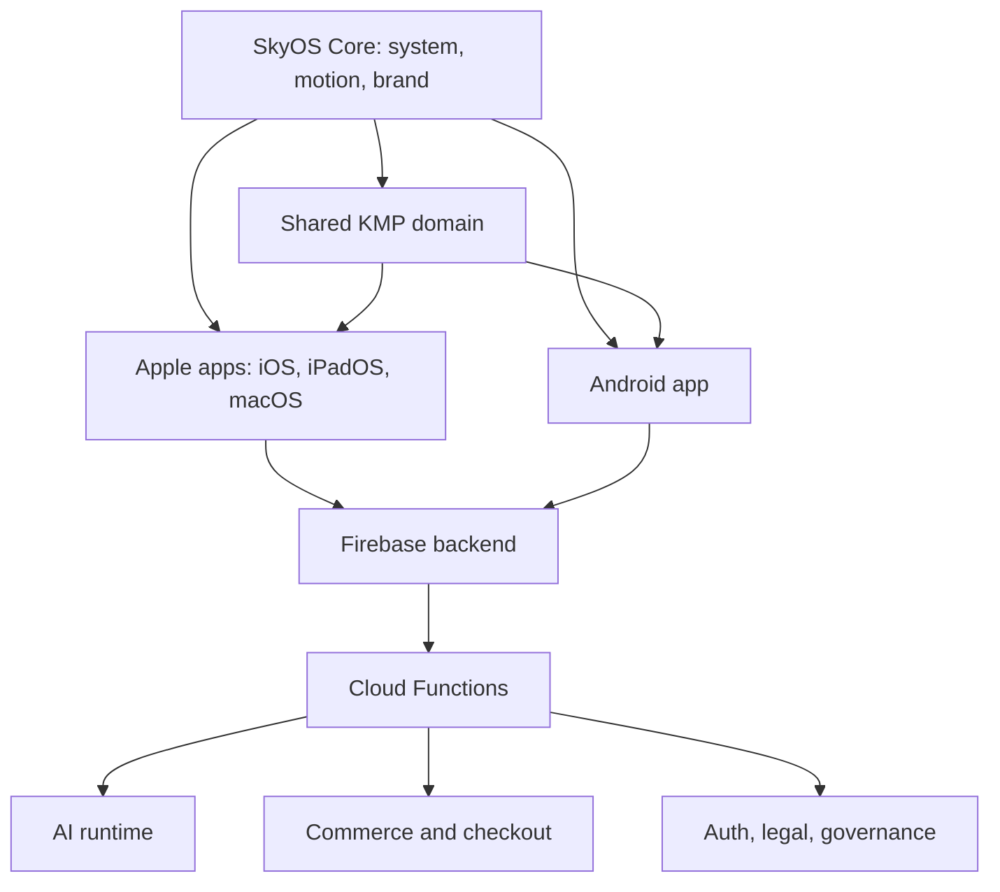

<p align="center">
  
</p>

<h1 align="center">SkyOS</h1>
<p align="center">
  A premium native product space for AI, creator media, membership, merch commerce, and trusted account controls.
</p>

<p align="center">
  
  
  
</p>

---

## What SkyOS Is

SkyOS is the operating core behind the Skydown app experience. It brings AI assistance, music,
video, merch, membership, support, and legal/account controls into one calm native interface instead
of scattering them across disconnected tools.

The product is designed for everyday users, creators, operators, and reviewers who need a clear
answer to three questions:

- what the app does
- which brand or feature area they are currently using
- where trust, account, billing, and legal controls live

## Product Surfaces

| Surface | User Value |
| --- | --- |
| Home | Entry point for orientation, featured content, and system context |
| AI / Agent | Assistant, visual, FAQ, and structured workflow support |
| Music | Curated creator and `ZweiZwei / 22` music context |
| Video | Focused media surface for clips and visual storytelling |
| Shop / Orders | `Skydown x 22` merch discovery, cart, order, and purchase visibility |
| Profile / Settings | Account, membership, support, privacy, legal, and trust controls |

## Brand System

<p align="center">
  
  
  
</p>

| Brand | Role | Primary Use |
| --- | --- | --- |
| `SkyOS` | System identity and operating core | Launcher, Home, platform architecture, trust surfaces |
| `Skydown` | Product and operator identity | App experience, AI, video, support, product communication |
| `ZweiZwei / 22` | Music identity | Music screens, artist context, release context |
| `Skydown x 22` | Merch collaboration identity | Shop, product, checkout, and commerce surfaces |

## Design Principles

- One system: every feature should feel like part of the same product.
- Calm hierarchy: important actions stay visible without turning the UI into noise.
- Native quality: SwiftUI, Jetpack Compose, and shared domain logic are used where they fit best.
- Trust is visible: support, legal, privacy, billing, and account controls are part of the product.
- AI is assistive: AI can help users draft, explore, and execute, but outputs must be reviewed.

## App Icon

The active release icon is maintained as a single master asset and mirrored into platform-specific
icon slots for Apple and Android builds.

<p align="center">
  
</p>

| Asset | Purpose |
| --- | --- |
| `docs/assets/skyos-app-icon-1024.png` | Apple master artwork |
| `docs/assets/skyos-app-icon-1024-android-padded.png` | Android adaptive-icon source with platform-safe padding |
| `docs/assets/icon-variants/A-original-premium/master-1024.png` | Release mirror for icon QA |

## Architecture



## Tech Stack

| Layer | Technology |
| --- | --- |
| Apple client | SwiftUI, Xcode, Asset Catalog |
| Android client | Kotlin, Jetpack Compose, Android Gradle |
| Shared domain | Kotlin Multiplatform (`shared/`) |
| Backend | Firebase Auth, Firestore, Storage, Cloud Functions, App Check |
| AI runtime | Cloud Functions, Genkit/Gemini-backed execution where enabled |
| Documentation | Markdown, release, store, legal, and compliance documents |

## Build

| Platform | Module | Build Reference |
| --- | --- | --- |
| iOS / iPadOS / macOS | `Skydown App.xcodeproj` | `xcodebuild` with the required destination |
| Android | `androidApp/` | `./gradlew :androidApp:assembleRelease` |
| Shared | `shared/` | Included by Apple and Android builds |
| Functions | `functions/` | `npm ci --prefix functions`, `npm run build --prefix functions`, `npm test --prefix functions` |

```bash
# Backend
npm ci --prefix functions
npm run build --prefix functions
npm test --prefix functions

# Android
./gradlew :androidApp:assembleRelease

# Apple example
xcodebuild -project "Skydown App.xcodeproj" -scheme "Skydown App" -configuration Debug -destination "generic/platform=iOS Simulator" build
```

For local Android release smoke tests without store signing, use:

```bash
./gradlew :androidApp:assembleRelease -PallowDebugReleaseSigning=true
```

Store-ready builds require production signing through `keystore.properties` or `SKYOS_UPLOAD_*`
secrets.

## Trust, Privacy, and AI Transparency

SkyOS includes legal, privacy, support, and AI-usage entry points inside the product. The repository
also keeps release and compliance working documents so product behavior, data handling, and public
language can stay aligned.

Core documents:

- [Privacy](docs/legal/privacy.md)
- [Terms](docs/legal/terms.md)
- [Imprint](docs/legal/imprint.md)
- [AI Usage Notice](docs/legal/AI_USAGE_NOTICE.md)
- [Subscription Terms](docs/legal/SUBSCRIPTION_TERMS.md)
- [Compliance Kit](docs/compliance/README.md)

Public regulatory references:

- [EU AI Act - European Commission overview](https://digital-strategy.ec.europa.eu/en/policies/regulatory-framework-ai)
- [EU AI Act - Regulation (EU) 2024/1689 on EUR-Lex](https://eur-lex.europa.eu/legal-content/EN/TXT/?uri=CELEX%3A32024R1689)
- [GDPR / DSGVO - European Commission Data Protection Rules](https://commission.europa.eu/law/law-topic/data-protection/eu-data-protection-rules_en)
- [GDPR / DSGVO - Regulation (EU) 2016/679 on EUR-Lex](https://eur-lex.europa.eu/eli/reg/2016/679/oj)
- [EU Data Protection Legal Framework - European Commission](https://commission.europa.eu/law/law-topic/data-protection/data-protection-eu_en)

These links are official public references. They do not replace qualified legal review for a specific
release, market, provider setup, or data-processing configuration.

## Documentation

| Topic | Document |
| --- | --- |
| Documentation index | [docs/README.md](docs/README.md) |
| Architecture | [docs/architecture.md](docs/architecture.md) |
| Backend | [docs/backend.md](docs/backend.md) |
| iOS | [docs/ios.md](docs/ios.md) |
| Android | [docs/android.md](docs/android.md) |
| AI system | [docs/ai-system.md](docs/ai-system.md) |
| Commerce | [docs/commerce.md](docs/commerce.md) |
| Owner/admin operations | [docs/owner-admin.md](docs/owner-admin.md) |
| Deployment | [docs/deployment.md](docs/deployment.md) |
| Release checklist | [docs/release-checklist.md](docs/release-checklist.md) |
| Branding | [docs/branding.md](docs/branding.md) |
| FAQ | [docs/faq.md](docs/faq.md) |
| Store documents | [docs/store/README.md](docs/store/README.md) |
| Store listing | [docs/store-listing.md](docs/store-listing.md) |
| Store screenshots | [docs/store-screenshots.md](docs/store-screenshots.md) |

## Release Readiness

SkyOS is documented as a v1.0.0 release candidate with cross-platform build paths, brand assets,
store-prep material, and legal/compliance working documents in place.

Before public distribution, confirm:

- production signing and distribution credentials
- store listing URLs for privacy, terms, support, and deletion requests
- final provider list and data-processing roles
- final legal approval for privacy, terms, subscription, AI, and imprint texts
- platform review requirements for App Store and Google Play

## Support

Current repository support contact: `skydownent@gmail.com`

The production release should publish the final support, privacy, deletion, and legal routing in
the app, store listings, and public policy pages.

## License

Project-specific. Add a central `LICENSE` file before distributing code under a public open-source
license.
