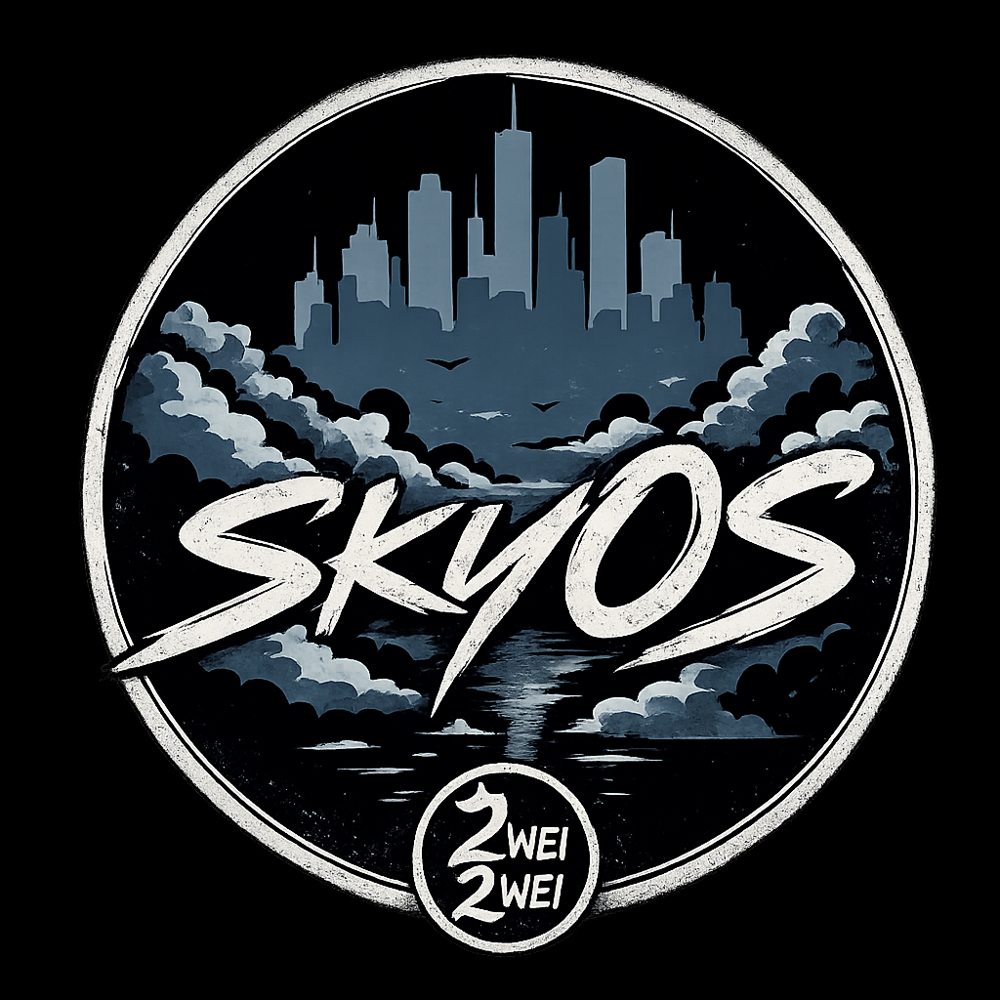
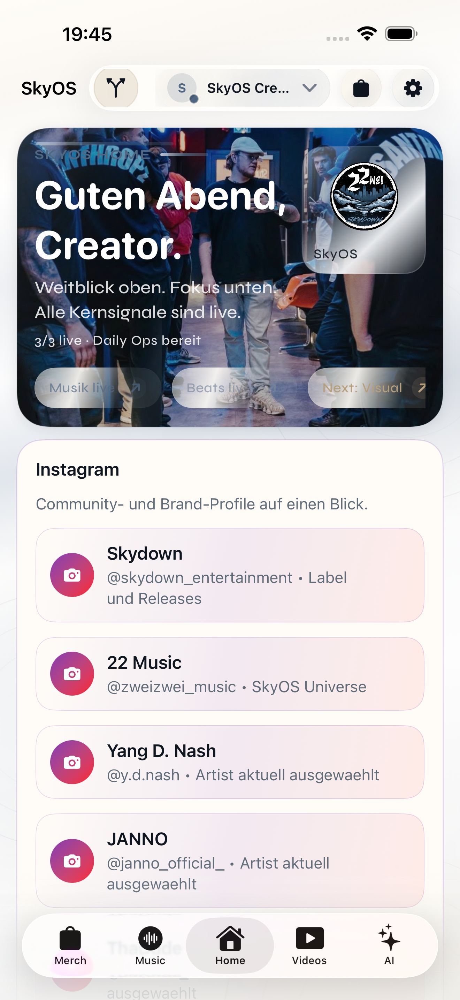
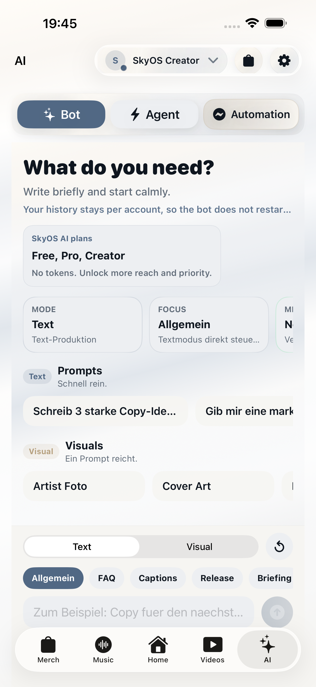
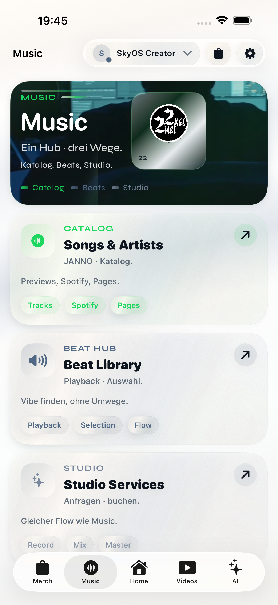
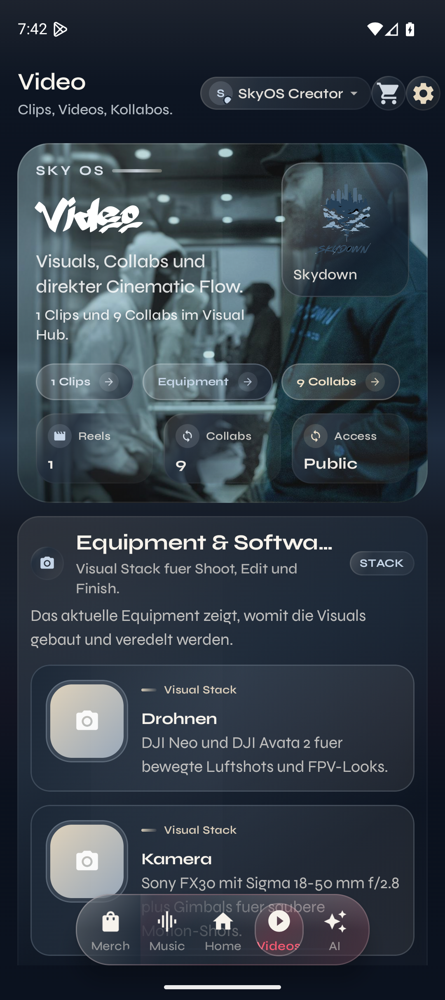
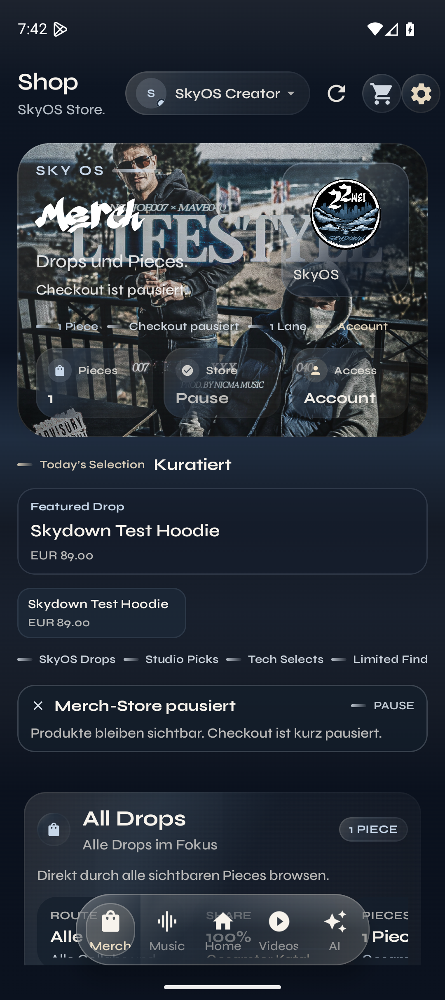
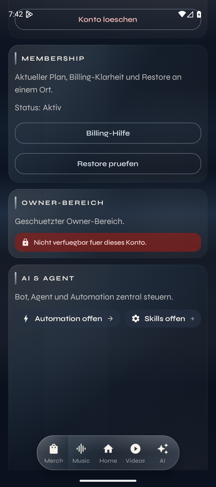

<p align="center">
  
</p>

<h1 align="center">SkyOS</h1>

<p align="center">
  Native Produkt- und Automationsplattform für Skydown: KI, Agent-Workflows, Reminder,
  Tasks, Notes, Creator-Medien, Merch-Commerce und vertrauenswürdige Kontosteuerung.
</p>

<p align="center">
  
  
  
</p>

---

## Kurzbeschreibung

**SkyOS** ist der technische Systemkern hinter der Skydown-App. Das Repository bündelt native Apple- und Android-Clients, ein Kotlin-Multiplatform-Modul, Firebase-Backend, Cloud Functions, Sicherheitsregeln, Store-Assets und Release-Dokumentation in einem Monorepo.

Die App richtet sich an Creator, Betreiber und Power-User, die KI, Medien, Produktivität, Commerce und Kontensteuerung nicht in getrennten Werkzeugen verwalten möchten, sondern in einer ruhigen, nativen Oberfläche mit klaren Rollen, Grenzen und Support-Pfaden.

## Hero

SkyOS löst ein konkretes Produktproblem: kreative Arbeit, KI-Ausführung, Erinnerungen, Aufgaben, Notizen, Medienflächen, Merch und Mitgliedschaften liegen normalerweise in vielen getrennten Systemen. Dieses Projekt führt diese Bereiche in einer nativen App zusammen und verlagert sensible Entscheidungen wie Rollen, Zahlungen, Upload-Freigaben, KI-Nutzung und Runtime-Sperren in ein Firebase-Backend.

| Frage | Antwort |
| --- | --- |
| Was macht die App? | Skydown auf SkyOS verbindet Home, AI, Agent, Music, Video, Shop, Cart, Orders, Profile, Settings und Owner/Admin-Flächen. |
| Für wen ist sie? | Für Creator-Workflows, Skydown-Betrieb, Team-/Owner-Rollen, Testende und Entwickler, die ein natives Produkt mit Backend-Autorität betreiben. |
| Welches Problem löst sie? | Weniger fragmentierte Tools, mehr nachvollziehbare Aktionen: Reminder mit Push, Tasks, Notes, KI-/Agent-Ausgaben, Medien, Shop und Trust-Flächen in einem System. |

## Repository-Status

| Feld | Stand im Checkout |
| --- | --- |
| Produktversion | `1.0.0` in `VERSION`, Android `versionName`, iOS `MARKETING_VERSION` und `functions/package.json` |
| Android | `applicationId` `com.nash.skyos`, `versionCode` `10031`, SDK 36, minSdk 26 |
| Apple | Bundle-ID `com.skydown.ios`, Build `10028`, Mac Catalyst im Xcode-Projekt aktiviert |
| Backend | Firebase Functions in `us-central1`, 64 Exports laut `npm run list-exports --prefix functions` |
| Interner Store-Test | iOS Build `10028` und Android versionCode `10031` sind als naechster Rollout-Kandidat vorbereitet; Play-Upload wartet weiterhin auf `SUPPLY_JSON_KEY` |
| Lokale Qualität | `./scripts/ci_local_gate.sh` bündelt Shared-Tests, Android-Checks und Functions-/Rules-Tests |
| Veröffentlichungsmodell | Closed Source mit öffentlicher README-/Dokumentationsspiegelung für Transparenz |
| Offene Projektangaben | Finale Produktions-URLs und formaler Security-Kontaktprozess sind als TODO markiert |

## Inhaltsverzeichnis

- [Repository-Status](#repository-status)
- [Transparenzmodell](#transparenzmodell)
- [Premium Brand System](#premium-brand-system)
- [Feature-Übersicht](#feature-übersicht)
- [Nutzen](#nutzen)
- [Screenshots](#screenshots)
- [Tech Stack](#tech-stack)
- [Installation](#installation)
- [Lokales Setup](#lokales-setup)
- [Umgebungsvariablen](#umgebungsvariablen)
- [Nutzung und Workflows](#nutzung-und-workflows)
- [Projektstruktur](#projektstruktur)
- [Befehle und Skripte](#befehle-und-skripte)
- [Tests und Qualitätssicherung](#tests-und-qualitätssicherung)
- [Deployment](#deployment)
- [Roadmap](#roadmap)
- [Mitwirken](#mitwirken)
- [Lizenz](#lizenz)
- [Kontakt und Autor](#kontakt-und-autor)

## Transparenzmodell

SkyOS ist **kein Open-Source-Projekt**. Der Quellcode, produktive Konfigurationen, Secrets, Store-Zugänge und operative Infrastruktur bleiben geschlossen.

Gleichzeitig ist das Projekt bewusst transparent dokumentiert: Die öffentliche README-Spiegelung erklärt Zweck, Architektur, reale Funktionen, Tech Stack, Sicherheitsgrenzen, Release-Qualität, bekannte TODOs und Kontaktwege. Ziel ist Nachvollziehbarkeit für Nutzer, Reviewer, Partner und technische Stakeholder, ohne Nutzungsrechte am privaten Code zu vergeben oder produktive Betriebsdaten offenzulegen.

| Öffentlich sichtbar | Nicht öffentlich |
| --- | --- |
| Produktbeschreibung, Architekturüberblick, reale Features, Screenshots, Tech Stack, Qualitäts- und Release-Prozess | Quellcode-Zugriff, produktive Secrets, Keystores, Service-Accounts, Store-Konsolen, Live-Nutzerdaten, interne Betriebsentscheidungen |
| README-Mirror und ausgewählte verlinkte Dokumentation | Schreibzugriff, Fork-/PR-Prozess, Wiederveröffentlichung oder kommerzielle Nutzung des Codes |

## Premium Brand System

SkyOS wurde auf ein zentrales Premium-Brand-System gehoben, damit Apple- und Android-Client dieselbe ruhige, präzise und hochwertige Produktsprache tragen. Die Leitidee ist nicht generische Material-/System-UI, sondern eine native Oberfläche mit kontrollierter Reduktion, klarer Hierarchie, wertigen Interaktionen und wiedererkennbarer Skydown-Materialität.

| Ebene | Stand |
| --- | --- |
| Design Tokens | Zentrale Farben, Spacing-, Radius-, Elevation-, Icon- und Motion-Rollen sind in den nativen Design-System-Dateien gebündelt. |
| Android | Compose-Flächen nutzen Premium Cards, Brand Actions, Icon Actions, Progress, Switches, Sheet Defaults und zentrale Textfelder statt verstreuter Material-Defaults. |
| Apple | SwiftUI-Flächen nutzen `SkydownBrandActionButton`, Premium Icon-/Link-/Inline-Surfaces, Progress-Komponenten, Toggle Style und Segmented Picker. |
| Admin UX | Dichte Owner-/Settings-Flächen wurden auf konsistente Premium Controls umgestellt, inklusive iOS Settings Admin Toggles und Segment-Auswahlen. |
| Accessibility | Kontrast, Dynamic Type/Scaling, reduzierte Motion, Haptik und klare Zustände bleiben Teil der Design-System-Definition. |
| Dokumentation | Das interne Konzept ist in `BRAND_SYSTEM.md` dokumentiert; öffentliche Dokumentation beschreibt die Produktqualität ohne interne Implementierungsdetails offenzulegen. |

## Feature-Übersicht

| Bereich | Belegbarer Stand im Repository |
| --- | --- |
| Home | Native Startfläche mit Produkt-Signalen, Einstieg in Workflows und Navigationszentrale. |
| AI und Agent | Text-, Visual- und Agent-Flächen mit serverseitiger Ausführung, Nutzungsgrenzen, Membership-Gating und Verlaufssynchronisierung. |
| Reminder, Tasks, Notes | Live ausgewiesene Produktivitätsfläche. Reminder werden serverseitig verarbeitet und per Push zugestellt; Tasks und Notes sind in der App und über Workflow-Endpunkte nutzbar. |
| Music | ZweiZwei/22-Musikbereich mit Tracks, Artist Pages, Beat-/Producer-Flächen, externen Links und Spotify-Anbindung inklusive Owner-CRUD und In-App-Rename fuer Artist Pages. |
| Video | Video Hub mit öffentlichen Konfigurationen, Player-/WebView-Komponenten und Owner/Admin-Verwaltungslogik. |
| Shop, Cart, Orders | Merch-Katalog, Warenkorb, serverseitige Bestelllogik, gehosteter Checkout, Stripe/Klarna-Pfade, Shopify-Sync und Order-Ansichten. |
| Membership | KI-Mitgliedschaften mit StoreKit auf iOS, Google Play Billing auf Android, Restore-Pfaden und Backend-Sync. |
| Profil und Galerie | Profilpflege, Profilbild/Galerie, abgesicherte Upload-Slots, Storage-Regeln und Moderationsrechte. |
| Settings und Legal | Rechtstexte, Support, Datenschutz, AGB, KI-Nutzungshinweis, Impressum, Kontoaktionen und Mitgliedschaftssteuerung. |
| Owner/Admin | Rollenvergabe, Runtime-Lockdown, KI-Prompts, Shopify-/Payment-Konfiguration, Membership-Operations und geschützte Betriebsflächen. |
| Externe Workflows | Activepieces/n8n-Konfigurationen, Secret-geschützte HTTP-Endpunkte und Agent-Bridge-Auditpfade. |
| Statische Website | Firebase-Hosting-Seiten in `site/` für Datenschutz, Nutzungsbedingungen und Support. |
| Premium UI System | Gemeinsame Premium-Controls, Token, Loading-/Empty-/Error-Zustände und ruhige Admin-Komponenten für iOS und Android. |

## Nutzen

- **Native Qualität statt Web-Shell:** SwiftUI für Apple-Plattformen, Jetpack Compose für Android, gemeinsame Domänenlogik über Kotlin Multiplatform.
- **Backend als Vertrauensebene:** Cloud Functions, Firestore Rules, Storage Rules und App Check sichern sensible Vorgänge ab.
- **Klare Rollen:** `owner`, `admin`, `subadmin` und `user` werden nicht nur in der UI, sondern auch serverseitig berücksichtigt.
- **Release-orientierte Dokumentation:** Architektur, Backend, Compliance, Store, Deployment und manuelle Tests sind im Repository dokumentiert.
- **Echte Betriebshebel:** Runtime-Lockdown, Upload-Sperren, Registrierungssperren, Budget-Lockdown und App-Check-Modi sind als Konfigurationsflächen vorhanden.
- **Transparente Grenzen:** Memory und tiefere Follow-up-Automationen sind im Produkt als nächster Schritt markiert, nicht als bereits vollständig live beworben.

## Screenshots

Im Repository liegen validierte Screenshot-Sets für iOS, iPad, Android und Google Play. Die Zuordnung ist in [screenshots/README.md](screenshots/README.md) und [docs/store/screenshots.md](docs/store/screenshots.md) dokumentiert.

| Home | AI | Music |
| --- | --- | --- |
|  |  |  |

| Video | Merch | Legal |
| --- | --- | --- |
|  |  |  |

## Tech Stack

| Ebene | Technologie |
| --- | --- |
| Apple Client | Swift, SwiftUI, Xcode-Projekt `Skydown App.xcodeproj`, Firebase iOS SDK, Google Sign-In, StoreKit |
| Android Client | Kotlin, Jetpack Compose, Material 3, Navigation Compose, Media3, Coil, Google Sign-In, Google Play Billing |
| Shared Module | Kotlin Multiplatform, Kotlin Serialization, Coroutines |
| Backend | Firebase Auth, Firestore, Storage, Cloud Functions, App Check, Remote Config, Firebase Secret Manager |
| Cloud Functions | Node.js 22, Firebase Functions, Firebase Admin, Genkit, Vertex AI/Gemini, Nodemailer |
| Commerce | Shopify-Konfiguration und Sync, Stripe Checkout/Webhooks, Klarna über Stripe, native Store-Subscriptions |
| Workflows | Activepieces, optionale n8n-Pfade, Manus BYOS und xAI/Grok als optionale Agent-Routen |
| Qualität | Gradle, Android Lint, Detekt, Node Test Runner, Firebase Emulator Tests, Xcode UI Tests, GitHub Actions |
| Veröffentlichung | Firebase Hosting, Firebase Deploy, Fastlane-Lanes für Google Play Internal Testing |

## Installation

### Voraussetzungen

| Werkzeug | Zweck |
| --- | --- |
| macOS mit Xcode | Apple-Client bauen, iOS-Simulator und UI-Tests ausführen. |
| Android Studio und Android SDK | Android-Client bauen, Emulator oder Gerät verwenden. |
| JDK 17 | Gradle-, Android- und Kotlin-Builds. |
| Node.js 22 und npm | Firebase Functions installieren, prüfen und testen. |
| Firebase CLI | Emulators, Functions, Rules, Indexes und Hosting deployen. |
| Optional: Fastlane | Google-Play-Upload-Lanes in `fastlane/Fastfile`. |

### Repository vorbereiten

Für interne Entwicklung mit Repository-Zugriff:

```bash
git clone git@github.com:Yang-D-Nash/SkyOs-App.git
cd SkyOs-App
```

> Hinweis: Das öffentliche README-Repository ist ein Transparenz-Mirror und enthält nicht den vollständigen privaten Quellcode. Der Clone-Befehl gilt nur für Personen mit internem Zugriff auf das private GitHub-Repository.

### Dependencies installieren

```bash
npm ci --prefix functions
```

Gradle lädt Android- und Shared-Abhängigkeiten beim ersten Build automatisch. Xcode löst Swift-Package-Abhängigkeiten über das Xcode-Projekt und `Package.resolved`.

## Lokales Setup

### Android starten

1. Projektwurzel in Android Studio öffnen.
2. `androidApp/google-services.json` für das gewünschte Firebase-Projekt prüfen.
3. Emulator oder echtes Gerät auswählen.
4. Debug-Build bauen:

```bash
./gradlew :androidApp:assembleDebug
```

Für Release-Builds ist Signing über `keystore.properties` oder `SKYOS_UPLOAD_*` erforderlich.

### iOS starten

1. `Skydown App.xcodeproj` in Xcode öffnen.
2. Signing-Team, Bundle-ID und `Skydown App/GoogleService-Info.plist` prüfen.
3. Scheme `Skydown App` wählen.
4. Simulator oder echtes Gerät starten.

Kommandozeilen-Check für den iOS-Simulator:

```bash
xcodebuild -project "Skydown App.xcodeproj" -scheme "Skydown App" \
  -destination "generic/platform=iOS Simulator" -configuration Debug \
  -sdk iphonesimulator CODE_SIGNING_ALLOWED=NO build
```

### Functions lokal vorbereiten

```bash
npm ci --prefix functions
npm run build --prefix functions
npm test --prefix functions
```

Optionaler Functions-Emulator:

```bash
cd functions
npm run serve
```

## Umgebungsvariablen

Die Vorlage liegt in [.env.example](.env.example). Android-Release-Signing kann zusätzlich über [keystore.properties.example](keystore.properties.example) vorbereitet werden.

| Variable | Zweck |
| --- | --- |
| `SKYOS_UPLOAD_STORE_FILE` | Pfad zum Android Upload-Keystore. |
| `SKYOS_UPLOAD_STORE_PASSWORD` | Passwort für den Android Upload-Keystore. |
| `SKYOS_UPLOAD_KEY_ALIAS` | Alias des Android Upload-Schlüssels. |
| `SKYOS_UPLOAD_KEY_PASSWORD` | Passwort des Android Upload-Schlüssels. |
| `SKYOS_FIREBASE_PROJECT_ID` | Firebase-Projekt für lokale QA- und Skriptpfade. |
| `SKYOS_FIREBASE_FUNCTIONS_REGION` | Functions-Region, im Repo typischerweise `us-central1`. |
| `SKYOS_FIREBASE_WEB_API_KEY` | Firebase Web API Key für lokale QA-Skripte. |
| `SKYOS_OWNER_EMAIL` / `SKYOS_OWNER_PASSWORD` | Owner-Testpfad für lokale End-to-End-Skripte. |
| `SKYOS_SUPPORT_EMAIL` | Optionaler Support-Override für Backend-Defaults. |
| `SMTP_CONNECTION_URL` | Versandpfad für E-Mails über Functions. |
| `STRIPE_SECRET_KEY` / `STRIPE_WEBHOOK_SECRET` | Stripe Checkout und Webhook-Verifikation. |
| `SHOPIFY_ADMIN_ACCESS_TOKEN` / `SHOPIFY_STORE_DOMAIN` | Shopify Admin Sync und Katalogverwaltung. |
| `MANUS_API_KEY` / `XAI_API_KEY` | Optionale Agent-Provider. |
| `SKYOS_IOS_APP_BUNDLE_ID` | iOS Bundle-ID für Store-/Subscription-Sync. |
| `SKYOS_WORKFLOW_SECRET` | Secret für Activepieces-HTTP-Workflows. |
| `AGENT_RUN_CALLBACK_SECRET` | Secret für Agent-Run-Callback-Pfade. |
| `SUPPLY_JSON_KEY` | Fastlane/Google-Play-Service-Account-Datei. |
| `PUBLIC_REPO_TOKEN` | GitHub Actions Secret zum Spiegeln der README in das öffentliche README-Repository. |

Produktive Secrets gehören in lokale Shells, CI-Secrets, Firebase Secret Manager oder nicht versionierte Konfigurationsdateien. Sie dürfen nicht committet werden.

## Nutzung und Workflows

### App-Nutzung

1. App öffnen und anmelden oder registrieren, sofern Registrierungen aktiv sind.
2. Home als Einstieg nutzen.
3. AI oder Agent für Text-, Visual- und Workflow-Arbeit öffnen.
4. Reminder, Tasks und Notes über Home/Agent verwenden.
5. Music, Video und Shop als Creator-/Commerce-Flächen nutzen.
6. Profile, Settings, Legal, Support und Membership zur Kontosteuerung verwenden.

### Productivity und Automation

Die live ausgewiesene Produktivitätsfläche besteht aus:

- Reminder mit Push-Zustellung über `processDueReminders` und `upsertPushToken`.
- Tasks für Erfassung und Verwaltung.
- Notes für Erfassung und Verwaltung.
- Activepieces-Endpunkte `createReminderFromWorkflow`, `createTaskFromWorkflow` und `createNoteFromWorkflow`, geschützt über `x-skyos-workflow-secret`.

Details: [docs/workflow-http-api-activepieces.md](docs/workflow-http-api-activepieces.md)

### Owner- und Admin-Betrieb

Owner-/Admin-Flächen liegen in Settings und Owner Hub. Dort sind unter anderem Rollen, Runtime-Kontrollen, KI-Prompt-Einstellungen, Shopify, Zahlungen, rechtliche Inhalte und Membership-Operations angebunden. Sensible Änderungen müssen mit [docs/owner-admin.md](docs/owner-admin.md), [docs/backend.md](docs/backend.md) und [manual-test-checklist.md](manual-test-checklist.md) abgeglichen werden.

### Release-Ablauf

Der verbindliche Ablauf liegt in [docs/release/app-release-workflow.md](docs/release/app-release-workflow.md). Für jeden Release Candidate gelten zusätzlich [docs/release-checklist.md](docs/release-checklist.md), [docs/release/store-upload-runbook.md](docs/release/store-upload-runbook.md) und [manual-test-checklist.md](manual-test-checklist.md).

## Projektstruktur

```text
.
├── Skydown App/                 # SwiftUI-App, Services, ViewModels, Assets und Lokalisierungen
├── Skydown App.xcodeproj/       # Xcode-Projekt und Swift-Package-Auflösung
├── Skydown AppTests/            # iOS Unit-Test-Ziel
├── Skydown AppUITests/          # iOS UI- und Screenshot-Tests
├── androidApp/                  # Android-App mit Compose, Datenlayer und Ressourcen
├── shared/                      # Kotlin-Multiplatform-Modelle, Use Cases und Tests
├── functions/                   # Firebase Cloud Functions, Security, Payments, Agent und Tests
├── docs/                        # Architektur, Backend, Store, Release, Compliance und Produktdoku
├── site/                        # Statische öffentliche Seiten für Hosting
├── screenshots/                 # Validierte Screenshot-Sets
├── store-assets/                # Store-Rohmaterial und Export-Artefakte
├── scripts/                     # CI-, Release-, Lokalisierungs- und App-Check-Hilfsskripte
├── fastlane/                    # Android-Lanes für Play Internal Testing
├── .github/workflows/           # CI und README-Spiegelung
├── firebase.json                # Firebase Functions, Firestore, Storage und Hosting
├── firestore.rules              # Firestore-Sicherheitsregeln
├── storage.rules                # Storage-Sicherheitsregeln
├── firestore.indexes.json       # Firestore-Indizes
└── README.md                    # Dieser Einstieg
```

## Befehle und Skripte

| Zweck | Befehl |
| --- | --- |
| Vollständiges lokales Gate | `./scripts/ci_local_gate.sh` |
| Nur Shared-Gate | `./scripts/ci_local_gate.sh --shared-only` |
| Nur Android-Gate | `./scripts/ci_local_gate.sh --android-only` |
| Nur Functions-Gate | `./scripts/ci_local_gate.sh --functions-only` |
| Shared Tests | `./gradlew :shared:allTests --no-daemon` |
| Android Debug Build | `./gradlew :androidApp:assembleDebug` |
| Android Debug-Test-APK | `./gradlew :androidApp:assembleDebugAndroidTest` |
| Android Lint | `./gradlew :androidApp:lintDebug` |
| Detekt für Android und Shared | `./gradlew detektAll` |
| Android Release Build | `./gradlew :androidApp:assembleRelease` |
| Android Release Bundle | `./gradlew :androidApp:bundleRelease` |
| Strenges Android Store-Gate | `./scripts/android_release_gate.sh` |
| Android Artefakte verifizieren | `./scripts/verify_android_release_artifacts.sh` |
| Release-Identität prüfen | `./scripts/release_identity_check.sh` |
| iOS Debug Compile | `xcodebuild -project "Skydown App.xcodeproj" -scheme "Skydown App" -destination "generic/platform=iOS Simulator" -configuration Debug -sdk iphonesimulator CODE_SIGNING_ALLOWED=NO build` |
| Functions installieren | `npm ci --prefix functions` |
| Functions Syntaxcheck | `npm run build --prefix functions` |
| Functions Tests | `npm test --prefix functions` |
| Functions Emulator | `cd functions && npm run serve` |
| Functions Exports listen | `npm run list-exports --prefix functions` |
| Lokalisierung prüfen | `./scripts/localization_audit.sh` |
| Lokalisierung synchronisieren | `python3 scripts/sync_localizations.py` |
| Android App-Check-Debugtoken registrieren | `python3 scripts/register_android_appcheck_debug_token.py '<debug-token>'` |
| Fastlane Play-Validierung | `fastlane android validate_android_internal` |
| Fastlane Play-Upload intern | `fastlane android upload_android_internal` |

## Tests und Qualitätssicherung

| Bereich | Abdeckung |
| --- | --- |
| Shared | Kotlin-Multiplatform-Tests für Auth, Cart, Orders, Varianten und Texttemplates. |
| Android | Lint, Detekt, Compose-/Instrumentation-Tests für AI, Merch, Music, Video, Owner Hub, Legal und Screenshots. |
| iOS | Xcode-Compile-Checks, Unit-Test-Ziel, UI-Tests und Screenshot-Flows in `Skydown AppUITests/`. |
| Functions | Node-Test-Runner für Rollen, App Check, Security-Verhalten und Functions-Sicherheit. |
| Rules | Firebase Emulator Tests für Firestore und Storage. |
| Manuelle QA | Rollen-/Plattform-Matrix in [manual-test-checklist.md](manual-test-checklist.md). |
| CI | GitHub Actions mit Pfadfiltern für Shared, Android, iOS und Functions. |

Empfohlener Standard vor Pull Request oder Release:

```bash
./scripts/ci_local_gate.sh
```

Bei iOS-Änderungen zusätzlich:

```bash
xcodebuild -project "Skydown App.xcodeproj" -scheme "Skydown App" \
  -destination "generic/platform=iOS Simulator" -configuration Debug \
  -sdk iphonesimulator -quiet CODE_SIGNING_ALLOWED=NO build
```

## Deployment

### Firebase

```bash
firebase deploy --only functions
firebase deploy --only firestore:rules,storage
firebase deploy --only firestore:indexes
firebase deploy --only hosting
```

Selektive Function-Deploys sind möglich:

```bash
firebase deploy --only functions:syncShopifyMerch,functions:startAiSubscriptionCheckout
```

### Android

```bash
./scripts/android_release_gate.sh
```

Das Gate baut frische Release-Artefakte, prüft `versionName`/`versionCode` gegen `androidApp/build.gradle.kts` und gibt nur die verifizierten Artefakte frei.

### iOS

iOS-Archive werden über Xcode oder einen passend signierten `xcodebuild`-Pfad erstellt. Der CI-nahe Compile-Check ersetzt keine Store-Signing- und Real-Device-Prüfung.

### Öffentliche Seiten

Die statischen Seiten liegen in `site/` und sind in `firebase.json` als Hosting-Ziel konfiguriert.

```bash
firebase deploy --only hosting
```

> TODO: Die produktive öffentliche Domain für Privacy, Terms und Support ist im Repository noch als betriebliche Freigabe zu bestätigen. Siehe [docs/release/store-upload-runbook.md](docs/release/store-upload-runbook.md).

## Roadmap

| Status | Thema |
| --- | --- |
| Live im Repository dokumentiert | Reminder mit Push, Tasks, Notes, AI/Agent-Flächen, Shop/Cart/Orders, Membership, Legal/Support, Activepieces-Erstellungsendpunkte. |
| Im Ausbau | Längerfristiges Profil-Memory und intelligentere Follow-up-Automationen. |
| Vor öffentlichem Rollout zu schließen | Store-Konsole, finale öffentliche URLs, finale rechtliche Freigabe, echte Geräte-Smokes, Screenshot-Mapping. |
| Qualitäts-TODO | Vollständige Lokalisierungsqualität für alle sichtbaren Flows und Zielsprachen weiter prüfen. |
| Dokumentations-TODO | Finale Produktions-URLs und gegebenenfalls `SECURITY.md` für verantwortliche Sicherheitsmeldungen ergänzen. |

## Mitwirken

SkyOS ist aktuell nicht für öffentliche Code-Beiträge geöffnet. Externe Rückmeldungen, Security-Hinweise, Review-Fragen oder Produktfeedback laufen über den Kontakt im Abschnitt [Kontakt und Autor](#kontakt-und-autor).

Für interne Mitarbeit gilt ein konservativer Ablauf:

1. Änderungen klein und fachlich klar halten.
2. Keine Secrets, Keystores, Dumps oder produktiven Tokens committen.
3. Bei Änderungen an Rollen, Billing, KI, Legal, Uploads oder Runtime-Kontrollen die passende Dokumentation in `docs/` mitpflegen.
4. Vor einem Pull Request mindestens das passende lokale Gate ausführen.
5. Bei Release-relevanten Änderungen die Checklisten in `docs/release/` und `manual-test-checklist.md` aktualisieren.

> TODO: `SECURITY.md` ergänzen, falls Sicherheitsmeldungen formal mit Reaktionszeiten und Scope dokumentiert werden sollen.

## Lizenz

SkyOS ist **Closed Source**. Soweit keine separate schriftliche Lizenz oder Vereinbarung vorliegt, sind Quellcode, Assets, Dokumentation, Marken, Produkttexte und Build-/Betriebsartefakte nicht zur Nutzung, Weitergabe, Veränderung oder kommerziellen Verwertung freigegeben.

Die öffentlich sichtbaren Inhalte dürfen gelesen und verlinkt werden. Eine Nutzung, Vervielfältigung, Bearbeitung, Wiederveröffentlichung oder kommerzielle Verwertung ist ohne ausdrückliche schriftliche Zustimmung nicht gestattet.

Die öffentliche README-Spiegelung dient Transparenz und Projektvertrauen. Sie ist keine Open-Source-Lizenz und gewährt keine Rechte am privaten Repository oder an produktiven Systemen.

## Kontakt und Autor

| Feld | Angabe |
| --- | --- |
| Betreiber | Nguyen Phuong Ngoc Anh (Yang D. Nash - Skydown) |
| Anschrift | Erich-Plate-Weg 44, 22419 Hamburg, Deutschland |
| Support | [skydownent@gmail.com](mailto:skydownent@gmail.com) |
| Produkt | SkyOS / Skydown |
| Version | `1.0.0` |

Rechtliche und operative Basisdokumente:

- [docs/legal/imprint.md](docs/legal/imprint.md)
- [docs/legal/privacy.md](docs/legal/privacy.md)
- [docs/legal/terms.md](docs/legal/terms.md)
- [docs/compliance/README.md](docs/compliance/README.md)
