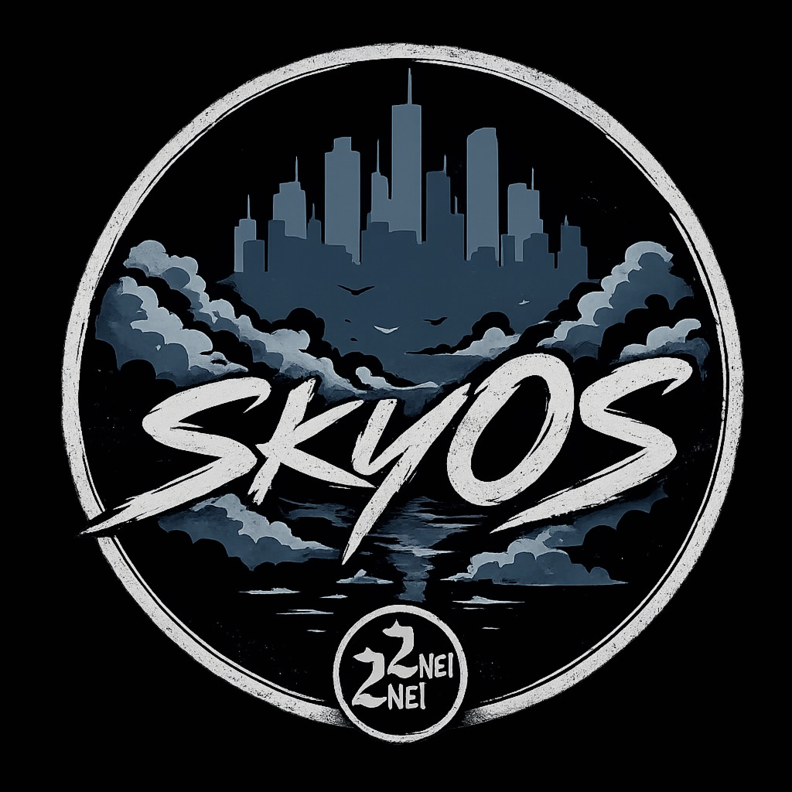
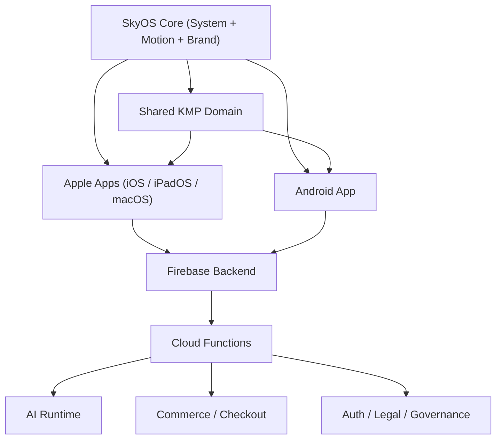

<p align="center">
  
</p>

<h1 align="center">SkyOS</h1>
<p align="center">
  Das zentrale Betriebskern-System fuer AI, Music, Video und Commerce auf <strong>macOS, iOS und Android</strong>.
</p>

<p align="center">
  
  
  
</p>

---

## Hero

SkyOS ist das Fundament dieses Projekts: Design-Sprache, Betriebslogik, Motion, Brand-System und Runtime laufen aus einem Kern.
Alle Produktflaechen sind Teil eines Systems, nicht lose Einzel-Apps:

- `Home` als Einstieg in die SkyOS-Welt
- `AI` und `Agent` als produktiver Workspace
- `Music` als kuratierte `ZweiZwei / 22`-Zone
- `Video` als fokussierte Content-Surface
- `Shop` als `Skydown x 22`-Commerce-Pfad

## Visual Identity

<p align="center">
  
  
  
</p>

| Marke | Rolle | Primärer Einsatz |
| --- | --- | --- |
| `SkyOS` | Systemkern, Plattformidentität, App-Icon | Home/System, Launcher, Architektur |
| `Skydown` | Produktidentität | AI, Video, Core-Produktkommunikation |
| `ZweiZwei / 22` | Music-Identität | Music-Screens, Artist-/Release-Kontext |
| `Skydown x 22` | Merch-Kollaboration | Shop, Produkt- und Commerce-Surfaces |

## At A Glance

| Bereich | Premium-Kriterium | Status |
| --- | --- | --- |
| Branding | SkyOS-first mit klarer Sub-Brand-Trennung | `PASS` |
| Icon-System | iOS, iPadOS, macOS, Android vollständig | `PASS` |
| Store-Readiness | Listing + Screenshot-Playbook vorhanden | `PASS` |
| Plattform-Konsistenz | SwiftUI + Compose + KMP kohärent | `PASS` |

## App Icon Gallery

Aktives Master-Icon (derzeit im Projekt ausgerollt):

<p align="center">
  
</p>

Premium-Varianten (A/B/C) für Brand- und Store-Testing:

<p align="center">
  
  
  
</p>

| Variante | Stil | Einsatzempfehlung |
| --- | --- | --- |
| `A` Original Premium | maximal markennah, aus Originalwelt abgeleitet | Brand-Konsistenz / Default-Baseline |
| `B` Minimal Legacy | ruhiger, reduzierter Look | kleine Größen, klare Launcher-Lesbarkeit |
| `C` Luxury Dark | kontraststark, cineastisch | Premium-Kampagnen / Store-Visual-Tests |

> Empfehlung: `A` als stabile Release-Baseline, `B/C` für kontrollierte Store-Experimente.

## Vision

SkyOS steht fuer eine Premium-Produktplattform mit ruhiger, klarer und vertrauenswuerdiger UX.  
Ziel ist eine konsistente Erfahrung ueber Desktop und Mobile, bei der alle Features technisch und visuell aus einem System kommen.

## Projektstatus

| Bereich | Stand |
| --- | --- |
| Produktstatus | `GO mit Legal-Review-Vorbehalt` |
| Branch | `main` |
| Plattform-Fokus | `macOS`, `iOS`, `Android` |
| Letzter dokumentierter Smoke | Android `PASS`, iOS `PASS` |
| Design-Prinzip | SkyOS-first, systemisch statt modular |

## Quick Navigation

| Fokus | Dokument |
| --- | --- |
| Architektur | [docs/architecture.md](docs/architecture.md) |
| Branding | [docs/branding.md](docs/branding.md) |
| iOS | [docs/ios.md](docs/ios.md) |
| Android | [docs/android.md](docs/android.md) |
| Store Listing | [docs/store-listing.md](docs/store-listing.md) |
| Screenshot-System | [docs/store-screenshots.md](docs/store-screenshots.md) |
| Release | [docs/release-checklist.md](docs/release-checklist.md) |

## Feature Cards

| Bereich | Rolle im System | Ergebnis |
| --- | --- | --- |
| SkyOS Core | Betriebskern, Design, Motion, Branding | Einheitliche Produktidentitaet |
| AI / Agent | Produktiver Workspace fuer Assistenz und Ausfuehrung | Klarer Kontext, Antworten, Status |
| Music (`ZweiZwei / 22`) | Eigenstaendige Musikidentitaet innerhalb von SkyOS | Artist- und Release-Fokus |
| Video | Fokusflaeche fuer Clips und Visuals | Ruhiger Medienfluss ohne Feed-Chaos |
| Shop (`Skydown x 22`) | Commerce-Pipeline von Produkt bis Checkout | Vertrauenswuerdiger Kaufpfad |
| Legal / Trust | Transparenz, Governance, Richtlinien | Release-faehige, saubere Kommunikation |

## Architekturuebersicht



## Tech Stack

| Layer | Technologie |
| --- | --- |
| Apple Client | SwiftUI, Xcode, Asset Catalog (`.xcassets`) |
| Android Client | Kotlin, Jetpack Compose, Android Gradle |
| Shared Domain | Kotlin Multiplatform (`shared/`) |
| Backend | Firebase Auth, Firestore, Storage, Cloud Functions |
| Dokumentation | Markdown, Store/Release/Legal-Dokumente |

## Plattformen und Build

| Plattform | Modul | Build-Referenz |
| --- | --- | --- |
| macOS / iOS | `Skydown App.xcodeproj` | `xcodebuild` mit passender Destination |
| Android | `androidApp/` | `./gradlew :androidApp:compileDebugKotlin` |
| Shared | `shared/` | Wird in Apple- und Android-Builds eingebunden |
| Functions | `functions/` | `npm ci --prefix functions` und `npm test --prefix functions` |

```bash
# Backend
npm ci --prefix functions
npm test --prefix functions

# Android
./gradlew :androidApp:compileDebugKotlin

# Apple (iOS Simulator Beispiel)
xcodebuild -project "Skydown App.xcodeproj" -scheme "Skydown App" -configuration Debug -destination "generic/platform=iOS Simulator" build
```

## App-Icons und Branding

SkyOS ist die dominante Icon- und Systemidentitaet fuer alle Plattformen.

| Asset | Zweck | Pfad |
| --- | --- | --- |
| SkyOS Logo (Original) | README / Dokumentation | `docs/assets/skyos-logo-original.png` |
| Skydown Logo (Original) | Produktmarke | `docs/assets/skydown-logo-original.png` |
| ZweiZwei Logo (Original) | Music-Marke | `docs/assets/zweizwei-logo-original.png` |
| SkyOS App Icon Master | Masterquelle fuer Launcher-Assets | `docs/assets/skyos-app-icon.png` |
| SkyOS Brand Mark | In-App Markierung | `Skydown App/Assets.xcassets/SkyOSBrandMark.imageset/skyos-mark.png` |
| Skydown Wordmark | Produkt-/Operator-Kontext | `Skydown App/Assets.xcassets/SkydownBrandLogo.imageset/skydown-logo.png` |
| ZweiZwei Wordmark | Music-Kontext | `Skydown App/Assets.xcassets/ZweiZweiBrandLogo.imageset/zweizwei-logo.png` |
| 22 Mark | Music-/Creative-Markierung | `Skydown App/Assets.xcassets/Sky22BrandLogo.imageset/22-logo.png` |

Technischer Audit-Status:

- Apple `AppIcon.appiconset` ist vollstaendig (inkl. `ios-marketing` 1024x1024)
- Apple `AppIcon.appiconset` enthaelt auch `mac`-Slots fuer Dock/Finder-Qualitaet
- iPhone- und iPad-Icongroessen entsprechen den erwarteten Pixelmassen
- Android `mipmap-mdpi` bis `mipmap-xxxhdpi` sind korrekt skaliert
- Adaptive Icons (`ic_launcher.xml`, `ic_launcher_round.xml`) sind korrekt verdrahtet
- Foreground-Source fuer Android ist versioniert (`drawable-nodpi/ic_launcher_foreground_src.png`)

## README Navigation

- [Architektur](docs/architecture.md)
- [Branding](docs/branding.md)
- [iOS](docs/ios.md)
- [Android](docs/android.md)
- [Backend](docs/backend.md)
- [Deployment](docs/deployment.md)
- [Store-Dokumente](docs/store/README.md)
- [Store Listing](docs/store-listing.md)
- [Store Screenshots](docs/store-screenshots.md)
- [Release-Checkliste](docs/release-checklist.md)

## Roadmap

| Phase | Fokus | Zielbild |
| --- | --- | --- |
| R1 - Stabilisierung | Build, Smoke, Legal-Konsistenz | Vollstaendig release-faehiger Hauptzweig |
| R2 - Plattform-Finish | macOS/iOS/Android QA, Asset-Schliff | Ein konsistentes SkyOS-Produkt auf allen Plattformen |
| R3 - Produkttiefe | AI-Workflows, Commerce, Membership | Hoehere Conversion und klarere Nutzerfuehrung |
| R4 - Operativer Ausbau | Monitoring, Support, Governance | Belastbarer Produktionsbetrieb |

## Release und Compliance

Der technische Stand ist release-nah. Vor oeffentlicher Auslieferung bleibt die juristische Finalfreigabe fuer alle Rechtstexte verpflichtend.

Relevante Dokumente:

- `docs/legal/privacy.md`
- `docs/legal/terms.md`
- `docs/legal/imprint.md`
- `docs/legal/AI_USAGE_NOTICE.md`
- `docs/legal/SUBSCRIPTION_TERMS.md`

## Lizenz

Aktuell projektspezifisch. Falls benoetigt, Lizenzdatei zentral in `LICENSE` ergaenzen.
