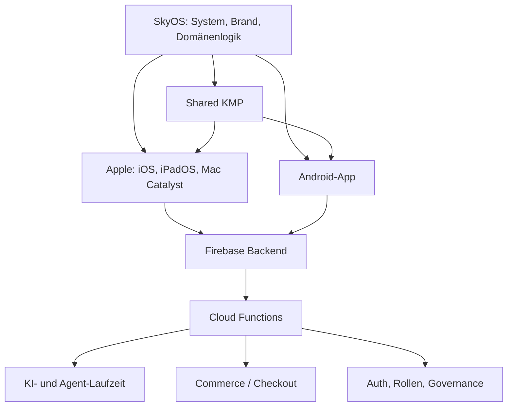

<p align="center">
  
</p>

<h1 align="center">SkyOS</h1>

<p align="center">
  Native Productivity- und Automation-Plattform: Reminder, Tasks, Notes, KI-Assistenz, Creator-Medien,
  Commerce und vertrauenswürdige Kontensteuerung — iOS, iPadOS, Android und Mac Catalyst.
</p>

<p align="center">
  
  
  
</p>

---

SkyOS ist der operative Kern hinter der Skydown-App: gemeinsame Domänenlogik (Kotlin Multiplatform), native Apple- und Android-Clients und ein Firebase-Backend (Auth, Firestore, Storage, Cloud Functions, App Check).

Diese README ist absichtlich umfassend, aber für schnellen Zugriff strukturiert: zuerst Orientierung und Einstieg, danach technische Tiefe.

## Auf einen Blick

- **Was ist das hier?** Produkt + Plattform + Betriebsdokumentation in einem Monorepo.
- **Für wen?** Entwickler, Reviewer, Betrieb, Produktverantwortliche.
- **Was ist der schnellste Einstieg?** Siehe `Schnellnavigation` und dann den passenden Pfad.

## Schnellnavigation

| Ich will... | Direktlink |
| --- | --- |
| Projekt und Architektur in 3 Minuten verstehen | [Status und Release-Reife](#status-und-release-reife), [Architekturüberblick](#architekturüberblick), [Projektstruktur](#projektstruktur) |
| Lokal starten und bauen | [Voraussetzungen](#voraussetzungen), [Erstinstallation](#erstinstallation-auf-neuer-maschine), [Lokale Entwicklung](#lokale-entwicklung) |
| Productivity-Launch (Reminder, Tasks, Notes, Activepieces) | [Release-Übersicht](#release-übersicht-productivity--automation-launch) |
| Release sicher durchführen | [Production-Checkliste](#production-checkliste), [App-Store-Release-Workflow](#app-store-release-workflow-verbindlich), [Deployment und Rollback](#deployment-und-rollback) |
| Sicherheit und Compliance prüfen | [Sicherheit](#sicherheit), [Rollen und Berechtigungen](#rollen-und-berechtigungen), [Recht, Datenschutz, KI-Transparenz](#recht-datenschutz-ki-transparenz) |
| Tiefer in Fachthemen einsteigen | [Weiterführende Dokumentation](#weiterführende-dokumentation) |

## Release-Übersicht (Productivity & Automation Launch)

Kurzfassung für Store-, Backend- und Integrations-Release: dieselbe Substanz steht ausführlicher weiter unten und in `docs/` — hier die **kompakte Checkliste**.

### Kurzbeschreibung

**Skydown** (App) läuft auf **SkyOS** (Systemkern): native iOS-/Android-/Catalyst-Clients, gemeinsame KMP-Domäne, Firebase (Auth, Firestore, Storage, Functions, App Check). Dieser Launch fokussiert **Reminder inkl. Push**, **Tasks**, **Notes** und die **Activepieces-HTTP-Workflows** als serverseitige Ergänzung zur App.

### Live (dieser Release)

| Bereich | Stand |
| --- | --- |
| **Reminder + Push** | End-to-end: App/Firestore → `processDueReminders` (alle 5 Min.) → FCM an registrierte Geräte |
| **Tasks** | In der App nutzbar; optional per `createTaskFromWorkflow` (Body-Feld `uid` = Firebase-UID) |
| **Notes** | In der App nutzbar; optional per `createNoteFromWorkflow` |
| **Activepieces** | Drei HTTPS-`onRequest`-Functions mit Secret-Header; Detailvertrag: [docs/workflow-http-api-activepieces.md](docs/workflow-http-api-activepieces.md) |
| **Memory / breitere Automation** | Bewusst **nicht** als vollständig live ausgewiesen — siehe „Coming next“ in App-Copy, FAQ und Store-Listing |

### Setup (lokal)

1. JDK **17**, Node **22** (für `functions/`), Xcode bzw. Android SDK.  
2. Firebase-Clientdateien zum Projekt passend lassen (`GoogleService-Info.plist`, `google-services.json` — **keine** produktiven Secrets committen).  
3. Monorepo-Gate: `./scripts/ci_local_gate.sh` (Varianten `--shared-only`, `--android-only`, `--functions-only`).

### Firebase Functions deployen

```bash
cd functions
npm ci
npm run build && npm test
cd ..
firebase deploy --only functions
```

Selektive Einzelfunction-Deploys nach Bedarf siehe [docs/deployment.md](docs/deployment.md).

### Firestore Rules deployen

```bash
firebase deploy --only firestore:rules
```

Bei Indexänderungen zusätzlich `firebase deploy --only firestore:indexes` ([firestore.indexes.json](firestore.indexes.json)).

### Activepieces

- Kanonische Schritt-für-Schritt- und Payload-Doku: [docs/workflow-http-api-activepieces.md](docs/workflow-http-api-activepieces.md).  
- Jeder Request: **`POST`**, Header **`x-skyos-workflow-secret`**, JSON-Body mit **`uid`** (Zielnutzer), **`source`: `"activepieces"`** (validiert im Backend).  
- Beispiel-JSON: [docs/automation/json-samples/reference-http-payloads/](docs/automation/json-samples/reference-http-payloads/).

### Secrets (Workflow)

| Name | Rolle |
| --- | --- |
| **`SKYOS_WORKFLOW_SECRET`** | Shared Secret für alle drei Workflow-Endpoints; Firebase Secret + gleicher Wert im Activepieces-HTTP-Schritt |

Setzen: `firebase functions:secrets:set SKYOS_WORKFLOW_SECRET`, danach Functions-Deploy. Vollständige Secret-Liste der Functions: Abschnitt [Environment-Variablen und Secrets](#environment-variablen-und-secrets).

### Mobile Builds (Kurz)

| Plattform | Typischer Check |
| --- | --- |
| **Android** | `./gradlew :androidApp:assembleDebug` (Debug); Release: [scripts/android_release_gate.sh](scripts/android_release_gate.sh) |
| **iOS** | Xcode-Archiv für Store; schneller Syntax-/Compile-Check z. B. `xcodebuild -project "Skydown App.xcodeproj" -scheme "Skydown App" -destination "generic/platform=iOS Simulator" -sdk iphonesimulator CODE_SIGNING_ALLOWED=NO build` (wie CI) |

### Aktueller Status (Repository)

Version **1.0.0**, iOS `CURRENT_PROJECT_VERSION=10018`, Android `versionCode=10019` — siehe [Status und Release-Reife](#status-und-release-reife). **Node 22** ist für Functions die offizielle Engine; lokale Abweichung kann `EBADENGINE`-Warnungen erzeugen — für Release-Builds Node 22 nutzen.

## Transparenz und Verantwortlichkeiten

| Wer / Was | Inhalt |
| --- | --- |
| **Diese README** | Technischer Ist-Stand der Codebasis. Sie gibt Orientierung und verweist auf die kanonischen Detaildokumente. |
| **Betreiber / Owner** | `Nguyen Phuong Ngoc Anh (Yang D. Nash - Skydown)`, Erich-Plate-Weg 44, 22419 Hamburg, Deutschland; Support: `skydownent@gmail.com`. |
| **Release-Ablauf** | Verbindliche Schrittfolge: [docs/release/app-release-workflow.md](docs/release/app-release-workflow.md). Ergänzend: [Release-Checkliste](docs/release-checklist.md), [Store-Upload-Runbook](docs/release/store-upload-runbook.md), [manuelle Smokes](manual-test-checklist.md). |
| **Rechtstexte und Außenwirkung** | Rechtswirksame Inhalte liegen in [docs/legal/](docs/legal/) und [site/](site/). Inhaltliche Verantwortung und Aktualisierung liegen beim Owner/Unternehmer der Plattform. |
| **Store-Einreichungen** | Accounts, Verträge, Richtlinien-Compliance und finale Inhalte sind Organisationspflichten; die technische Basis liefert dieses Repo. |
| **Sicherheits- und Kostenentscheidungen** | Kritische Aktionen (Payments, Rollen, KI-Hochlast, Public-Mirror) brauchen bewusstes Operations-Handling, siehe [Sicherheit](#sicherheit), [Deployment und Rollback](#deployment-und-rollback), [docs/owner-admin.md](docs/owner-admin.md). |
| **Datenverarbeitung** | Bewertung gegenüber Endnutzern erfolgt über Produkt, Policies und Anbieter-Verträge; technische Einordnung in [docs/compliance/README.md](docs/compliance/README.md) und [docs/backend.md](docs/backend.md). |

**Kurz:** Technik ist hier transparent dokumentiert. Rechts- und Plattformverantwortung bleibt bei der Organisation, die das Produkt betreibt.

## Inhaltsverzeichnis

<details>
<summary>Vollständige Navigation ausklappen</summary>

- [Transparenz und Verantwortlichkeiten](#transparenz-und-verantwortlichkeiten)
- [Status und Release-Reife](#status-und-release-reife)
- [Grenzen der README und bewusst offene Punkte](#grenzen-der-readme-und-bewusst-offene-punkte)
- [Kritische Daten- und Steuerflüsse](#kritische-daten--und-steuerflüsse)
- [Funktionen](#funktionen)
- [Tech-Stack](#tech-stack)
- [Architekturüberblick](#architekturüberblick)
- [Projektstruktur](#projektstruktur)
- [Voraussetzungen](#voraussetzungen)
- [Erstinstallation auf neuer Maschine](#erstinstallation-auf-neuer-maschine)
- [Environment-Variablen und Secrets](#environment-variablen-und-secrets)
- [Lokale Entwicklung](#lokale-entwicklung)
- [Datenmodell, „Migrationen“ und Indizes](#datenmodell-migrationen-und-indizes)
- [Seed-Daten und initiale Konfiguration](#seed-daten-und-initiale-konfiguration)
- [Authentifizierung](#authentifizierung)
- [API- und Integrationsdokumentation](#api--und-integrationsdokumentation)
- [Workflows (Activepieces, Automation, Entwicklung)](#workflows-activepieces-automation-und-entwicklung)
  - [Activepieces-HTTP-API (extern)](#activepieces-http-api-extern)
  - [Automation-Konfiguration in Firestore](#automation-konfiguration-in-firestore)
  - [Repository-Workflow: PR, CI, Release](#repository-workflow-pr-ci-release)
- [Datei-Uploads und Storage](#datei-uploads-und-storage)
- [Zahlungen und Webhooks](#zahlungen-und-webhooks)
- [E-Mail und Benachrichtigungen](#e-mail-und-benachrichtigungen)
- [Tests](#tests)
- [Linting und statische Analyse](#linting-und-statische-analyse)
- [Formatierung und Code-Stil](#formatierung-und-code-stil)
- [Builds](#builds)
- [Continuous Integration](#continuous-integration)
- [Deployment und Rollback](#deployment-und-rollback)
- [Production-Checkliste](#production-checkliste)
- [App-Store-Release-Workflow (verbindlich)](#app-store-release-workflow-verbindlich)
- [Sicherheit](#sicherheit)
- [Performance](#performance)
- [Logging, Monitoring, Fehleranalyse](#logging-monitoring-fehleranalyse)
- [Rollen und Berechtigungen](#rollen-und-berechtigungen)
  - [Die vier Benutzerrollen](#die-vier-benutzerrollen)
  - [UserQuotaPlan und Kontingente](#userquotaplan-und-kontingente)
  - [Firebase Custom Claims und Server-Gates](#firebase-custom-claims-und-server-gates)
  - [Feinrechte im User-Dokument](#feinrechte-im-user-dokument)
  - [Owner-Konto und E-Mail-Auflösung](#owner-konto-und-e-mail-auflösung)
- [Admin- und Owner-Betrieb](#admin--und-owner-betrieb)
- [Mobile und responsive Verhalten](#mobile-und-responsives-verhalten)
- [Webbrowser und statische Seiten](#webbrowser-und-statische-seiten)
- [Backup und Wiederherstellung](#backup-und-wiederherstellung)
- [Wartung und Betrieb](#wartung-und-betrieb)
- [Beiträge, Git-Workflow und Release-Prozess](#beiträge-git-workflow-und-release-prozess)
- [Changelog](#changelog)
- [Lizenz](#lizenz)
- [Support und Kontakt](#support-und-kontakt)
- [Troubleshooting und typische Fehlerbilder](#troubleshooting-und-typische-fehlerbilder)
- [Weiterführende Dokumentation](#weiterführende-dokumentation)
- [Externe offizielle Dokumentation (Stack)](#externe-offizielle-dokumentation-stack)
- [Marken, App-Icon und Design](#marken-app-icon-und-design)
- [Recht, Datenschutz, KI-Transparenz](#recht-datenschutz-ki-transparenz)

</details>

---

## Status und Release-Reife

Kurz gelesen:

- Versionen stehen konsistent auf `1.0.0`.
- Store-Build-IDs stehen auf iOS `10018` und Android `10019`.
- Release-Ablauf wird zentral im Release-Workflow gepflegt.

| Aspekt | Stand (Repository) |
| --- | --- |
| **Produktversion (Repository-Stand)** | `1.0.0` (`VERSION`, iOS `MARKETING_VERSION`, Android `versionName`) |
| **Build-Identität (Repository-Stand)** | iOS `CURRENT_PROJECT_VERSION=10018`, Android `versionCode=10019` |
| **iOS** | Bundle-ID `com.skydown.ios` — siehe Xcode-Projekt und [docs/ios.md](docs/ios.md) |
| **Android** | Application ID `com.nash.skyos` — siehe [docs/android.md](docs/android.md) |
| **Backend** | Firebase-Projekt in Client-Konfigurationen referenziert; Functions-Paket `skyos-functions@1.0.0` ([functions/package.json](functions/package.json)) |
| **Live-Workflows (laut Doku)** | Reminder inkl. Push, Tasks, Notes, Activepieces-HTTP-Workflow-API; erweiterte „Memory“-Automationen bewusst **nicht** als vollständig live beworben |
| **Lokale Quality Gates** | `./scripts/ci_local_gate.sh` (Shared-Tests, Android lint + detekt, Functions Build + Tests inkl. Rules-Emulator) |
| **App-Store-Release (Ablauf)** | Kanonische Schrittfolge: [docs/release/app-release-workflow.md](docs/release/app-release-workflow.md) — **dort pflegen** bei Prozessänderungen |

Build- und VersionCode-Identität pro Store-Release werden im [Store-Upload-Runbook](docs/release/store-upload-runbook.md) gepflegt; die README führt bewusst kein zweites Zähler-Log.

---

## Grenzen der README und bewusst offene Punkte

Diese README ist bewusst ein Einstieg mit belastbaren Kernfakten. Die folgenden Themen werden nicht vollständig hier gepflegt, sondern in den verlinkten Fachdokumenten:

| Thema | Wo vertieft / wer pflegt |
| --- | --- |
| Staging- oder zweite Firebase-Projekte, exakte `firebase use`-Matrix | Betrieblich pflegen und in [docs/deployment.md](docs/deployment.md) ergänzen |
| Vollständig maschinenlesbare **API-Liste** aller Functions-Exports (OpenAPI) | Entwicklungsteam; fachlich [docs/backend.md](docs/backend.md) |
| Abdeckung aller `process.env`-/Secret-Vorkommen in einer Zeilendokumentation | Laufend Code + `index.js` — bei großen Refactors sinnvoll: Skript oder Sektion in [docs/backend.md](docs/backend.md) |
| Konkrete SLO, Budget-Ziele, verbindliches APM (Sentry etc.) | Betrieb/Google Cloud, sobald gebunden, hier einen Satz nachtragen |
| Pager, Eskalation, On-Call | Internes Runbook, nicht im öffentlichen Repo-Standard |
| Öffentliches Herausgeben: **Lizenzdatei** | Siehe [Lizenz](#lizenz) — betriebliche Entscheidung |

Die Tabelle ersetzt verstreute `TODO:`-Hinweise aus älteren Fassungen. Detail-Lücken gehören in Issues oder in die passenden Dateien unter `docs/`.

---

## Kritische Daten- und Steuerflüsse

Ziel dieser Sektion: die wichtigsten Vertrauenslinien auf einen Blick. Details und Sonderfälle stehen in [docs/architecture.md](docs/architecture.md) und [docs/backend.md](docs/backend.md).

| Fluss | Kurz, technisch, transparent |
| --- | --- |
| **Identität** | Firebase Auth; Client sendet Anfragen mit ID-Token. **Custom Claims** (`role`, `isOwner`, `isAdmin`, `isStaff`) setzt das Backend (`setUserRoleClaims` in [`functions/src/security/roles.js`](functions/src/security/roles.js)); **kanonische Rolle** lebt parallel im **Firestore-**Dokument `users/{uid}` (Sync, Legacy-Fälle — siehe Tests in `functions/tests/roles.sync.test.js`). Doppelboden mit Absicht: *UI darf lügen* — Server nicht. |
| **Productivity (Tasks, Notes, Reminder)** | Inhalt in Firestore gemäß Regeln; **Reminder-Automatik** inkl. zeitgesteuerter Verarbeitung in Functions (siehe `processDueReminders` u. a. in Doku/Backend-Liste). Push: App registriert Token, Weg gemäß Plattform-Dokus. |
| **Activepieces / externe Workflows** | `POST` auf HTTPS-**onRequest**-Function; Geheimnis-Header; fehlendes/falsches Secret → `401`/`500` — **ausführlich:** [Workflows (Activepieces, …)](#workflows-activepieces-automation-und-entwicklung), Fachdoku [workflow-http-api-activepieces.md](docs/workflow-http-api-activepieces.md). |
| **KI- und Agentfähigkeit** | Ausführung **serverseitig** in Functions (siehe `index.js` und [docs/ai-system.md](docs/ai-system.md)), nicht als alleiniger Client-Trust; Nutzungs- und Kostenkontrolle in Backend-Dokus (Usage, Reconciliation). |
| **Merch, Checkout, Zahlung** | Bestelllogik **nicht** allein im Client: Functions (`submitMerchOrder`, Checkout-Start, `stripeMerchWebhook` o. ä.) in Verbindung mit [docs/commerce.md](docs/commerce.md). |
| **Uploads in Storage** | **Kein** freies Hochladen: `requestUploadSlot` und Regeln; Content-Types und Pfade in [storage.rules](storage.rules) + Tests. |
| **Laufzeit-Notbremse** | `system/runtimeConfig` — Lockdown, App-Check-Modus, Budget — siehe [docs/backend.md](docs/backend.md) Abschnitt 5, [docs/owner-admin.md](docs/owner-admin.md). |

**Hinweis zur Backend-Struktur:** Ein großer Teil der Cloud-Functions-Logik liegt in `functions/index.js` (laut `package.json` einziger `main`). Das vereinfacht Deploys, macht Navigation aber schwerer; für Änderungen gezielt suchen und selektiv deployen (siehe [docs/deployment.md](docs/deployment.md)).

---

## Funktionen

Kurzbild:

- Native App-Erfahrung mit Productivity, Media, Commerce und Account/Trust.
- KI- und Integrationslogik ist backendgeführt, nicht rein clientseitig.

| Bereich | Inhalt |
| --- | --- |
| **Home** | Einstieg, Productivity-Snapshot, Quick Actions |
| **KI / Agent** | Assistenz, Visuals, FAQ, Tasks/Notes-Anbindung, serverseitige Agent-Laufzeiten (siehe [docs/ai-system.md](docs/ai-system.md)) |
| **Music / Video** | kuratierte Medien- und Story-Bereiche |
| **Shop / Bestellungen** | Merch (`Skydown x 22`), Warenkorb, Bestellübersicht ([docs/commerce.md](docs/commerce.md)) |
| **Profil / Einstellungen** | Konto, Membership, Support, Rechtliches, Trust-Controls |
| **Productivity** | Reminder (inkl. Push-Pfad), Tasks, Notes; externe Workflows über HTTP (Activepieces) |

Detaillierte Product-Maps: [docs/architecture.md](docs/architecture.md).

---

## Tech-Stack

| Schicht | Technologie |
| --- | --- |
| **Apple-Client** | SwiftUI, Xcode, Asset Catalog (`Skydown App/`) |
| **Android-Client** | Kotlin, Jetpack Compose (`androidApp/`) |
| **Geteilte Domäne** | Kotlin Multiplatform (`shared/`) |
| **Backend** | Firebase: Auth, Firestore, Cloud Storage, Cloud Functions v1/v2, App Check |
| **KI in Functions** | Genkit, Google GenAI / Vertex (siehe Abhängigkeiten in `functions/package.json` und [docs/ai-system.md](docs/ai-system.md)) |
| **Zahlungs- und Store-Anbindung** | u. a. Stripe (Checkout/Webhooks), Shopify Admin/Storefront, App Store / Google Play Subscription-Libs |
| **E-Mail (optional)** | Nodemailer über `SMTP_CONNECTION_URL` |

---

## Architekturüberblick



- **Eindeutige Autorität** für Abrechnung, Rollenwechsel, sensible KI- und Owner-Operationen liegt beim **Backend** (siehe [docs/backend.md](docs/backend.md)).
- **Native Clients** sind „reich“, aber nicht allein vertrauenswürdig — Firestore-**Security Rules** und **Callable Functions** setzen Regeln durch.

---

## Projektstruktur

| Pfad | Zweck |
| --- | --- |
| `Skydown App/` | SwiftUI-App, Ressourcen, `GoogleService-Info.plist` (Firebase-Client) |
| `androidApp/` | Android-App, `google-services.json` |
| `shared/` | KMP-Modul (Domänenmodelle, gemeinsame Logik) |
| `functions/` | Cloud Functions — Einstieg `index.js`, Sicherheit unter `src/security/`, Zahlungen unter `src/payments/` |
| `firestore.rules` / `storage.rules` | Sicherheitsregeln |
| `firestore.indexes.json` | Firestore-Indizes für Abfragen |
| `firebase.json` | Firebase-Projektkonfiguration (Functions, Rules, Indizes) |
| `docs/` | **Kanonische** Fachdokumentation (Architektur, Backend, Stores, Legal, …) |
| `site/` | Statische HTML-Seiten (Privacy, Terms, Support) — **Hosting auf Produktionsdomain vorbereiten** |
| `scripts/` | Build-, CI- und Hilfsskripte (siehe Tabelle unten) |
| `.github/workflows/` | GitHub Actions (CI) |
| `examples/web/` | Beispiele (z. B. App Check) — kein produktives Web-Frontend des Monorepos |

Wichtige Skripte:

| Skript | Zweck |
| --- | --- |
| [scripts/ci_local_gate.sh](scripts/ci_local_gate.sh) | Lokales Gegenstück zu CI: Shared-Tests, Android (lint, detekt, Metadaten), `npm run build` + `npm test` in `functions/` |
| [scripts/android_release_clean_build.sh](scripts/android_release_clean_build.sh) | Sauberer Android-Release-Build |
| [scripts/verify_android_release_artifacts.sh](scripts/verify_android_release_artifacts.sh) | Prüfung vor manuellem Play-Upload |
| [scripts/localization_audit.sh](scripts/localization_audit.sh) | Lokalisierungs-Audit (siehe [docs/deployment.md](docs/deployment.md)) |
| [scripts/android_release_gate.sh](scripts/android_release_gate.sh) | **Strenger** Android-Release-Gate: `android_release_clean_build` + `verify_android_release_artifacts` in einem Lauf; klare „Upload erlaubt / nur so“-Semantik am Ende |
| [scripts/android_merge_strings_from_base.py](scripts/android_merge_strings_from_base.py) | Hilfsskript für String-Merge (Plattform-Workflows) |
| [scripts/pad_skyos_app_icon.py](scripts/pad_skyos_app_icon.py) | Icon-Padding für plattformgerechte Quellen |
| [scripts/e2e-role-crud.mjs](scripts/e2e-role-crud.mjs) | E2E-Tests gegen Firebase (siehe [Tests](#tests)) — **nicht** in `ci_local_gate` |

---

## Voraussetzungen

| Werkzeug | Version / Hinweis |
| --- | --- |
| **Xcode** | aktuelles iOS-SDK, für SwiftUI- und Archiv-Builds |
| **Android Studio** / **Android SDK** | `ANDROID_HOME` setzen, falls CLI-Tools (z. B. `aapt2`) genutzt werden |
| **JDK** | 17 (Gradle, KMP, Android) |
| **Node.js** | **22** (laut [functions/package.json](functions/package.json) `engines.node`; lokal ggf. per `nvm`/`fnm` strikt 22 nutzen) |
| **Firebase CLI** | Emulatoren, `firebase deploy`, [Firebase-Dokumentation](https://firebase.google.com/docs/cli) |
| **Ruby/Fastlane** | optional für Android/iOS-Store-Automatisierung (siehe Store-Dokus) |

---

## Erstinstallation auf neuer Maschine

1. **Repository klonen** und in das Wurzelverzeichnis wechseln.
2. **JDK 17** und **Node 22** installieren; optional Android SDK und Xcode Command Line Tools.
3. **Firebase-Client-Dateien:** `GoogleService-Info.plist` bzw. `google-services.json` müssen zu eurem Firebase-Projekt passen (siehe Firebase-Konsole). Keine echten **Secrets** committen.
4. **Keystore (nur Release):** [keystore.properties.example](keystore.properties.example) nach `keystore.properties` kopieren und befüllen, **oder** die gleichen Schlüssel als **Umgebungsvariablen** setzen (siehe [androidApp/build.gradle.kts](androidApp/build.gradle.kts): `SKYOS_UPLOAD_*` bzw. Legacy `SKYDOWN_UPLOAD_*`).
5. **Lokale Umgebung:** [`.env.example`](.env.example) als Leitfaden; Werte in Shell, Secret Store oder Firebase Secrets — nicht ins Git.
6. **Qualität prüfen:**

```bash
./scripts/ci_local_gate.sh
```

7. Tiefere Plattform-Schritte: [docs/ios.md](docs/ios.md), [docs/android.md](docs/android.md), Backend: [docs/backend.md](docs/backend.md).

---

## Environment-Variablen und Secrets

### Zentrale Vorlage

Die Datei [`.env.example`](.env.example) listet **typische** Variablen für lokale QA, Android-Signing und Cloud Functions. **Nie** produktive Werte versionieren.

### Android Release-Signing

| Variable | Bedeutung |
| --- | --- |
| `SKYOS_UPLOAD_STORE_FILE` | Pfad zur JKS-Datei |
| `SKYOS_UPLOAD_STORE_PASSWORD` | Keystore-Passwort |
| `SKYOS_UPLOAD_KEY_ALIAS` | Key-Alias |
| `SKYOS_UPLOAD_KEY_PASSWORD` | Key-Passwort |

CI-/CD-Details abweichend von [docs/deployment.md](docs/deployment.md): dort und in eurer Pipeline-Doku pflegen (siehe auch [Grenzen der README](#grenzen-der-readme-und-bewusst-offene-punkte)).

### In Cloud Functions hinterlegte Secrets (`defineSecret` in `functions/index.js`)

Diese Namen werden als **Firebase Secrets** (Secret Manager) gebunden — siehe [Firebase: Umgebung und Secrets](https://firebase.google.com/docs/functions/config-env):

- `SMTP_CONNECTION_URL`
- `STRIPE_SECRET_KEY`
- `STRIPE_WEBHOOK_SECRET`
- `SHOPIFY_ADMIN_ACCESS_TOKEN`
- `MANUS_API_KEY`
- `XAI_API_KEY`
- `AGENT_RUN_CALLBACK_SECRET`
- `SKYOS_WORKFLOW_SECRET`

### Zusätzliche Umgebungsvariablen (Auswahl, Code-bezogen)

| Variable | Verwendung |
| --- | --- |
| `SKYOS_IOS_APP_BUNDLE_ID` | iOS-Bundle für Store-/Backend-Logik; Default im Code: `com.skydown.ios` |
| `SKYOS_WORKFLOW_SECRET` | Secret-Param fuer Activepieces-HTTP-Endpoints und lokaler Emulator-Fallback; `WORKFLOW_API_SECRET` wird nur noch als Legacy-Laufzeit-Fallback gelesen |
| `STRIPE_SECRET_KEY` / `STRIPE_WEBHOOK_SECRET` | Entwicklungs-Fallbacks neben Secrets |
| `SHOPIFY_STORE_DOMAIN` / `SHOPIFY_ADMIN_ACCESS_TOKEN` | Shop-Konfiguration |
| `GROK_AGENT_MODEL` | Modell-Override; Default: `grok-2-latest` (siehe `functions/index.js`) |
| `GCLOUD_PROJECT` / `GOOGLE_CLOUD_PROJECT` | Laufzeit-Projektkontext (Google Cloud) |
| `BILLING_BUDGET_TOPIC` | Optional; Pub/Sub-Topic, Default im Code: `billing-budget-alerts` |
| `ORDER_NOTIFICATION_TO` / `ORDER_NOTIFICATION_FROM` | E-Mail-Benachrichtigungen Bestellungen |
| `SKYOS_SUPPORT_EMAIL` / `SKYDOWN_SUPPORT_EMAIL` | Optional; Default-Support-Inbox in Functions (`DEFAULT_SUPPORT_EMAIL`), im Repo abgestimmt mit `PlatformContactEmails` im Shared-Modul |

Vollständige, **automatisch** erzeugbare Env-Liste existiert im Repo nicht; bei Refactors von `functions/index.js` lohnt ein Skript oder ein Block in [docs/backend.md](docs/backend.md) (siehe [Grenzen](#grenzen-der-readme-und-bewusst-offene-punkte)).

### Owner-E-Mail (Server)

- `SKYOS_OWNER_EMAIL` oder `SKYDOWN_OWNER_EMAIL` — Logik in [functions/src/security/constants.js](functions/src/security/constants.js); fester technischer Default nur als Fallback, **für Betrieb muss explizit gesetzt werden**.
- `SKYOS_SUPPORT_EMAIL` oder `SKYDOWN_SUPPORT_EMAIL` — optional; Default-Support-Inbox (`DEFAULT_SUPPORT_EMAIL` in derselben Datei), abgestimmt mit [PlatformContactEmails.kt](shared/src/commonMain/kotlin/com/skydown/shared/model/PlatformContactEmails.kt).

---

## Lokale Entwicklung

### Monorepo-Gate (empfohlen vor jedem größeren Commit)

```bash
./scripts/ci_local_gate.sh
# Varianten: --shared-only, --android-only, --functions-only
```

Enthält u. a.: `:shared:allTests`, Android `:androidApp:lintDebug` + `detektAll` + KMP-Metadaten, `npm ci` + `npm run build` + `npm test` in `functions/`.

### Android (Kurz)

- Öffnen in **Android Studio**, run auf Emulator oder Gerät.
- Ohne Keystore: normale **Debug**-Builds. Release siehe [Builds](#builds).

### iOS (Kurz)

- `Skydown App.xcodeproj` in Xcode öffnen, passendes Team/Signierung wählen für **Distribution**.

### Firebase Functions lokal (optional)

Im Verzeichnis `functions/` (siehe [functions/package.json](functions/package.json)):

| Script | Befehl | Zweck |
| --- | --- | --- |
| `build` | `npm run build` | `node --check index.js` (Syntax) |
| `lint` | `npm run lint` | identisch zu `build` |
| `test` | `npm test` | `test:node` + `test:rules` (Emulator) |
| `serve` | `npm run serve` | `firebase emulators:start --only functions` |
| `deploy` | `npm run deploy` | `firebase deploy --only functions` |

Vollständige Befehlskette laut `package.json`:

- `test:node`: `node --test` auf ausgewählte Sicherheits- und Rollen-Tests
- `test:rules`: Firestore- und Storage-**Emulatoren** + alle `tests/**/*.test.js`

**Hinweis:** Es gibt **kein** `package.json` in der **Repository-Wurzel**; Node bezieht sich ausschließlich auf `functions/`.

---

## Datenmodell, „Migrationen“ und Indizes

Es gibt **keine** klassischen SQL-Migrationen (z. B. Alembic/Flyway). Stattdessen:

| Artefakt | Bedeutung | Deploy |
| --- | --- | --- |
| `firestore.rules` | Autorisationslogik in Firestore | `firebase deploy --only firestore:rules` |
| `storage.rules` | Storage-Autorisationslogik | `firebase deploy --only storage` (oder gebündelt, siehe [docs/deployment.md](docs/deployment.md)) |
| `firestore.indexes.json` | Zusammengesetzte Indizes | `firebase deploy --only firestore:indexes` |

Fehlende Indizes meldet die Firebase-Konsole; Schema-Evolution erfolgt **inkrementell** über App- und Functions-Releases. Überblick über Sammlungen: [docs/backend.md](docs/backend.md). Ein **zweites Staging-Projekt** ist in dieser README **nicht** festgeschrieben — wo es existiert: URLs, `firebase use` und Deploy-Disziplin intern festhalten ([Grenzen](#grenzen-der-readme-und-bewusst-offene-punkte)).

---

## Seed-Daten und initiale Konfiguration

Es liegt **kein** dediziertes SQL-**Seed-**Script vor. Viele Konfigurationen laufen über **Firestore-Dokumente** (z. B. `appConfig/shopifyMerch`, `adminConfig/…`, `system/runtimeConfig`).

- Initiale Werte: über **Firebase-Konsole**, **Owner-Flows** in der App oder **Cloud Functions** (Bootstrap).
- **Betreiber** sollten kritische Pfade in [docs/owner-admin.md](docs/owner-admin.md) nachvollziehen.

---

## Authentifizierung

- **Benutzer:** Firebase Auth (E-Mail, ggf. weitere Provider laut Produkteinstellung) — technische Details in [docs/backend.md](docs/backend.md) und [docs/ios.md](docs/ios.md) / [docs/android.md](docs/android.md).
- **Rollen und Kontingente:** alle vier Rollen, `UserQuotaPlan`, Claims und Feinrechte — [Rollen und Berechtigungen](#rollen-und-berechtigungen).
- **Custom Claims:** `role`, `isOwner`, `isAdmin`, `isStaff` (Bedeutung und `assertAdmin` vs. Subadmin — siehe oben); Synchronisation u. a. über `syncCurrentUserClaims` und `setUserRoleClaims` (siehe Tests in `functions/tests/`).
- **App Check:** betrieblich wichtig; Modus abhängig von `system/runtimeConfig` (Enforce/Monitor) — [docs/backend.md](docs/backend.md) und Sicherheits-Tests in `functions/tests/`.

Bei **Auth-Fehlern** in der App: Token erneuern, Uhrzeit prüfen, App-Check-Provider in Firebase, Bundle-ID/Package-Name mit Firebase-Projekt abgleichen (siehe [Troubleshooting](#troubleshooting-und-typische-fehlerbilder)).

---

## API- und Integrationsdokumentation

| Schnittstelle | Dokumentation |
| --- | --- |
| **Activepieces / HTTP-Workflows** (Reminder, Task, Note) | [docs/workflow-http-api-activepieces.md](docs/workflow-http-api-activepieces.md) — Header `x-skyos-workflow-secret` |
| **Callables / interne API-Oberfläche** | Überblick in [docs/backend.md](docs/backend.md); **keine** maschinell gepflegte OpenAPI-Datei im Repo |
| **Beispiel App Check (Web-ähnlich)** | [examples/web/firebase-app-check.example.js](examples/web/firebase-app-check.example.js) — Referenz, nicht das Produkt-UI |

Eine zentrale **OpenAPI-** oder **AsyncAPI-**Datei für alle Callables **existiert nicht**; fachlich genügen [docs/backend.md](docs/backend.md) und Code-Suche, bis bei Bedarf eine generierte Doku eingeführt wird ([Grenzen](#grenzen-der-readme-und-bewusst-offene-punkte)).

### Externe Dienste (Kurzüberblick)

| Dienst | Einsatzzweck |
| --- | --- |
| **Google Firebase** | Auth, Firestore, Storage, Functions, App Check |
| **Google Cloud** | Vertex / GenAI je nach Konfiguration, Pub/Sub (Budget) |
| **Shopify** | Katalog, Merch, Store-Integrationen |
| **Stripe** | Hosted Checkout, Webhooks (Merch) |
| **E-Mail-Provider** | via SMTP-URL in Secret |
| **xAI / weitere KI-Provider** | ggf. über konfigurierte API-Keys — siehe [docs/ai-system.md](docs/ai-system.md) |
| **Apple App Store / Google Play** | Abo-Sync, siehe [docs/commerce.md](docs/commerce.md) |

---

## Workflows (Activepieces, Automation, Entwicklung)

Hier **explizit** getrennt: (1) **externe** Server-zu-Server-Workflows über **Activepieces** (oder vergleichbare HTTP-Orchestrierer), (2) **interne** Konfiguration, *welche* Webhook-/Flow-Endpunkte die Plattform für Owner bzw. einzelne Nutzer nutzt, (3) der **Entwicklungs- und Review-Workflow** in diesem Repository.

Kanonische Detaildoku für (1) und (2) fachlich: [docs/workflow-http-api-activepieces.md](docs/workflow-http-api-activepieces.md) und [docs/backend.md](docs/backend.md) (Sammlungen `adminConfig`).

### Activepieces-HTTP-API (extern)

Diese **drei** HTTPS-Endpoints werden als **Cloud Functions** `onRequest` bereitgestellt; sie sind **nicht** für Browser-Mashups gedacht, sondern für **serverseitige** Aufrufer, die im JSON-Body die **Firebase-`uid`** des Zielnutzers mitsenden (kein anonymer Firestore-Client-Zugriff).

| Export-Name (Function) | Wirkung (Kurz) | Ziel-Daten (laut Doku) |
| --- | --- | --- |
| `createReminderFromWorkflow` | legt Reminder an | `users/{uid}/reminders/{id}`, `status=scheduled`, Reminder-Push folgt über `processDueReminders` |
| `createTaskFromWorkflow` | legt Task an | `users/{uid}/tasks/{id}`, u. a. `source=activepieces` |
| `createNoteFromWorkflow` | legt Notiz an | `users/{uid}/notes/{id}` |

**Basis-URL (Muster):**

```text
https://us-central1-<firebase-project-id>.cloudfunctions.net/<functionExportName>
```

`us-central1` ist die in eurem Setup übliche Region; bei abweichendem Functions-Region-Setup die tatsächliche **Deploy-URL** aus der **Google Cloud Console** bzw. Firebase nehmen.

**Vertrag (Security):**

| Vorgabe | technische Umsetzung im Code |
| --- | --- |
| Nur `POST` | andere Methoden → `405` + `method_not_allowed` |
| Geheimnis-Header | exakt **`x-skyos-workflow-secret`** (Kleinbuchstaben, Bindestriche wie in Doku und Code) |
| Geheimnis-Quelle | Firebase Secret `SKYOS_WORKFLOW_SECRET` (oder Laufzeit-`process.env` gleichnamig); fehlendes Secret in Prod → `500` + `workflow_secret_missing` |
| Abgleich | `crypto.timingSafeEqual` auf Buffer — Länge und Inhalt zeitkonstant (siehe `isSecretMatch` in `functions/index.js`) |

**Secret setzen und deployen (Beispiel, Operator):**

```bash
firebase functions:secrets:set SKYOS_WORKFLOW_SECRET
firebase deploy --only functions
```

**Erwartbare HTTP-Antworten (Auszug):** Erfolg `200` mit JSON `ok: true` und `reminderId` / `taskId` / `noteId`; typische Fehler: `400` (Body), `401` (Header), `405` (Methode), `500` (Secret nicht provisioniert). Vollständige Tabelle und **Beispiel-JSON-Bodies:** [docs/workflow-http-api-activepieces.md](docs/workflow-http-api-activepieces.md).

**Abgrenzung:** **Memory** und tiefere Folge-Automationen sind in der fachlichen Doku **nicht** Bestandteil dieser Live-HTTP-API ([docs/workflow-http-api-activepieces.md](docs/workflow-http-api-activepieces.md) „Live Status“).

### Automation-Konfiguration in Firestore

Neben den obigen **HTTP-Triggern** speichert die Plattform **Einstellungen**, *welche* externe Automation (z. B. Activepieces, n8n) für wen gilt — siehe Pfade in [docs/backend.md](docs/backend.md):

| Pfad / Muster | Bedeutung |
| --- | --- |
| `adminConfig/ownerActivepiecesFlow` | **plattformweite** Owner-Konfiguration (globaler Activepieces-/Webhook-Kontext) |
| `adminConfig/automationN8n_<uid>` | **nutzerbezogene** Konfiguration (optional pro Firebase-`uid`) |

Erwartete **Meta-Felder** (laut [`.env.example`](.env.example) und Backend-Doku): u. a. `provider`, `scope`, `isEnabled`, `baseURL`, `webhookPath` — **vollständige** Validierungs- und Default-Logik in den Cloud Functions (`loadOwnerActivepiecesWorkflowSettings`, `loadPersonalWorkflowAutomationSettings`, … in `functions/index.js`).

**Transparenz:** Fehlkonfiguration hier führt **nicht** zu einem stillen Erfolg — vielmehr zu **ablehnbaren** Agent- oder Bridge-Pfaden; Support und Owner sollten wissen, dass **dieses** Dokument der Schalter ist, nicht allein der HTTP-Client.

### Repository-Workflow: PR, CI, Release

| Schritt | Empfehlung / Befehl | Hinweis |
| --- | --- | --- |
| **Lokale Qualität vor Push** | `./scripts/ci_local_gate.sh` (oder `--shared-only` / `--android-only` / `--functions-only`) | spiegelt den [lokalen CI-Gate](scripts/ci_local_gate.sh) der wichtigsten Pfade |
| **Pull Request** | Ziel-Branch in diesem Repo: **`main`** (siehe [`.github/workflows/ci.yml`](.github/workflows/ci.yml)) | parallele Strategien (`develop`, …) nur **teamintern** dokumentieren |
| **CI-Auslösung** | **Pfad-basiert** (shared / android / ios / functions) | kein vollständiger Matrix-Build auf jedem Tippfehler in der Doku — absichtlich sparsam |
| **Vor Functions-Deploy** | `cd functions && npm ci && npm run build && npm test` | inkl. Firestore/Storage-**Emulator**-Tests für Regeln |
| **Vor Store-Build** | Vollständiger **App-Store-Release** (iOS + Android + ggf. Backend): [docs/release/app-release-workflow.md](docs/release/app-release-workflow.md) | **Kanonische** Schrittfolge; nicht nur „irgendwas bauen“ |
| **Vor Store-Build (Kurz)** | Android: [scripts/android_release_gate.sh](scripts/android_release_gate.sh) bzw. Einzelskripte; iOS: Xcode-Archiv; außerdem [docs/release-checklist.md](docs/release-checklist.md) | Ergänzt den Workflow, ersetzt ihn nicht |
| **Nach Schema-/Rules-Änderung** | `firebase deploy` der betroffenen `firestore`-/`storage`-Artefakte | siehe [docs/deployment.md](docs/deployment.md) |

**Reihenfolge bei Querschnitts-Features (typisch):** zuerst **Shared**-Modelle/Tests, dann **Rules** + Functions-**Verträge**, danach **Android/iOS**-UI — damit Clients nicht gegen veraltete Regeln bauen.

---

## Datei-Uploads und Storage

- Client fordert **Upload-Slots** serverseitig an (`requestUploadSlot` o. ä.) — siehe [docs/backend.md](docs/backend.md) und [storage.rules](storage.rules).
- Pfade, Content-Types und Größen **werden** auf Storage-Ebene validiert; Tests in `functions/tests/`.

Bei `PERMISSION_DENIED` für Storage: Slot-Request, Pfade, `request.auth` und ggf. Lockdown-Flags in `system/runtimeConfig` prüfen.

---

## Zahlungen und Webhooks

- **Technisch im Repo:** **Stripe** (u. a. `STRIPE_SECRET_KEY` / `STRIPE_WEBHOOK_SECRET` als Firebase Secrets) mit serverseitiger **Signaturprüfung**; Implementierung unter `functions/src/payments/`; fachlich [docs/commerce.md](docs/commerce.md), [docs/deployment.md](docs/deployment.md). **App Store** und **Google Play**-Abos: u. a. Apple Server Library, Android Purchase-Flows — siehe `functions/package.json` und Commerce-Doku.
- **Unternehmerische und steuerliche Ebene (transparent benannt, ohne Auskunft zu ersetzen):** Wer Zahlungsmethoden in **Produktion** schaltet, verantwortet **Angebot, Rechnungsstellung, Steuern, AGB, Widerruf** und anwendbare **Geldwäsche-/KYC-Pflichten** gemeinsam mit Mandatsträgern und Beratern. Die technische Anbindung ist hier beschrieben, **nicht** die wirtschaftlich-rechtliche Bewertung. Diese Verantwortung liegt beim **Betreiber/Owner**; die README verweist auf die relevanten **Dokupfade** ([docs/legal/](docs/legal/), [docs/commerce.md](docs/commerce.md)).

---

## E-Mail und Benachrichtigungen

- SMTP über Secret `SMTP_CONNECTION_URL` (Nodemailer) — [`.env.example`](.env.example).
- **Bestellbenachrichtigungen:** per `ORDER_NOTIFICATION_TO` / `ORDER_NOTIFICATION_FROM` (Defaults im Code) steuerbar.
- **Push (Reminder):** Clients registrieren Firebase-Messaging-Tokens via `upsertPushToken`; `processDueReminders` versendet FCM/APNs zur Faelligkeit — fachlich in [docs/ios.md](docs/ios.md), [docs/android.md](docs/android.md) und [docs/backend.md](docs/backend.md).

---

## Tests

| Ebene | Befehl / Ort |
| --- | --- |
| **KMP Shared** | `./gradlew :shared:allTests` (Teil des CI-Gates) |
| **Functions (Node + Rules-Emulator)** | `cd functions && npm test` (siehe `test:node`, `test:rules`) |
| **Manuelle Smokes** | [manual-test-checklist.md](manual-test-checklist.md) |

E2E-Skript (Rollen-CRUD, [scripts/e2e-role-crud.mjs](scripts/e2e-role-crud.mjs)) — **direkter API-Zugriff** auf Auth/Firestore, nur mit **absichtsvoll** gesetzter Umgebung:

**Erforderlich (siehe Kopf des Skripts):** u. a. `SKYOS_FIREBASE_WEB_API_KEY` (oder `SKYDOWN_…`), `SKYOS_FIREBASE_PROJECT_ID` (Default im Skript: `skydown-a6add`), `SKYOS_FIREBASE_FUNCTIONS_REGION` (Default: `us-central1`), `SKYOS_OWNER_EMAIL` / `SKYOS_OWNER_PASSWORD` für den Owner-Testpfad. Ohne diese Variablen bricht das Skript bewusst ab.

```bash
export SKYOS_FIREBASE_WEB_API_KEY="…"
export SKYOS_OWNER_EMAIL="…"
export SKYOS_OWNER_PASSWORD="…"
node scripts/e2e-role-crud.mjs
```

---

## Linting und statische Analyse

| Plattform | Werkzeug |
| --- | --- |
| **Kotlin (Android/Shared)** | [detekt](https://detekt.github.io/) — `detekt` pro Modul, Aggregat `./gradlew detektAll` |
| **Android** | Android **Lint** (`:androidApp:lintDebug` in CI) |
| **Functions (JS)** | `npm run build` bzw. `lint` führt `node --check` auf `index.js` (kein ESLint im `package.json`) |
| **Swift** | **Xcode** / Compiler-Warnungen; CI kompiliert iOS-Destination |

---

## Formatierung und Code-Stil

- [`.editorconfig`](.editorconfig) — grundlegende Datei-Einstellungen.
- **Kotlin:** `kotlin.code.style=official` in [gradle.properties](gradle.properties).
- **Swift/SwiftUI** und **Compose** — an bestehende Module anlehnen; Doku: [docs/branding.md](docs/branding.md) für Tonalität und Markenkonsistenz (nicht ersetzbar für Code-Style, aber produktwichtig).

---

## Builds

| Plattform | Typische Befehle / Skripte |
| --- | --- |
| **Shared** | in Android- und iOS-Builds eingebunden, Tests siehe oben |
| **Android Debug** | `./gradlew :androidApp:assembleDebug` (Android Studio) |
| **Android Release (Store)** | `./scripts/android_release_clean_build.sh` + `./scripts/verify_android_release_artifacts.sh`; Signing siehe [keystore.properties.example](keystore.properties.example) / Env |
| **Release ohne lokalen Keystore-Druck (Android)** | `./gradlew :androidApp:assembleRelease -PallowDebugReleaseSigning=true` (nur für nicht-produktive Szenen, siehe bisherige README-Logik) |
| **iOS Simulator (ohne Code Signing)** | siehe [`.github/workflows/ci.yml`](.github/workflows/ci.yml) bzw. Release mit `xcodebuild` + `CODE_SIGNING_ALLOWED=NO` für schnelle Checks |
| **Functions** | `npm ci && npm run build` in `functions/` |

---

## Continuous Integration

Workflow: [`.github/workflows/ci.yml`](.github/workflows/ci.yml) — **pfad-basiert**:

| Job | Läuft wenn Pfade passen |
| --- | --- |
| `shared-tests` | `shared/**`, Gradle-Root-Dateien |
| `android-lint` | `androidApp/**` oder geteilte Pfade; Gradle: `lintDebug`, `detektAll`, Kotlin-Compiles |
| `ios-build` | `Skydown App/**`, `Skydown App.xcodeproj/**`, `Skydown AppUITests/**` |
| `functions-tests` | `functions/**` — `npm run build` + `npm test` (Node 22) |
| `ci-summary` | fasst Ergebnisse zusammen |

Detailliert: [docs/ci.md](docs/ci.md).

Zusätzlich existiert [`.github/workflows/sync-public-readme.yml`](.github/workflows/sync-public-readme.yml) — spiegelt die Root-`README.md` plus lokal verlinkte Dateien/Ordner in ein **öffentliches** Repo, wenn `PUBLIC_REPO_TOKEN` in GitHub Secrets konfiguriert ist.

---

## Deployment und Rollback

Kurzbild:

- Deploy-Quelle ist `docs/deployment.md`.
- Rollback ist mehrstufig (Runtime-Konfig, Provider, Functions-Version).
- Staging-Details bleiben in interner Betriebsdoku.

- **Einstieg:** [docs/deployment.md](docs/deployment.md) (Firebase, selektive Deploys, Client-Releases, Rollback-Logik, Runtime-Lockdowns).
- **Häufige Firebase-Befehle:** siehe Tabelle in `docs/deployment.md` (Functions, Rules+Storage, Einzelfunktionen).
- **Rollback** ist bewusst mehrschichtig: Runtime-Lockdown in Firestore, Provider abschalten, ggf. Redeploy einer stabilen **Functions**-Version — vollständige Strategie: `docs/deployment.md` Abschnitt 6ff.

**Staging-URLs** und ggf. zweite Projekt-IDs: in eurem **internen** Betriebshandbuch, nicht in dieser README duplizieren (siehe [Grenzen](#grenzen-der-readme-und-bewusst-offene-punkte)).

---

## Production-Checkliste

Kurzbild:

- Prozessreihenfolge: Release-Workflow.
- Qualitäts- und Trust-Gates: Release-Checkliste.
- Build-/Upload-Nachweise: Store-Upload-Runbook.

| Schicht | Einstieg |
| --- | --- |
| **App-Store-Release (Reihenfolge, Checkboxen)** | [docs/release/app-release-workflow.md](docs/release/app-release-workflow.md) — **hier zuerst** bei Prozessänderungen |
| **Produkt, Pre-Release, Trust** | [docs/release-checklist.md](docs/release-checklist.md) |
| **Store, Upload, Build-Identität, Hashes** | [docs/release/store-upload-runbook.md](docs/release/store-upload-runbook.md) |
| **Sicherheits- und Kosten-Hebel, Owner** | [docs/owner-admin.md](docs/owner-admin.md), [docs/deployment.md](docs/deployment.md) |
| **Manuelle Plattform-Smokes (Matrix)** | [manual-test-checklist.md](manual-test-checklist.md) |
| **Rechtstexte / öffentliche Erklärungen** | [docs/legal/](docs/legal/), gehostetes [site/](site/) — inhaltlich durch Owner/Betreiber gepflegt (siehe [Transparenz](#transparenz-und-verantwortlichkeiten)) |

**Klarstellung:** Eine grüne CI und diese README ersetzen weder App-Store-Prüfung noch rechtlich belastbare Anbieter- und Produktdokumentation. Sie machen den Code- und Regel-Stand nachvollziehbar und testbar.

---

## App-Store-Release-Workflow (verbindlich)

Die vollständige, checkbox-basierte Reihenfolge steht ausschließlich in:

**[docs/release/app-release-workflow.md](docs/release/app-release-workflow.md)**

| Aspekt | Hinweis |
| --- | --- |
| **Rolle der Datei** | Zentrale **Checkliste** für euren App-Release; bei Tool- oder Prozesswechsel **zuerst** dort anpassen, dann Runbook/README ggf. spiegeln (steht so im Dokumentenkopf). |
| **Abgrenzung** | Ergänzt [docs/release-checklist.md](docs/release-checklist.md) (breite RC-Gate) und [docs/release/store-upload-runbook.md](docs/release/store-upload-runbook.md) (Build-IDs, Hashes, Konsolen) — ersetzt sie **nicht**. |
| **Wichtigste Befehle (Kurz)** | `./scripts/ci_local_gate.sh` → `./scripts/android_release_gate.sh` (Android) → iOS Archive/Upload laut Doku; Backend nur bei Scope, siehe die Datei. |
| **KI-Assistent** | Ein separater Prompt zur Generierung/Überarbeitung ähnlicher Abläufe gehört nicht ins Repo, sondern in das jeweilige Tooling; fachliche Nachvollziehbarkeit bleibt in [app-release-workflow.md](docs/release/app-release-workflow.md). |

---

## Sicherheit

Kurzbild:

- Keine Secrets oder Keystores in Git.
- Serverregeln und App Check sind harte Sicherheitsachsen.
- Webhooks und externen Traffic nur mit validierten Secrets.

- **Keine** Secrets, Keystores, echten API-Keys oder vollständigen Service-Account-Dateien in Git; `.gitignore` strikt beachten.
- **Client-Konfigurationen** `google-services.json` / `GoogleService-Info.plist` sind pro Firebase-Projekt notwendig, aber bei **öffentlichem** Repo-Release separat bewerten.
- **App Check** und **Security Rules** sind prüfpflichtig; Rules-Tests: `npm test` in `functions/`.
- **Webhooks (Stripe, Workflows):** nur mit validierten Secrets und in HTTPS-Produktionskontext.
- **Node-Abhängigkeiten in `functions/`:** regelmäßig `npm audit` auswerten; bewusstes Upgrade statt unreflektiertem `audit fix --force` (Breaking-Risiko, Transitive-Tooling-Debris).

Für tiefere Checklisten: [docs/compliance/README.md](docs/compliance/README.md) — ergänzt die jeweils geltenden rechtlich relevanten Prozesse.

---

## Performance

Kurzbild:

- Native UI, schwere Arbeit backendseitig.
- Firestore-Indexe und Query-Form sind Performance-kritisch.
- Kosten-/Last-Ziele sind Betriebsaufgabe, nicht README-Versprechen.

- Native UIs, serverseitige Bündelung schwerer Arbeit (AI, Zahlung, Suche).
- Firestore: **Indizes** und **Abfrageform** prüfen (fehlender Index führt zu Fehlern, nicht zu stillem Slowdown) — [Firebase Indizes](https://firebase.google.com/docs/firestore/query-data/indexing).
- Große `index.js` in Functions: selektive Deploys nach Risiko-Review ([docs/deployment.md](docs/deployment.md)).
- **Kosten- und Last-Monitoring** (Firebase/GCP) müssen betrieblich mit Budget-Alerts, Metriken und euren internen SLO/Review-Zyklen belegt werden — in dieser README **keine** vorgegebenen Kennzahlen, um keine falsche Garantie zu erzeugen.

---

## Logging, Monitoring, Fehleranalyse

Kurzbild:

- Primäre Logs laufen über Firebase/Cloud Logging.
- APM-Tooling ist optional und aktuell nicht fest im Monorepo verdrahtet.
- Budget- und Permission-Spitzen sollten aktiv überwacht werden.

- **Cloud Functions:** [Firebase-Logger / strukturierte Logs](https://firebase.google.com/docs/functions/writing-and-viewing-logs) — zentral in der Google Cloud Console / Firebase-Projekt.
- **Fehlerverfolgung / APM:** Sentry, Datadog o. ä. **sind in diesem Monorepo nicht fester Bestandteil**; sobald ein Tool produktiv angebunden ist, sollte ein interner Verweis im Runbook ergänzt werden. Hier bleibt die Tool-Wahl bewusst offen, um keine falsche Garantie zu erzeugen.
- **Budget-Alerts:** Pub/Sub-Topic `BILLING_BUDGET_TOPIC` bzw. Default, siehe Code/Deployment-Doku.
- **Firestore `PERMISSION_DENIED`:** in Tests auch „Expression-Limit“-Fälle — massiv komplexe Rules/Writes können in Edge-Cases laufen; Alarmierung auf unerwartete `PERMISSION_DENIED`-Spitzen sinnvoll (Team-Entscheid).

---

## Rollen und Berechtigungen

Autoritative **Rollen-Strings** in Backend und Shared: `owner`, `admin`, `subadmin`, `user` ([`functions/src/security/constants.js`](functions/src/security/constants.js), [`shared/.../User.kt`](shared/src/commonMain/kotlin/com/skydown/shared/model/User.kt) `UserRole`).

**Wichtig:** Sichtbarkeit in der **App** ist nur eine Schicht. **Cloud Functions** (`assertOwner` / `assertAdmin`) und **Firestore- bzw. Storage-Regeln** sind maßgeblich. UI und Token können **hinter** dem User-Dokument in Firestore liegen — bei `syncCurrentUserClaims` u. a. Tests ([`functions/tests/`](functions/tests/)) und [docs/backend.md](docs/backend.md) nachlesen.

### Die vier Benutzerrollen

| Rolle | `UserRole` (Shared) / String | Typische **Default-Kontingent**-Logik | **Staff** (`hasStaffAccess` in KMP) | **`assertAdmin`** (nur *Owner* oder *Admin*) | Kurzbeschreibung |
| --- | --- | --- | --- | --- | --- |
| **Owner** | `Owner` / `owner` | `UserQuotaPlan.OwnerUnlimited` | ja (`Owner` \| `Admin`) | ja | Vollmacht für Plattform, Umsatz, Runtime, Rechtstexte, Rollenvergabe; **nur** das technisch festgelegte Owner-Konto darf die Rolle `owner` tragen (siehe unten). |
| **Admin** | `Admin` / `admin` | `UserQuotaPlan.InternalTeam` | ja | ja | Betriebsoberfläche: viele Owner-nahliegende Aktionen laut [docs/owner-admin.md](docs/owner-admin.md); **kein** Ersatz für Firestore-Regeln. |
| **Subadmin** | `Subadmin` / `subadmin` | `UserQuotaPlan.Creator` (siehe auch Abo-Logik im Backend) | **nein** (nur `Owner` und `Admin`) | **nein** | Mittlere Stufe: u. a. **nicht** in `roleHasAdminAccess` / `assertAdmin`; in **Rules-Tests** explizit **außerhalb** reiner Owner-/Admin-Bereiche (siehe `functions/tests/security.rules.test.js`). Abo-Erhalt für Admins/Subadmins: `shouldPreservePaidQuotaPlan` in [`functions/src/security/roles.js`](functions/src/security/roles.js). |
| **User** | `User` / `user` | `UserQuotaPlan.Free` | nein | nein | Reguläre Endnutzer; Shop, KI-Limits, Productivity-Features je nach `quotaPlan` und Abo. |

Client-seitig (iOS: `isPlatformOwner` u. a.; Android: Extension `User.isPlatformOwner`):

- **`User.isPlatformOwner`**: wahr genau dann, wenn `resolvedRole == UserRole.Owner` ([`User.kt`](shared/src/commonMain/kotlin/com/skydown/shared/model/User.kt)).

Zusatz **„Admin-Bereich“-Workspace** in KMP: `hasAdminWorkspaceAccess` ist nur für **`Owner`** `true` (exklusiver Owner-Workspace, nicht identisch mit allgemeiner „ist Admin“-API).

### UserQuotaPlan und Kontingente

Neben der **Rolle** speichert jedes `users/{uid}`-Dokument ein **Kontingent-Schema** `quotaPlan` (Roh-String: `owner_unlimited`, `internal_team`, `free`, `creator`, `studio`). Auflösung: `UserQuotaPlan.resolve(quotaPlan, resolvedRole)` in [`User.kt`](shared/src/commonMain/kotlin/com/skydown/shared/model/User.kt).

| Plan | Roh-String | KI-Text/Tag (Plan-Default) | KI-Visual/Tag | KI-Agent/Tag | Verlaufs-Tage (Default) | Rolle → Default, wenn kein passender Wert |
| --- | --- | --- | --- | --- | --- | --- |
| **OwnerUnlimited** | `owner_unlimited` | 5000 | 1200 | 3000 | 30 | `Owner` |
| **InternalTeam** | `internal_team` | 240 | 40 | 140 | 30 | `Admin` |
| **Creator** | `creator` | 120 | 20 | 70 | 7 | `Subadmin` |
| **Studio** | `studio` | 240 | 40 | 140 | 30 | — (primär **Abo** / Synchronisation) |
| **Free** | `free` | 30 | 4 | 18 | 3 | `User` |

Tatsächliche Tages-Limits im Dokument (`aiTextRequestsPerDay` etc.) werden mit `maxOf(…, resolvedQuotaPlan.…)` zusammengeführt — effektiv können **Dokumentwerte** und **Plan** beide die Nutzung begrenzen (Details im Shared-Code).

**Abo / Store:** Käufe (`creator` / `studio` i. d. S., Status `active` / `trialing` u. a.) interagieren mit `shouldPreservePaidQuotaPlan` für **admin**- und **subadmin**-Konten im Backend, damit bezahlte Pläne bei Rollen-Sync nicht fälschlich heruntergesetzt werden ([`roles.js`](functions/src/security/roles.js)).

### Firebase Custom Claims und Server-Gates

Bei `setUserRoleClaims` / `buildRoleClaims` ([`functions/src/security/roles.js`](functions/src/security/roles.js)) setzt das Backend u. a.:

| Claim | Inhalt (vereinfacht) |
| --- | --- |
| `role` | `owner` \| `admin` \| `subadmin` \| `user` |
| `isOwner` | nur bei Rolle `owner` |
| `isAdmin` | `roleHasAdminAccess` → **nur** `owner` oder `admin` (Subadmin und User: `false`) |
| `isStaff` | identisch implementiert mit `isAdmin` (Moderation/Staff-Gate = Owner + Admin) |

- **`assertOwner(auth)`**: nur Rolle *Owner* (E-Mail des festen Owner-Kontos inkl. siehe unten).
- **`assertAdmin(auth)`**: *Owner* oder *Admin* — **Subadmin** fällt hier bewusst **nicht** drunter; bei erwarteten Admin-Callables den Fehlertext in den Functions prüfen.

### Feinrechte im User-Dokument

Zusätzlich zu Rolle/Quota halten `users/{uid}`-Dokumente u. a. (Shared `User`):

- `canManageMusicCatalog`, `canManageVideoCatalog`, `canModerateProfiles` (Booleans).

Berechnete Hilfsrechte in [`User.kt`](shared/src/commonMain/kotlin/com/skydown/shared/model/User.kt):

- **`canManageMusic` / `canManageVideos` / `canModerateUserProfiles`**: **Owner** immer; **Admin** nur mit jeweils passendem Flag. **Subadmin/User**: über diese Extension **nicht** als Admin für Kataloge vorgesehen (Owner-Pfad bzw. Admin+Flags).

### Owner-Konto und E-Mail-Auflösung

- Im **Shared-Code** sind die In-Repo-Defaults in [`PlatformContactEmails.kt`](shared/src/commonMain/kotlin/com/skydown/shared/model/PlatformContactEmails.kt) zentralisiert; `UserRole.Companion.OWNER_EMAIL` verweist darauf und dient u. a. `UserRole.resolve(...)` zur Erzwingung der Rolle **Owner** bei dieser E-Mail ([`User.kt`](shared/src/commonMain/kotlin/com/skydown/shared/model/User.kt)). **Firestore/Storage Rules** enthalten dieselbe Owner-Adresse als Literal in `isOwnerEmail()` — bei Änderung alle drei Stellen gemeinsam anpassen.
- Im **Backend** ist die Plattform-Identität in `OWNER_EMAIL` aus Umgebung (`SKYOS_OWNER_EMAIL` / `SKYDOWN_OWNER_EMAIL`) mit Fallback in [`functions/src/security/constants.js`](functions/src/security/constants.js) hinterlegt. **Für den Live-Betrieb** muss die Umgebung den gewünschten Owner eindeutig setzen — kein Deduplizieren fremder Mails in dieser README.
- `setUserRoleClaims` lehnt es ab, jemanden auf `owner` zu setzen, der **nicht** das feste Owner-Konto ist (siehe HttpsError-Pfad in [`roles.js`](functions/src/security/roles.js)).

Bei **Berechtigungs**-Bugs: Client, **ID-Token-Claims**, **User-Dokument in Firestore** und serverseitige `HttpsError` / `PERMISSION_DENIED` **gemeinsam** bewerten; [docs/owner-admin.md](docs/owner-admin.md) und Sicherheits-Tests in `functions/tests/` zu Rate ziehen.

---

## Admin- und Owner-Betrieb

Kurzbild:

- Owner/Admin-Abläufe sind in `docs/owner-admin.md` zentralisiert.
- `system/runtimeConfig` ist der schnellste Betriebshebel bei Vorfällen.

- [docs/owner-admin.md](docs/owner-admin.md) — zentrale Anlaufstelle: Kill-Switches, Konfig, Owner-spezifische Abläufe.
- **Runtime-Config** in Firestore (`system/runtimeConfig`) — schneller Hebel bei Vorfällen, siehe [docs/backend.md](docs/backend.md) Abs. 5ff.

---

## Mobile und responsives Verhalten

- Zielplattformen: **iPhone, iPad, Mac Catalyst, Android-Phones, Foldables** (Android-Hinweise in [docs/android.md](docs/android.md) zu Fold-Tests, wo relevant).
- Kein **responsives Web-App-Layout** im monolithischen Sinn, sondern **native** Layout-Systeme (SwiftUI, Compose). Tablet-/Fold-Optimierung: plattformweise in den verlinkten Docs adressieren.

---

## Webbrowser und statische Seiten

- **Hauptprodukt** sind native Apps, kein SPA im Repo-Root.
- [site/](site/) liefert statische `privacy`, `terms`, `support` und `index`-Seiten. CDN, Domain und TLS-Setup sind Betriebsentscheidungen und gehören in die interne Betriebsdokumentation.

---

## Backup und Wiederherstellung

- **Firestore / Auth / Storage:** Backup- und Wiederanlauf-Strategie liegt bei eurem Cloud-Betrieb (Export-Jobs, Aufbewahrung, PITR wo verfügbar), inklusive passender IAM-Richtlinien. Referenz: [Google Cloud / Firestore](https://cloud.google.com/firestore/docs), Compliance-Kontext: [docs/compliance/README.md](docs/compliance/README.md).
- **Rollback-Logik** fachlich: [docs/deployment.md](docs/deployment.md).

---

## Wartung und Betrieb

- Regelmäßig prüfen: Dependency- und Secret-Rotation, `system/runtimeConfig`, Kostenbudgets, Store-Listings, Legal-Text-Drift und Firebase-**Rules** bei Schemaänderungen.
- **Öffentlicher Mirror:** Der Workflow [`.github/workflows/sync-public-readme.yml`](.github/workflows/sync-public-readme.yml) spiegelt die Root-`README.md` samt lokal verlinkter Inhalte in das konfigurierte Public-Repo.

---

## Beiträge, Git-Workflow und Release-Prozess

- **Branch-Modell:** In diesem Repo läuft CI auf `main` mit Pull Requests (siehe [`.github/workflows/ci.yml`](.github/workflows/ci.yml)). Ein separates `develop` oder eigene Git-Flow-Regeln gehören ins Team-Regelwerk.
- **Pull-Request-Disziplin:** Änderungen an **Trust, Billing, Legal, Firestore-Regeln** nur zusammen mit den zugehörigen **Doku-Anpassungen** in [docs/](docs/) (siehe [docs/README.md](docs/README.md) „Operating Standard“).
- **Releases:** semantische Versionen und **Store-Paketierung** laut euren Checklisten; diese README beschreibt **nicht** jeden Release-Schritt, verweist aber vollständig.
- **CONTRIBUTING.md** ist im Root **optional**; minimaler Einstieg für neue Mitwirkende: `./scripts/ci_local_gate.sh` + Doku-Index in [docs/README.md](docs/README.md).

---

## Changelog

Die zentrale Historie liegt in [CHANGELOG.md](CHANGELOG.md). Ergänzend sind **GitHub Releases** (Tags) und/oder zeitgeführte Notizen in [docs/release/](docs/release/) sinnvoll, damit Kunden- und interne Nachvollziehbarkeit außerhalb reiner Commits entsteht.

---

## Lizenz

Die **Lizenzierung** dieses Quellcodes liegt in der Hoheit des Owners/Betreibers (intern, kommerziell, spätere Open-Source-Freigabe o. ä.). Eine `LICENSE` im Repo-Root dient als **eindeutige, nach außen sichtbare** Regel; sie sollte festgelegt sein, bevor Quellcode öffentlich geteilt wird. Welche Lizenz wirtschaftlich und rechtlich passt, ist eine Betreiberentscheidung mit fachlicher Beratung — die README wählt keine Lizenz.

---

## Support und Kontakt

- Primärer Kontaktkanal: **skydownent@gmail.com**.
- Der Owner agiert als verantwortlicher Unternehmer für Produkt, Betrieb und Rechtstexte.
- Rückfragen zu rechtlichen, betrieblichen oder inhaltlichen Punkten bitte direkt über den oben genannten Kontakt an den Owner richten.
- In App, [site/support.html](site/support.html) und Store-Listings sollten dieselben Support-Kanäle konsistent gepflegt sein.

---

## Troubleshooting und typische Fehlerbilder

Schnell vorgehen:

1. Fehlerbild im Build-/Runtime-Log sauber eingrenzen.
2. Rolle/Token/Rules gemeinsam prüfen (nicht isoliert).
3. Danach erst gezielte Fixes oder Rollback entscheiden.

| Symptom | Mögliche Ursache | Erste Schritte |
| --- | --- | --- |
| `Android` kompiliert nicht | KMP-Extensions nicht importiert, fehlendes `google-services.json` | Build-Log, `./gradlew :androidApp:compileDebugKotlin` |
| `iOS` Build scheitert | fehlendes/ falsches `GoogleService-Info.plist` oder Signing | Xcode, CI-`xcodebuild` nachvollziehen |
| `functions` `npm test` | Emulator-Port, Node-Version ≠ 22, fehlendes `npm ci` | In `functions/` `npm ci`, `node -v` |
| `permission-denied` trotz „Admin“-Erwartung | **Subadmin** fällt **nicht** unter `assertAdmin` (nur *owner* + *admin*); Token/Firestore veraltet | Rollen-Matrix oben, `syncCurrentUserClaims`, User-Dokument `role` |
| `401` / `unauthorized` bei Workflows | `x-skyos-workflow-secret` falsch, Secret nicht gesetzt | Secret in Firebase + Header prüfen ([Doku](docs/workflow-http-api-activepieces.md)) |
| Stripe-Webhook 4xx/5xx | Falscher Endpoint, signatur, Body | Raw-Events in Stripe-Dashboard, Secret-Rotation prüfen |
| Firestore `PERMISSION_DENIED` | Regeln, `uploadSlots`, fehlendes `request.auth` | [firestore.rules](firestore.rules), ggf. Lockdown |
| Viele `PERMISSION_DENIED` mit **Expression-Limit** | ungewöhnlich komplexe Dokumente/Regelpfad | Doku-Team, Regeln vereinfachen oder Struktur ändern (bekanntes Firebase-Verhalten) |
| App Check 403 / weiche Fehler | Modus, Soft-Fail, Token fehlt | [docs/backend.md](docs/backend.md) Runtime-Config, Tests `app-check.test.js` |
| Lokal anderes Node | Engine-Warnung, riskante Differenzen | `nvm install 22 && nvm use 22` in `functions/` |
| `npm` Vulnerabilities | abhängig von `firebase-tools` u. a. | `npm audit`, gezielte Upgrades, keine unreflektierten `audit fix --force` in Prod |

Pager, Eskalation und interne 24/7-Prozesse stehen absichtlich nicht hier; sie gehören in Betriebs- und ggf. interne Sicherheitsdokumentation.

---

## Weiterführende Dokumentation

Vollständiger **Index** mit fachlichem Tiefeninhalt: [docs/README.md](docs/README.md).

Auszug wichtiger Verweise:

| Thema | Datei |
| --- | --- |
| Architektur | [docs/architecture.md](docs/architecture.md) |
| Backend | [docs/backend.md](docs/backend.md) |
| iOS | [docs/ios.md](docs/ios.md) |
| Android | [docs/android.md](docs/android.md) |
| KI / Agent | [docs/ai-system.md](docs/ai-system.md) |
| Commerce | [docs/commerce.md](docs/commerce.md) |
| Owner/Admin | [docs/owner-admin.md](docs/owner-admin.md) |
| Deployment | [docs/deployment.md](docs/deployment.md) |
| CI | [docs/ci.md](docs/ci.md) |
| Store | [docs/store/README.md](docs/store/README.md) |
| Runbook / Uploads | [docs/release/store-upload-runbook.md](docs/release/store-upload-runbook.md) |
| **App-Store-Release (Ablauf)** | [docs/release/app-release-workflow.md](docs/release/app-release-workflow.md) |

---

## Externe offizielle Dokumentation (Stack)

- [Kotlin Multiplatform](https://kotlinlang.org/docs/multiplatform.html)
- [Android Jetpack Compose](https://developer.android.com/jetpack/compose)
- [SwiftUI](https://developer.apple.com/xcode/swiftui/) / [Human Interface Guidelines](https://developer.apple.com/design/human-interface-guidelines/)
- [Firebase](https://firebase.google.com/docs) (Auth, Firestore, Storage, Functions, App Check, Emulator)
- [Google Cloud — Firestore Indizes & Export](https://cloud.google.com/firestore/docs) (Kontext „Backup/Scaling“)
- [Stripe (Webhooks / Checkout)](https://stripe.com/docs)
- [Shopify](https://shopify.dev/docs)

---

## Marken, App-Icon und Design

### Marken

| Marke | Rolle | Primärer Einsatz |
| --- | --- | --- |
| **SkyOS** | Systemidentität und Betriebskern | Plattform, vertrauenswürdige Systembereiche |
| **Skydown** | Produktidentität | App-Erleben, AI, Support |
| **ZweiZwei / 22** | Musikkontext | Music, Artist-Kontext |
| **Skydown x 22** | Merch-Kollaboration | Shop, Checkout |

### Logos (Dokumentation & QA)

<p align="center">
  
  
  
</p>

### App-Icon

<p align="center">
  
</p>

| Datei (Auswahl) | Zweck |
| --- | --- |
| [docs/assets/skyos-app-icon-1024.png](docs/assets/skyos-app-icon-1024.png) | Apple-Master |
| [docs/assets/skyos-app-icon-1024-android-padded.png](docs/assets/skyos-app-icon-1024-android-padded.png) | Android-Quelle mit sicherem Padding |
| [docs/assets/icon-variants/](docs/assets/icon-variants/) | Icon-Varianten für QA (u. a. `A-original-premium/.../master-1024.png`) |

**Designprinzipien (Kurz):** ein ruhiges Systemgefühl, vertrauensvoll, KI klar **assistiv**; Details [docs/branding.md](docs/branding.md) und [docs/design/SKYOS_EXPERIENCE_PRINCIPLES.md](docs/design/SKYOS_EXPERIENCE_PRINCIPLES.md).

---

## Recht, Datenschutz, KI-Transparenz

- **Ort der rechtlich relevanten Texte** (AGB, Datenschutz, Impressum, Abo-Bedingungen, KI-Nutzungshinweis, ggf. weitere): [docs/legal/](docs/legal/) und die **zur Veröffentlichung** vorgesehenen Inhalte in [site/](site/) (Privacy, Terms, Support).
- **Betreiberangaben im Launch-Paket:** `Nguyen Phuong Ngoc Anh (Yang D. Nash - Skydown)`, Erich-Plate-Weg 44, 22419 Hamburg, Deutschland; Support und rechtliche Rückfragen: `skydownent@gmail.com`.
- **Verantwortung:** Der Owner/Unternehmer verantwortet Inhalt, Aktualität, Geltungsbereich und Anpassung an das Geschäftsmodell. Diese README hält keine zweite, parallele Rechtstext-Version vor.
- **Rückfragen:** Rechtliche oder organisatorische Rückfragen laufen direkt über den Support-Kontakt im Abschnitt [Support und Kontakt](#support-und-kontakt).
- **Operative Compliance-Struktur** (Checklisten, Rollen, Prozesshüllen): [docs/compliance/README.md](docs/compliance/README.md) — ergänzt die tatsächlichen vertraglichen und behördlichen Pflichten.
- **Europäische und allgemeine Referenzquellen** (z. B. EU AI Act, DSGVO) sind in den jeweiligen Legal- und Compliance-Dokumenten des Repos oder offiziell verlinkt, damit Entscheidungen zu Inhalten nachvollziehbar und gezielt getroffen werden können.

---

*README: technischer und organisatorischer Einstieg. **Fachlich vertiefte** Wahrheit: [docs/README.md](docs/README.md).*
