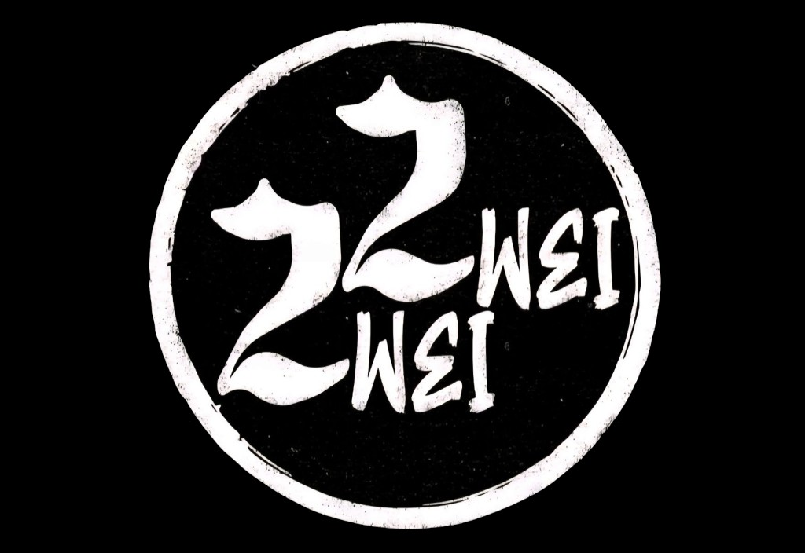
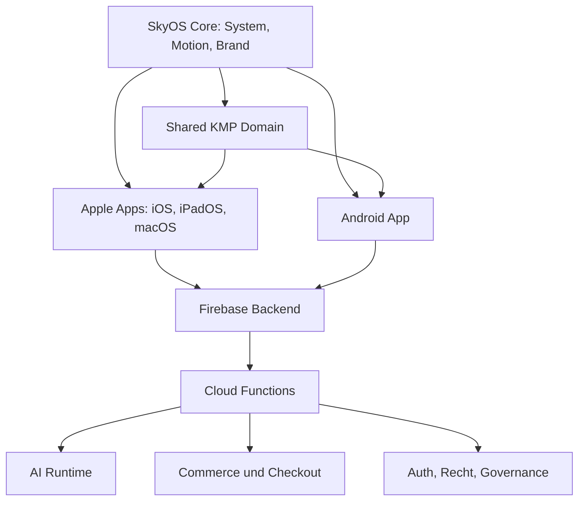

<p align="center">
  
</p>

<h1 align="center">SkyOS</h1>
<p align="center">
  Ein hochwertiger nativer Produktraum fuer KI, Creator-Medien, Membership, Merch-Commerce und vertrauenswuerdige Kontosteuerung.
</p>

<p align="center">
  
  
  
</p>

---

## Was SkyOS ist

SkyOS ist der Betriebskern hinter der Skydown-App. Die App verbindet KI-Assistenz, Musik, Video,
Merch, Membership, Support sowie rechtliche und kontobezogene Steuerung in einer ruhigen nativen
Oberflaeche, statt diese Bereiche auf lose Einzeltools zu verteilen.

Das Produkt ist fuer Nutzer, Creator, Betreiber und Reviewer so aufgebaut, dass drei Fragen schnell
klar werden:

- was die App leistet
- in welchem Marken- oder Funktionsbereich man sich befindet
- wo Vertrauen, Konto, Zahlung, Support und Rechtliches gesteuert werden

## Produktbereiche

| Bereich | Nutzen |
| --- | --- |
| Home | Einstieg fuer Orientierung, hervorgehobene Inhalte und Systemkontext |
| AI / Agent | Assistenz, Visuals, FAQ und strukturierte Workflow-Unterstuetzung |
| Music | Kuratierter Creator- und `ZweiZwei / 22`-Musikkontext |
| Video | Fokussierte Medienflaeche fuer Clips und visuelles Storytelling |
| Shop / Orders | `Skydown x 22` Merch, Warenkorb, Bestellungen und Kaufuebersicht |
| Profile / Settings | Konto, Membership, Support, Datenschutz, Rechtliches und Trust Controls |

## Markensystem

<p align="center">
  
  
  
</p>

| Marke | Rolle | Primaerer Einsatz |
| --- | --- | --- |
| `SkyOS` | Systemidentitaet und Betriebskern | Launcher, Home, Plattformarchitektur, Trust-Bereiche |
| `Skydown` | Produkt- und Betreiberidentitaet | App-Erlebnis, AI, Video, Support, Produktkommunikation |
| `ZweiZwei / 22` | Musikidentitaet | Music-Screens, Artist-Kontext, Release-Kontext |
| `Skydown x 22` | Merch-Kollaboration | Shop, Produkt, Checkout und Commerce-Bereiche |

## Designprinzipien

- Ein System: Jede Funktion soll sich wie Teil desselben Produkts anfuehlen.
- Ruhige Hierarchie: Wichtige Aktionen bleiben sichtbar, ohne die Oberflaeche laut zu machen.
- Native Qualitaet: SwiftUI, Jetpack Compose und gemeinsame Domain-Logik werden dort eingesetzt, wo sie am besten passen.
- Vertrauen ist sichtbar: Support, Rechtliches, Datenschutz, Billing und Kontoaktionen sind Teil des Produkts.
- KI bleibt assistiv: KI kann beim Entwerfen, Strukturieren und Ausfuehren helfen, Ergebnisse muessen aber geprueft werden.

## App-Icon

Das aktive Release-Icon wird als Master-Asset gepflegt und in die plattformspezifischen Icon-Slots
fuer Apple und Android gespiegelt.

<p align="center">
  
</p>

| Asset | Zweck |
| --- | --- |
| `docs/assets/skyos-app-icon-1024.png` | Apple-Master-Artwork |
| `docs/assets/skyos-app-icon-1024-android-padded.png` | Android Adaptive-Icon-Quelle mit plattformsicherem Padding |
| `docs/assets/icon-variants/A-original-premium/master-1024.png` | Release-Spiegel fuer Icon-QA |

## Architektur



## Tech Stack

| Layer | Technologie |
| --- | --- |
| Apple Client | SwiftUI, Xcode, Asset Catalog |
| Android Client | Kotlin, Jetpack Compose, Android Gradle |
| Shared Domain | Kotlin Multiplatform (`shared/`) |
| Backend | Firebase Auth, Firestore, Storage, Cloud Functions, App Check |
| AI Runtime | Cloud Functions, Genkit/Gemini-basierte Ausfuehrung, wo aktiv |
| Dokumentation | Markdown, Release-, Store-, Legal- und Compliance-Dokumente |

## Build

| Plattform | Modul | Build-Referenz |
| --- | --- | --- |
| iOS / iPadOS / macOS | `Skydown App.xcodeproj` | `xcodebuild` mit passender Destination |
| Android | `androidApp/` | `./scripts/android_release_clean_build.sh` fuer oeffentliche Artefakte; vor Play-Upload `./scripts/verify_android_release_artifacts.sh`; Kotlin-Static-Analysis `./gradlew detektAll` |
| Shared | `shared/` | Wird in Apple- und Android-Builds eingebunden |
| Functions | `functions/` | `npm ci --prefix functions`, `npm run build --prefix functions`, `npm test --prefix functions` |

```bash
# Backend
npm ci --prefix functions
npm run build --prefix functions
npm test --prefix functions

# Android: saubere oeffentliche Release-Artefakte
./scripts/android_release_clean_build.sh
# Vor manuellem Play-Upload: Version/Metadaten pruefen (Fastlane laeuft das automatisch)
./scripts/verify_android_release_artifacts.sh

# Apple-Beispiel
xcodebuild -project "Skydown App.xcodeproj" -scheme "Skydown App" -configuration Debug -destination "generic/platform=iOS Simulator" build
```

Fuer lokale Android-Smoke-Tests ohne Store-Signing kann weiterhin gebaut werden mit:

```bash
./gradlew :androidApp:assembleRelease -PallowDebugReleaseSigning=true
```

Store-faehige Builds benoetigen Produktionssigning ueber `keystore.properties` oder
`SKYOS_UPLOAD_*` Secrets. Android Studio installiert mit dem Run-Button normalerweise `debug`;
fuer Verteilung und Store-Tests muessen die Release-Artefakte aus dem Clean-Build-Script verwendet
werden.

## Vertrauen, Datenschutz und KI-Transparenz

SkyOS enthaelt rechtliche Hinweise, Datenschutz, Support und KI-Nutzungshinweise direkt im Produkt.
Das Repository haelt zusaetzlich Release- und Compliance-Arbeitsdokumente vor, damit Produktverhalten,
Datenverarbeitung und oeffentliche Kommunikation zusammenpassen.

Zentrale Dokumente:

- [Datenschutz](docs/legal/privacy.md)
- [AGB / Terms](docs/legal/terms.md)
- [Impressum](docs/legal/imprint.md)
- [KI-Nutzungshinweis](docs/legal/AI_USAGE_NOTICE.md)
- [Subscription Terms](docs/legal/SUBSCRIPTION_TERMS.md)
- [Compliance Kit](docs/compliance/README.md)

Oeffentliche regulatorische Referenzen:

- [EU AI Act - Uebersicht der Europaeischen Kommission](https://digital-strategy.ec.europa.eu/en/policies/regulatory-framework-ai)
- [EU AI Act - Verordnung (EU) 2024/1689 auf EUR-Lex](https://eur-lex.europa.eu/legal-content/DE/TXT/?uri=CELEX%3A32024R1689)
- [DSGVO / GDPR - Datenschutzregeln der Europaeischen Kommission](https://commission.europa.eu/law/law-topic/data-protection/eu-data-protection-rules_de)
- [DSGVO / GDPR - Verordnung (EU) 2016/679 auf EUR-Lex](https://eur-lex.europa.eu/eli/reg/2016/679/oj/deu)
- [EU-Datenschutzrahmen - Europaeische Kommission](https://commission.europa.eu/law/law-topic/data-protection/data-protection-eu_de)

Diese Links sind offizielle oeffentliche Referenzen. Sie ersetzen keine qualifizierte Rechtspruefung
fuer einen konkreten Release, Markt, Provider-Setup oder eine konkrete Datenverarbeitung.

## Dokumentation

| Thema | Dokument |
| --- | --- |
| Dokumentationsindex | [docs/README.md](docs/README.md) |
| Architektur | [docs/architecture.md](docs/architecture.md) |
| Backend | [docs/backend.md](docs/backend.md) |
| iOS | [docs/ios.md](docs/ios.md) |
| Android | [docs/android.md](docs/android.md) |
| AI-System | [docs/ai-system.md](docs/ai-system.md) |
| Commerce | [docs/commerce.md](docs/commerce.md) |
| Owner/Admin-Betrieb | [docs/owner-admin.md](docs/owner-admin.md) |
| Deployment | [docs/deployment.md](docs/deployment.md) |
| CI / Quality Gates | [docs/ci.md](docs/ci.md) |
| Release-Checkliste | [docs/release-checklist.md](docs/release-checklist.md) |
| Branding | [docs/branding.md](docs/branding.md) |
| FAQ | [docs/faq.md](docs/faq.md) |
| Store-Dokumente | [docs/store/README.md](docs/store/README.md) |
| Store Listing | [docs/store-listing.md](docs/store-listing.md) |
| Store Screenshots | [docs/store-screenshots.md](docs/store-screenshots.md) |

## Release-Bereitschaft

SkyOS ist als v1.0.0 Release Candidate dokumentiert. Cross-Plattform-Buildpfade, Brand-Assets,
Store-Vorbereitung sowie Legal- und Compliance-Arbeitsdokumente sind im Repository vorhanden.

Vor oeffentlicher Auslieferung muessen bestaetigt werden:

- Produktionssigning und Distribution-Credentials
- Store-Listing-URLs fuer Datenschutz, AGB, Support und Loeschanfragen
- finale Provider-Liste und Datenverarbeitungsrollen
- finale rechtliche Freigabe fuer Datenschutz, AGB, Subscription, KI-Hinweis und Impressum
- Plattformanforderungen fuer App Store und Google Play

## Support

Aktueller Repository-Supportkontakt: `skydownent@gmail.com`

Der Produktionsrelease sollte die finalen Wege fuer Support, Datenschutz, Loeschanfragen und
rechtliche Kontaktaufnahme in der App, in den Store Listings und auf den oeffentlichen Policy-Seiten
veroeffentlichen.

## Lizenz

Projektspezifisch. Vor einer oeffentlichen Open-Source-Verteilung sollte eine zentrale `LICENSE`
Datei ergaenzt werden.
