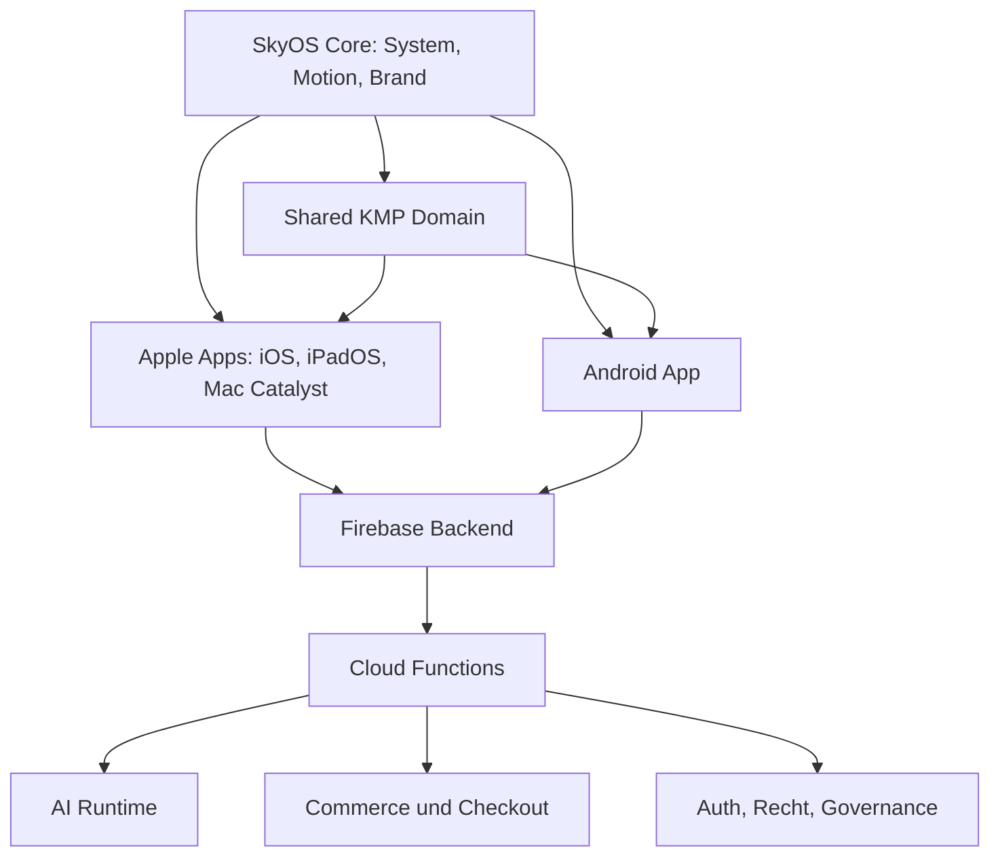

<p align="center">
  
</p>

<h1 align="center">SkyOS</h1>
<p align="center">
  Eine native Productivity- und Automation-App fuer Reminder, Tasks, Notes, KI-Unterstuetzung,
  Creator-Medien, Commerce und vertrauenswuerdige Kontosteuerung.
</p>

<p align="center">
  
  
  
</p>

---

## Was SkyOS ist

SkyOS ist der Betriebskern hinter der Skydown-App. Die App verbindet produktive Workflows
wie Reminder, Tasks und Notes mit KI-Assistenz, Musik, Video, Merch, Membership, Support
sowie rechtlicher und kontobezogener Steuerung in einer ruhigen nativen Oberflaeche.

Das Produkt ist fuer Nutzer, Creator, Betreiber und Reviewer so aufgebaut, dass drei Fragen schnell
klar werden:

- was die App leistet
- in welchem Marken- oder Funktionsbereich man sich befindet
- wo Vertrauen, Konto, Zahlung, Support und Rechtliches gesteuert werden

## Aktueller Release-Stand

Stand: `2026-04-27` Europe/Berlin.

| Bereich | Status |
| --- | --- |
| Produktversion | `1.0.0` Release Candidate |
| iOS / iPadOS | Bundle `com.skydown.ios`, Build `10007`, Release-Simulator-Build bestanden |
| Android | Package `com.nash.skyos`, `versionCode 10015`, Release-AAB/APK verifiziert |
| Backend | Firebase-Projekt `skydown-a6add`, Functions-Paket `skyos-functions@1.0.0` |
| Live Productivity | Reminder + Push, Tasks, Notes, Activepieces HTTP Workflow API |
| Lokale Gates | Functions Build/Syntax, Rules-Tests, Android/iOS Builds und relevante Lints muessen vor Release-Commit gruen sein |
| Store-Status | Listing-Copy ist vorbereitet; Store-Konsole, Produktions-URLs, Legal-Sign-off und echte Device-Smokes bleiben externe Launch-Gates |

Die operative Wahrheit fuer Uploads und offene Store-Punkte steht im
[Store Upload Runbook](docs/release/store-upload-runbook.md). Diese README beschreibt den
releasefaehigen Code- und Doku-Stand, nicht automatisch eine bereits genehmigte oeffentliche
Store-Freigabe.

## Live Features

| Feature | Status |
| --- | --- |
| Reminder + Push | Live: App, callable Functions, Firestore, Push-Token-Sync und Scheduled Function `processDueReminders` |
| Tasks | Live: App-Erfassung, Speicherung, Anzeige, Abschluss und Workflow-Erstellung |
| Notes | Live: App-Erfassung, Speicherung, Anzeige, Bearbeitung und Workflow-Erstellung |
| Activepieces | Live: HTTP Endpoints fuer Reminder, Task und Note mit `x-skyos-workflow-secret` |
| Memory / erweiterte Automationen | Coming next: sichtbar als naechster Ausbauschritt, nicht als vollstaendig live beworben |

## Produktbereiche

| Bereich | Nutzen |
| --- | --- |
| Home | Einstieg fuer Orientierung, Productivity Snapshot, Quick Actions und Systemkontext |
| AI / Agent | Assistenz, Visuals, FAQ, Tasks/Notes-Dock und strukturierte Workflow-Unterstuetzung |
| Music | Kuratierter Creator- und `ZweiZwei / 22`-Musikkontext |
| Video | Fokussierte Medienflaeche fuer Clips und visuelles Storytelling |
| Shop / Orders | `Skydown x 22` Merch, Warenkorb, Bestellungen und Kaufuebersicht |
| Profile / Settings | Konto, Membership, Support, Datenschutz, Rechtliches und Trust Controls |

## Markensystem

<p align="center">
  
  
  
</p>

| Marke | Rolle | Primaerer Einsatz |
| --- | --- | --- |
| `SkyOS` | Systemidentitaet und Betriebskern | Launcher, Home, Plattformarchitektur, Trust-Bereiche |
| `Skydown` | Produkt- und Betreiberidentitaet | App-Erlebnis, AI, Video, Support, Produktkommunikation |
| `ZweiZwei / 22` | Musikidentitaet | Music-Screens, Artist-Kontext, Release-Kontext |
| `Skydown x 22` | Merch-Kollaboration | Shop, Produkt, Checkout und Commerce-Bereiche |

## Designprinzipien

- Ein System: Jede Funktion soll sich wie Teil desselben Produkts anfuehlen.
- Ruhige Hierarchie: Wichtige Aktionen bleiben sichtbar, ohne die Oberflaeche laut zu machen.
- Native Qualitaet: SwiftUI, Jetpack Compose und gemeinsame Domain-Logik werden dort eingesetzt, wo sie am besten passen.
- Vertrauen ist sichtbar: Support, Rechtliches, Datenschutz, Billing und Kontoaktionen sind Teil des Produkts.
- KI bleibt assistiv: KI kann beim Entwerfen, Strukturieren und Ausfuehren helfen, Ergebnisse muessen aber geprueft werden.

## App-Icon

Das aktive Release-Icon wird als Master-Asset gepflegt und in die plattformspezifischen Icon-Slots
fuer Apple und Android gespiegelt.

<p align="center">
  
</p>

| Asset | Zweck |
| --- | --- |
| `docs/assets/skyos-app-icon-1024.png` | Apple-Master-Artwork |
| `docs/assets/skyos-app-icon-1024-android-padded.png` | Android Adaptive-Icon-Quelle mit plattformsicherem Padding |
| `docs/assets/icon-variants/A-original-premium/master-1024.png` | Release-Spiegel fuer Icon-QA |

## Architektur



## Tech Stack

| Layer | Technologie |
| --- | --- |
| Apple Client | SwiftUI, Xcode, Asset Catalog |
| Android Client | Kotlin, Jetpack Compose, Android Gradle |
| Shared Domain | Kotlin Multiplatform (`shared/`) |
| Backend | Firebase Auth, Firestore, Storage, Cloud Functions, App Check |
| AI Runtime | Cloud Functions, Genkit/Gemini-basierte Ausfuehrung, wo aktiv |
| Dokumentation | Markdown, Release-, Store-, Legal- und Compliance-Dokumente |

## Voraussetzungen

- Xcode mit aktuellem iOS-SDK fuer SwiftUI-Builds, Archive und TestFlight/App-Store-Arbeit
- Android Studio / Android SDK, `ANDROID_HOME` fuer tiefere APK-Pruefung mit `aapt2`
- JDK 17 fuer Gradle, Kotlin Multiplatform und Android
- Node.js 22 fuer `functions/` entsprechend `functions/package.json`
- Firebase CLI fuer Emulator-, Rules- und Deploy-Workflows
- Produktionssigning nur lokal oder in Secrets: `keystore.properties` oder `SKYOS_UPLOAD_*`
- App-/Store-Zugaenge fuer App Store Connect, Google Play Console, Firebase, Shopify, Stripe/Klarna

## Schnellstart

```bash
# Voller lokaler CI-Gate: shared, Android lint/metadata, Functions und Rules
./scripts/ci_local_gate.sh

# Kotlin static analysis
./gradlew detektAll

# Functions syntax/build check
npm ci --prefix functions
npm run build --prefix functions
npm test --prefix functions
```

Firebase Functions Deployment:

```bash
firebase deploy --only functions
```

Firestore Rules Deployment:

```bash
firebase deploy --only firestore:rules
```

Fuer iOS:

```bash
xcodebuild -project "Skydown App.xcodeproj" \
  -scheme "Skydown App" \
  -configuration Release \
  -destination "generic/platform=iOS Simulator" \
  CODE_SIGNING_ALLOWED=NO \
  build
```

Fuer Android:

```bash
./scripts/android_release_clean_build.sh
./scripts/verify_android_release_artifacts.sh
```

## Build

| Plattform | Modul | Build-Referenz |
| --- | --- | --- |
| iOS / iPadOS / Mac Catalyst | `Skydown App.xcodeproj` | `xcodebuild` oder Xcode mit passender Destination; Store-Archive brauchen echte Signierung |
| Android | `androidApp/` | `./scripts/android_release_clean_build.sh` fuer oeffentliche Artefakte; vor Play-Upload `./scripts/verify_android_release_artifacts.sh`; Kotlin-Static-Analysis `./gradlew detektAll` |
| Shared | `shared/` | Wird in Apple- und Android-Builds eingebunden |
| Functions | `functions/` | `npm ci --prefix functions`, `npm run build --prefix functions`, `npm test --prefix functions` |

```bash
# Backend
npm ci --prefix functions
npm run build --prefix functions
npm test --prefix functions

# Android: saubere oeffentliche Release-Artefakte
./scripts/android_release_clean_build.sh
# Vor manuellem Play-Upload: Version/Metadaten pruefen (Fastlane laeuft das automatisch)
./scripts/verify_android_release_artifacts.sh

# Apple compile validation ohne lokale Store-Signierung
xcodebuild -project "Skydown App.xcodeproj" -scheme "Skydown App" -configuration Release -destination "generic/platform=iOS Simulator" CODE_SIGNING_ALLOWED=NO build
```

Fuer lokale Android-Smoke-Tests ohne Store-Signing kann weiterhin gebaut werden mit:

```bash
./gradlew :androidApp:assembleRelease -PallowDebugReleaseSigning=true
```

Store-faehige Builds benoetigen Produktionssigning ueber `keystore.properties` oder
`SKYOS_UPLOAD_*` Secrets. Android Studio installiert mit dem Run-Button normalerweise `debug`;
fuer Verteilung und Store-Tests muessen die Release-Artefakte aus dem Clean-Build-Script verwendet
werden.

## Activepieces Setup

SkyOS bietet drei serverseitige HTTP Endpoints fuer Activepieces:

- `createReminderFromWorkflow`
- `createTaskFromWorkflow`
- `createNoteFromWorkflow`

Basis-URL:

```text
https://us-central1-<project-id>.cloudfunctions.net/<endpointName>
```

Activepieces HTTP Step:

- Methode: `POST`
- Header: `Content-Type: application/json`
- Header: `x-skyos-workflow-secret: <SKYOS_WORKFLOW_SECRET>`
- Body enthaelt immer `uid` des Firebase Users plus die Endpoint-Daten

Details und Beispiel-Payloads stehen in
[docs/workflow-http-api-activepieces.md](docs/workflow-http-api-activepieces.md).

## Konfiguration und Secrets

| Zweck | Quelle |
| --- | --- |
| Android Firebase Client | `androidApp/google-services.json` |
| Apple Firebase Client | `Skydown App/GoogleService-Info.plist` |
| Android Release Signing | `keystore.properties.example`, `.env.example`, `SKYOS_UPLOAD_*` |
| Google Play Fastlane | `SUPPLY_JSON_KEY` als Pfad zur Play-Service-Account-JSON |
| Workflow HTTP API | Firebase Secret `SKYOS_WORKFLOW_SECRET`, gesendet als `x-skyos-workflow-secret` |
| Functions Runtime | Firebase Secrets / Runtime Config, dokumentiert in `.env.example` |
| Public Policy Pages | `site/privacy.html`, `site/terms.html`, `site/support.html`, final auf Produktionsdomain zu hosten |

Keine echten Secrets, privaten Service-Account-Keys, Keystores, `.env`-Dateien oder Store-Credentials
duerfen in das Repository. Die vorhandenen Firebase Client-Konfigurationsdateien sind fuer die
jeweiligen Apps noetig, sollten aber vor einer Open-Source- oder externen Repository-Verteilung
bewusst freigegeben werden.

## Vertrauen, Datenschutz und KI-Transparenz

SkyOS enthaelt rechtliche Hinweise, Datenschutz, Support und KI-Nutzungshinweise direkt im Produkt.
Das Repository haelt zusaetzlich Release- und Compliance-Arbeitsdokumente vor, damit Produktverhalten,
Datenverarbeitung und oeffentliche Kommunikation zusammenpassen.

Zentrale Dokumente:

- [Datenschutz](docs/legal/privacy.md)
- [AGB / Terms](docs/legal/terms.md)
- [Impressum](docs/legal/imprint.md)
- [KI-Nutzungshinweis](docs/legal/AI_USAGE_NOTICE.md)
- [Subscription Terms](docs/legal/SUBSCRIPTION_TERMS.md)
- [Compliance Kit](docs/compliance/README.md)

Oeffentliche regulatorische Referenzen:

- [EU AI Act - Uebersicht der Europaeischen Kommission](https://digital-strategy.ec.europa.eu/en/policies/regulatory-framework-ai)
- [EU AI Act - Verordnung (EU) 2024/1689 auf EUR-Lex](https://eur-lex.europa.eu/legal-content/DE/TXT/?uri=CELEX%3A32024R1689)
- [DSGVO / GDPR - Datenschutzregeln der Europaeischen Kommission](https://commission.europa.eu/law/law-topic/data-protection/eu-data-protection-rules_de)
- [DSGVO / GDPR - Verordnung (EU) 2016/679 auf EUR-Lex](https://eur-lex.europa.eu/eli/reg/2016/679/oj/deu)
- [EU-Datenschutzrahmen - Europaeische Kommission](https://commission.europa.eu/law/law-topic/data-protection/data-protection-eu_de)

Diese Links sind offizielle oeffentliche Referenzen. Sie ersetzen keine qualifizierte Rechtspruefung
fuer einen konkreten Release, Markt, Provider-Setup oder eine konkrete Datenverarbeitung.

## Dokumentation

| Thema | Dokument |
| --- | --- |
| Dokumentationsindex | [docs/README.md](docs/README.md) |
| Architektur | [docs/architecture.md](docs/architecture.md) |
| Backend | [docs/backend.md](docs/backend.md) |
| iOS | [docs/ios.md](docs/ios.md) |
| Android | [docs/android.md](docs/android.md) |
| AI-System | [docs/ai-system.md](docs/ai-system.md) |
| Commerce | [docs/commerce.md](docs/commerce.md) |
| Owner/Admin-Betrieb | [docs/owner-admin.md](docs/owner-admin.md) |
| Deployment | [docs/deployment.md](docs/deployment.md) |
| CI / Quality Gates | [docs/ci.md](docs/ci.md) |
| Release-Checkliste | [docs/release-checklist.md](docs/release-checklist.md) |
| Branding | [docs/branding.md](docs/branding.md) |
| FAQ | [docs/faq.md](docs/faq.md) |
| Store-Dokumente | [docs/store/README.md](docs/store/README.md) |
| Store Listing | [docs/store-listing.md](docs/store-listing.md) |
| Store Screenshots | [docs/store-screenshots.md](docs/store-screenshots.md) |
| Store Upload Runbook | [docs/release/store-upload-runbook.md](docs/release/store-upload-runbook.md) |

## Release-Bereitschaft

SkyOS ist als `v1.0.0` Release Candidate fuer den Productivity-Automation-Launch dokumentiert.
Repository-seitig gehoeren Reminder + Push, Tasks, Notes und die Activepieces HTTP API zum Live-Stand.
Memory und weitere Follow-up-Automationen bleiben bewusst als `coming next` kommuniziert.

Vor oeffentlichem Store-Rollout muessen ausserhalb des Repos weiterhin bestaetigt werden:

- finale Store-Console-Eintraege und Uploads
- Produktions-URLs fuer Datenschutz, AGB, Support und Website
- Legal-Sign-off fuer Policies, Subscription Terms, KI-Hinweis und Impressum
- realer iPhone- und Android-Device-Smoke aus den hochgeladenen Store-Artefakten

## Support

Aktueller Repository-Supportkontakt: `skydownent@gmail.com`

Der Produktionsrelease sollte die finalen Wege fuer Support, Datenschutz, Loeschanfragen und
rechtliche Kontaktaufnahme in der App, in den Store Listings und auf den oeffentlichen Policy-Seiten
veroeffentlichen.

## Lizenz

Projektspezifisch. Vor einer oeffentlichen Open-Source-Verteilung sollte eine zentrale `LICENSE`
Datei ergaenzt werden.
