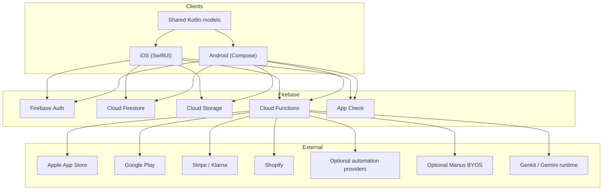

# SkyOS Architecture

SkyOS is a native mobile product system with Firebase as the operational backbone. It is built to
keep user experience fast and expressive while moving authority for sensitive behavior into backend
services, rules, and owner-governed runtime controls.

## 1. System Overview

SkyOS consists of:

- an iOS app built with SwiftUI
- an Android app built with Jetpack Compose
- a Kotlin Multiplatform shared module for shared models and domain helpers
- Firebase Auth for account identity
- Firestore for app state, user state, content, legal content, commerce data, and operational config
- Firebase Storage for media and uploads
- Cloud Functions for privileged writes, payment handling, AI execution, and owner operations
- Firestore and Storage rules for final client-side access boundaries

## 2. Product Runtime Map

## 3. Client Architecture

### iOS

The iOS client lives in `Skydown App/` and is organized around:

- `Views/` for SwiftUI surfaces
- `ViewModels/` for screen orchestration and state
- `Services/` for auth, AI, commerce, payments, music, orders, legal content, and integrations
- `Models/` for local domain structures
- `Utilities/` for design, localization, alerts, Keychain-backed storage, and platform helpers

### Android

The Android client lives in `androidApp/` and is organized around:

- `ui/screen/` for Compose screens
- `ui/viewmodel/` for state orchestration
- `data/` and `data/repository/` for Firebase, billing, legal, commerce, and AI interactions
- `ui/component/` for adaptive and reusable UI building blocks

### Shared Layer

The `shared/` module keeps selected domain contracts aligned across platforms. It is not the full
app business layer; it is a shared model surface where consistency helps more than platform-specific
freedom.

## 4. Core Product Flows

### Auth and Session

1. User signs in through supported auth flow.
2. Auth state restores on launch.
3. User document, role, and plan context are loaded.
4. Clients gate surfaces based on role and entitlement.
5. Functions and rules remain the final authority for sensitive actions.

### AI and Agent

1. User sends a bot, FAQ, visual, or agent request.
2. Client includes account context and current entitlement state.
3. Cloud Functions authorize usage and enforce limits or safeguards.
4. Provider execution runs only when allowed.
5. Usage, history, and operational signals are updated.
6. Client renders success, blocked, retry, or support-oriented states.

### Merch and Orders

1. Client loads catalog data, including Shopify-backed products where configured.
2. User updates cart locally.
3. Order submission and hosted checkout preparation run through Functions.
4. Order records are stored server-side and scoped to `orderOwnerUid`.
5. Payment and fulfillment events update order state asynchronously.
6. Owner/admin can monitor and manage commerce from protected surfaces.

### Membership

1. Clients surface current plan and upgrade affordances.
2. Native store or hosted checkout flows initiate purchase depending on configured product path.
3. Server sync confirms purchase state and plan mapping.
4. Capability and quota state update from canonical backend truth.
5. Restore and support paths remain visible from Settings.

### Owner and Admin

Owner and admin flows include:

- role management
- AI runtime and prompt governance
- legal content settings
- membership and revenue operations
- commerce configuration
- runtime lockdown and budget protection

These controls are sensitive because they change system behavior for real users, not only internal dashboards.

## 5. Data and Trust Boundaries

SkyOS uses layered authority:

- UI gating reduces accidental misuse
- repositories and services scope which calls clients can make
- callable Functions own privileged mutations
- Firestore rules enforce document-level read/write rules
- Storage rules enforce upload slots, content types, size limits, and file naming rules
- runtime config can disable writes, uploads, registrations, or the broader system

Important rule: if the UI hides an owner action but rules still allow a normal user to perform it,
SkyOS is not secure.

## 6. External Automation and AI Extensions

SkyOS supports optional external execution paths:

- account-scoped automation config for webhook-style flows
- owner-configurable provider routing and runtime policy
- optional Manus BYOS for agent execution on a per-account basis

These are additive layers. They should never silently weaken the default permission model or create
cross-account leakage.

## 7. Release-Critical Architecture Constraints

The architecture is only release-ready when:

- builds pass on both platforms
- Functions and rules tests are green
- role enforcement is proven outside the UI
- legal and support entry points resolve correctly
- billing and restore flows are validated on live store paths
- runtime kill switches and rollback paths are known to the owner team

For current operational commands and deploy guidance, see [backend.md](backend.md),
[deployment.md](deployment.md), and [release-checklist.md](release-checklist.md).
